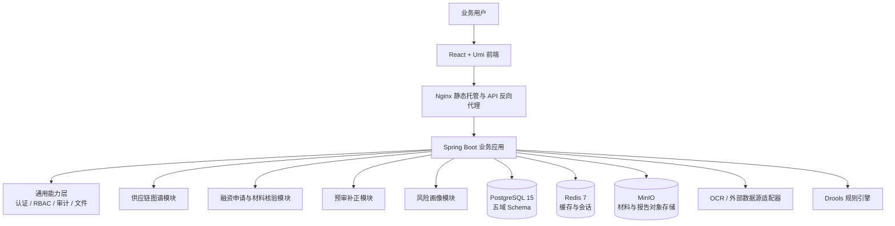
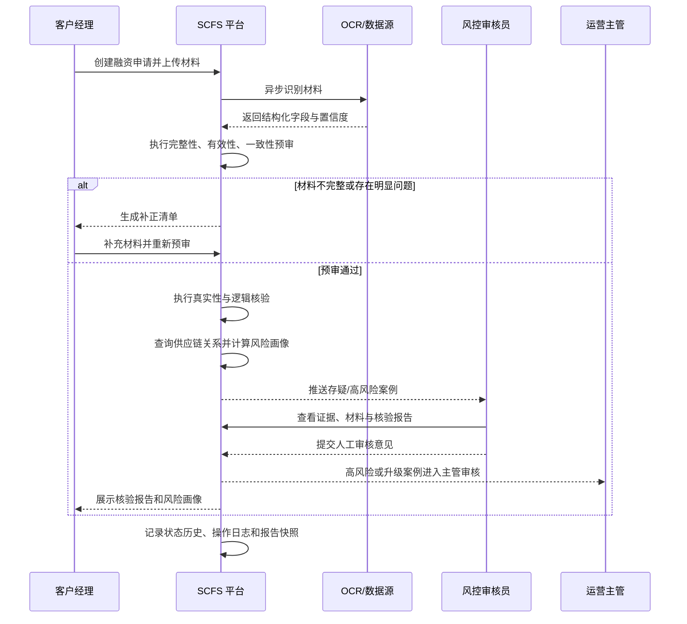

# SCFS 供应链金融智能风控与尽调辅助平台

## 项目详细介绍材料

> 适用场景：项目交付物、产品说明、技术方案、项目验收材料、演示汇报材料。  
> 项目版本：V1.0  
> 编制依据：项目源代码、产品需求文档、技术架构 RFC、前后端自检报告。

---

## 一、项目概述

### 1.1 项目名称

供应链金融智能风控与尽调辅助平台（Supply Chain Finance System，简称 SCFS）。

### 1.2 项目定位

SCFS 是面向银行供应链金融业务的智能风控与尽调辅助平台，围绕融资申请、贸易背景材料、企业供应链关系和风险判断等关键对象，为客户经理、风控审核员、运营主管、规则管理人员和审计人员提供统一的业务操作与风险分析入口。

平台通过供应链图谱、材料 OCR 识别、材料预审、交易真实性核验、风险画像、规则配置和审计追溯等能力，将分散的企业关系数据、融资材料、核验结果和人工处理记录串联起来，形成从“企业尽调”到“融资申请辅助审核”再到“风险报告归档”的闭环。

### 1.3 建设背景

传统供应链金融业务主要依赖客户经理经验和人工材料审核，存在以下问题：

1. 只能看到融资企业自身信息，难以判断企业在核心企业供应链中的真实位置。
2. 合同、订单、发票、物流、验收等材料数量多，人工逐项核对效率较低。
3. 不同材料中的企业名称、统一社会信用代码、金额和时间信息容易出现不一致。
4. 循环交易、关联交易、异常新增交易关系等风险往往难以及时发现。
5. 风险判断缺少统一标准，规则变化、人工决策和历史依据不易追溯。

SCFS 针对上述问题，提供结构化、可视化、可留痕的辅助分析能力，帮助业务人员提高审核效率和风险识别能力。

### 1.4 系统边界

本平台定位为风控与尽调辅助系统，主要输出材料检查结果、交易核验结果、风险提示和风险画像，辅助人工审批决策。平台不替代银行核心信贷系统，不直接承担放款、资金清算、客户主数据管理等核心职能；融资审批结果仍由具备相应权限的业务或风控人员结合实际情况确认。

---

## 二、核心价值

| 价值方向 | 平台提供的能力 |
| --- | --- |
| 看清企业位置 | 通过供应链关系图谱展示企业上下游关系、合作层级、供应链角色和距离核心企业的层级位置 |
| 判断材料真伪 | 对上传材料进行 OCR 结构化识别，并基于主体、金额、时间和交易信息执行一致性检查 |
| 提升审核效率 | 通过材料完整性、有效性和企业信息一致性预审，提前发现缺件、过期和信息不一致问题 |
| 提前识别风险 | 汇总供应链、交易稳定性和材料质量等维度，形成企业或融资申请风险画像 |
| 统一业务标准 | 通过规则定义、风险权重和材料清单模板配置，将业务经验沉淀为可维护的系统规则 |
| 满足合规追溯 | 对关键业务操作和状态变更记录审计日志、状态历史、报告快照和内容哈希 |

---

## 三、业务角色与权限体系

平台采用基于角色的访问控制（RBAC），同时结合菜单级权限、按钮/API 级权限和双岗审批机制。

| 角色 | 主要职责 | 典型功能 |
| --- | --- | --- |
| 系统管理员（ADMIN） | 用户、角色、菜单和系统基础配置管理 | 系统管理、权限配置、全量查看 |
| 客户经理（RM） | 发起融资申请、上传材料、跟踪审核和开展企业尽调 | 工作台、供应链图谱、融资申请、材料管理 |
| 风控审核员（RCO） | 处理存疑核验案例并提出风控意见 | 审核中心、核验详情、风险报告 |
| 规则经办岗（OPS_MAKER） | 创建或修改规则、风险权重和材料模板 | 规则配置、变更提交 |
| 规则复核岗（OPS_CHECKER） | 对规则变更进行独立复核 | 待复核列表、变更审批 |
| 运营主管（OPS） | 处理升级案例并监控运营情况 | 运营管理、审计查询、升级审核 |
| 审计人员（AUDIT） | 对业务操作、核验记录和规则变更进行追溯检查 | 审计查询、全流程留痕查看 |

### 双岗控制

规则定义、风险权重配置和材料清单模板的变更均采用“经办—复核”流程。经办人员提交变更后进入待复核状态，复核人员审核通过后才正式生效；经办人与复核人不能为同一人。前端通过审批组件控制操作入口，后端通过服务层和权限校验再次验证，避免仅依赖页面隐藏实现安全控制。

---

## 四、功能模块介绍

### 4.1 工作台

工作台是登录后的统一入口，展示当前用户的待办事项、融资申请概况、近期申请和常用功能入口。不同角色根据权限看到不同菜单和操作按钮，便于用户快速进入待处理业务。

### 4.2 供应链图谱与企业尽调

供应链图谱模块以企业为节点、企业间交易或供应关系为边，展示核心企业及其上下游合作网络。

主要能力包括：

- 全量企业关系图谱展示；
- 企业角色识别，例如核心企业、供应商、采购方等；
- 企业在供应链中的位置分析，包括与核心企业的距离、是否处于核心链路、上下游稳定性等；
- 异常关系预警，包括异常新增关系、关联关系和其他异常交易提示；
- 节点拖拽、缩放、框选、悬浮提示和图谱图片导出；
- 企业角色、位置分析和异常预警列表的搜索过滤。

前端使用 AntV G6 进行图谱渲染，后端提供企业、关系、角色、位置分析和异常关系等数据接口。图谱默认限制展示层级，降低关系数量较大时的渲染压力。

### 4.3 融资申请管理

融资申请模块负责维护融资申请主数据、申请编号、融资企业、业务类型、融资金额、申请人和处理人等信息，并记录整个申请的状态流转历史。

申请状态按照业务过程逐步推进，典型流程为：

```text
DRAFT 草稿
  ↓
SUBMITTED 已提交
  ↓
PRE_AUDITING 预审中
  ├─ 预审不通过 → SUBMITTED 待补正
  └─ PRE_AUDIT_PASSED 预审通过
          ↓
      VERIFYING 核验中
          ↓
      RISK_SCORING 风险评分
          ↓
      PENDING_DECISION 待决策
       ├─ APPROVED 已通过
       └─ REJECTED 已拒绝
```

服务层对状态流转进行校验，禁止跳过业务前置条件的非法流转；每次状态变化都会写入申请状态历史，并保留操作人、原状态、目标状态、操作说明和时间信息。

### 4.4 材料管理与 OCR 识别

材料管理支持融资申请下的材料上传、材料类型调整、重新识别、识别结果查询、人工修正和文件下载/预览。系统对上传文件设置扩展名白名单和大小限制，支持 PDF、图片、DOCX、XLSX 等常见业务材料格式。

当前项目中的 OCR 能力采用异步 Mock 适配器实现，能够模拟识别买方、卖方、统一社会信用代码、商品、金额、交易编号等字段，并生成字段级置信度和原始识别结果。实际生产部署时，可将该适配器替换为银行内部 OCR 服务或第三方 OCR 服务，业务数据模型和上层核验流程可以保持不变。

### 4.5 材料预审与补正

预审模块在正式核验前对材料进行三类检查：

1. **完整性检查**：根据业务类型匹配材料清单模板，计算应交材料数、已提交材料数、完整度百分比，并列出缺失材料。
2. **有效性检查**：检查材料是否存在识别结果、关键字段是否缺失、材料是否超过有效期限，并形成异常明细。
3. **企业信息一致性检查**：围绕企业名称、统一社会信用代码、法定代表人和地址等要素，比较不同材料中的信息是否一致。

当预审不通过时，系统可生成补正清单，明确需要补充或修正的材料项，业务人员补齐后可重新提交预审。该机制能够把明显的材料问题前置处理，减少风控人员在正式核验阶段的重复工作。

### 4.6 交易真实性核验与核验报告

真实性核验模块围绕贸易背景的关键维度生成核验结果，支持完整性、有效性、一致性和逻辑检查，并提供“执行全部核验”的统一入口。

核验完成后，系统生成核验报告，报告包含：

- 报告编号和版本信息；
- 总体评估结论；
- 异常项数量；
- 风险提示和核验明细；
- 原始材料/识别结果等内容快照；
- 内容哈希和生成时间；
- PDF 导出能力。

报告以快照方式归档，避免后续材料或规则变化导致历史报告内容无法还原。

### 4.7 风险画像

风险画像用于把多个分析结果汇总成便于决策的结构化结论。当前模型主要包含三个评分维度：

- 供应链评分：反映企业在供应链中的位置、关系稳定性和供应链可信度；
- 交易稳定性评分：反映交易数量、金额波动和历史趋势等情况；
- 材料质量评分：反映材料完整性、有效性、识别质量和一致性。

平台支持配置三个维度的权重，并计算综合得分和风险等级，同时输出风险原因与建议。默认权重为供应链 40%、交易 30%、材料 30%，具体权重可由具备权限的人员通过双岗流程维护。风险画像同样保存内容哈希和生成时间，方便后续核验与审计。

### 4.8 规则配置

规则配置模块将核验标准从业务代码中抽离，支持：

- 规则定义的新增、编辑、启用和停用；
- 规则版本和规则变更记录管理；
- 风险权重及阈值维护；
- 不同业务类型的材料清单模板配置；
- 待复核变更查询、审批、拒绝和退回；
- 规则变更日志追溯。

后端预留 Drools 规则引擎能力，规则可通过 DRL 内容和参数进行维护。规则上线前通过双岗审批，降低未经复核的规则变更直接影响业务结果的风险。

### 4.9 审计查询

审计模块对登录、融资申请操作、材料处理、核验、审批、规则变更和报告生成等关键行为进行记录。审计人员可按用户、模块、操作类型、目标对象和时间范围查询日志，并查看业务记录和核验快照，用于合规检查、争议处理和问题定位。

---

## 五、总体技术架构



### 5.1 前端架构

- React 18 + Umi Max；
- Ant Design 与 Pro Components 构建后台业务界面；
- Axios 统一封装接口请求、JWT 注入和错误处理；
- TypeScript 提供接口和页面数据类型约束；
- AntV G6 实现供应链关系图谱；
- 通过路由守卫和按钮权限组件实现菜单、页面和操作级控制；
- Vitest、Testing Library 用于前端单元测试。

### 5.2 后端架构

- Spring Boot 3.2.5，JDK 17；
- Maven 多模块工程，按通用能力和业务域拆分；
- MyBatis 负责数据访问，数据库 SQL 与业务服务分离；
- Spring Security + JWT 实现无状态认证；
- 自定义 `@RequirePermission` 注解和权限切面控制 API 访问；
- 自定义审计注解和审计切面记录关键业务行为；
- Spring 异步任务执行 OCR 等耗时操作；
- Flyway 管理数据库结构和种子数据版本；
- Knife4j/OpenAPI 提供接口文档和调试入口。

### 5.3 数据架构

PostgreSQL 按业务域划分五个 Schema：

| Schema | 主要内容 |
| --- | --- |
| `schema_common` | 用户、角色、菜单、权限、文件、规则、审计日志 |
| `schema_graph` | 企业、供应链关系、企业角色、位置分析、异常关系 |
| `schema_verify` | 融资申请、申请状态历史、申请材料、OCR 结果、核验结果和核验报告 |
| `schema_preaudit` | 完整性、有效性、企业信息一致性和补正清单 |
| `schema_risk` | 风险画像、交易稳定性和风险评分相关数据 |

数据库初始化通过 Flyway 执行，包含表结构、权限菜单、规则配置、企业图谱和演示业务数据。

---

## 六、关键业务流程



---

## 七、安全、合规与可追溯设计

1. **身份认证**：使用 JWT Bearer Token，统一处理登录、刷新、退出和当前用户信息。
2. **权限控制**：后端 API 权限是最终控制边界，前端权限用于菜单和按钮展示，形成前后端双重控制。
3. **双岗审批**：规则、权重、模板变更强制执行经办与复核分离。
4. **文件安全**：限制上传文件类型和大小，文件存放在 MinIO，不直接依赖应用容器本地磁盘。
5. **数据脱敏**：前端对统一社会信用代码、手机号、法人姓名等敏感信息提供脱敏展示能力。
6. **操作审计**：关键业务操作通过审计注解/切面记录用户、模块、动作、目标对象、请求上下文和时间。
7. **结果防篡改**：核验报告和风险画像保存内容快照及哈希值，便于判断历史结果是否被修改。
8. **数据保留**：配置中预留核验报告、材料文件和审计日志不少于五年的保留策略，规则变更日志长期保留。
9. **并发控制**：融资申请更新和状态变化带有版本号校验，降低并发操作覆盖数据的风险。

---

## 八、部署与运行方式

项目提供 Docker Compose 一体化部署方式，包含以下服务：

| 服务 | 端口 | 用途 |
| --- | ---: | --- |
| `scfs-frontend` | 80 | 前端页面、静态资源和 API 代理 |
| `scfs-app` | 8080 | Spring Boot 后端业务服务 |
| `scfs-postgres` | 5432 | PostgreSQL 数据库 |
| `scfs-redis` | 6379 | 缓存和会话相关能力 |
| `scfs-minio` | 9000/9001 | 文件对象存储及管理控制台 |
| `scfs-mock` | 9002 | 外部 OCR/数据源模拟服务 |

在项目根目录执行：

```bash
docker compose up --build -d
```

启动后访问 `http://localhost/` 进入平台。后端启动时通过 Flyway 自动创建数据库 Schema、业务表和初始化数据。开发调试时，也可以分别启动前端、Spring Boot 后端和 Flask Mock 服务。

项目内置演示账号，默认密码为 `admin123`，包括管理员、客户经理、风控审核员、规则经办岗、规则复核岗、运营主管和审计人员。正式环境应立即修改默认密码，并替换 Compose 文件中的数据库、MinIO 和 JWT 密钥配置。

---

## 九、当前交付形态与生产化说明

本项目已经形成可运行的前后端一体化平台和完整的演示业务闭环，适合用于产品演示、方案验证、功能验收和后续集成开发。当前实现中，OCR 和部分外部数据源使用 Mock 服务模拟，演示数据通过数据库迁移脚本初始化，适合作为可控的开发/验收环境。

若进入生产部署，建议重点完成以下工作：

- 接入真实 OCR、企业征信、工商、税务、物流或核心企业数据源；
- 将演示账号、默认口令和示例密钥替换为正式密钥管理方案；
- 完善生产环境的 HTTPS、访问控制、备份恢复、监控告警和日志集中管理；
- 根据实际监管和银行制度补充规则审批、模型验证、数据授权和隐私保护流程；
- 对图谱大数据量场景进行分页、分层加载和缓存优化；
- 对 OCR 识别、规则执行和风险评分增加可观测性、重试、超时和降级策略；
- 补充真实数据场景下的集成测试、性能测试、安全测试和灾备演练。

上述事项属于从演示/验收环境走向银行生产环境的工程化增强，不影响当前平台作为供应链金融智能风控与尽调辅助平台原型的整体功能闭环。

---

## 十、项目交付价值总结

SCFS 已将供应链金融业务中最关键的“企业关系看清、材料问题找出、交易真实性核验、风险结果汇总、业务过程留痕”整合到同一平台中。系统既提供面向业务人员的可视化操作界面，也提供按业务域拆分的后端服务、结构化数据模型、可配置规则和标准化部署方式。

通过该平台，银行业务人员可以在一个统一工作台中完成企业供应链尽调和融资材料辅助审核；风控人员可以基于核验明细、证据快照和风险画像开展人工复核；运营和审计人员可以追溯规则、操作和结果形成过程，从而为供应链金融业务提供更高效、更标准、更透明的风险辅助能力。

