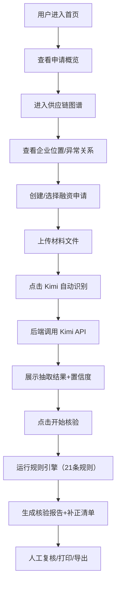

# 链证通：供应链全景与材料智能核验平台 - 需求文档

> 版本：v1.0（基于实际代码实现状态编写）
> 更新日期：2026-06-23
> 文档状态：反映当前项目实际实现

---

## 1. 产品概述

### 1.1 产品定位

链证通是一个面向银行供应链金融业务场景的 Web 系统，用于辅助客户经理开展供应链关系识别、应收账款真实性核验和融资申请材料智能预审。

- **目标用户**：银行客户经理、供应链金融业务人员
- **核心价值**：通过 AI 智能材料识别、规则引擎自动核验和供应链图谱可视化，将单笔融资申请审核时间从数小时缩短至分钟级，降低人为错误率
- **市场定位**：供应链金融辅助决策工具，不直接做授信决策，仅提供核验支持

### 1.2 核心目标

1. **全流程覆盖**：从材料上传 → AI 识别 → 规则核验 → 报告生成的端到端流程
2. **智能化预审**：基于 Kimi AI 自动识别材料类型、抽取关键字段、评估置信度
3. **可视化分析**：供应链关系图谱，自动标记异常关系
4. **规则自动核验**：21 条业务规则自动执行，覆盖应收账款真实性、材料完整性、图谱异常

---

## 2. 系统功能模块

系统包括四个核心模块：

| 模块 | 功能描述 | 实现状态 |
|------|----------|----------|
| 供应链关系图谱系统 | 展示企业间关系、识别企业链条位置、发现异常关系 | ✅ 已实现 |
| 应收账款真实性辅助核验系统 | 核验交易主体一致性、金额一致性、日期顺序合理性 | ✅ 已实现 |
| 供应链金融材料智能预审系统 | 材料完整性检查、字段一致性核验、补正清单生成 | ✅ 已实现 |
| Kimi 文档识别与字段抽取中台 | 材料类型识别、结构化字段抽取、置信度评估 | ✅ 已实现 |

### 2.1 用户角色

| 角色 | 核心权限 |
|------|----------|
| 客户经理 | 查看供应链图谱、创建融资申请、上传材料、触发 Kimi 识别、查看核验报告 |
| 业务主管 | 客户经理权限 + 查看高风险申请、审核异常报告 |

> 注：当前版本暂未实现登录权限系统，所有功能对所有用户开放。

---

## 3. 功能需求详述

### 3.1 数据看板（Dashboard）

**需求描述**：首页提供供应链金融业务的全局数据概览。

**功能点**：

| 功能 | 描述 | 实现位置 |
|------|------|----------|
| 统计卡片 | 展示企业总数、融资申请总数、待预审申请数、高风险申请数、材料缺失申请数 | `SummaryCards.tsx` |
| 最近核验记录 | 展示最近 10 条核验记录，包含申请编号、核验规则、结果、时间 | `Dashboard.tsx` |
| 融资申请列表 | 展示最近 5 条融资申请，含申请编号、金额、状态 | `Dashboard.tsx` |
| 风险趋势图表 | 近 30 天高风险申请趋势折线图 | `RiskTrendChart.tsx` |

**数据接口**：

```
GET /api/dashboard/summary -> DashboardSummary
```

返回数据包含：`enterprise_count`、`application_count`、`pending_count`、`high_risk_count`、`material_missing_count`、`recent_verifications[]`、`risk_trend[]`。

---

### 3.2 供应链关系图谱

**需求描述**：以可视化图谱展示企业间供应链关系，支持交互和异常标记。

**功能点**：

| 功能 | 描述 | 实现位置 |
|------|------|----------|
| 关系图谱展示 | ECharts graph 展示企业关系，节点大小代表交易金额，颜色代表企业角色 | `SupplyChainGraph.tsx` |
| 企业详情面板 | 点击节点展示企业详情卡片和关联关系列表 | `EnterpriseDetailPanel.tsx` |
| 异常关系标记 | 异常关系（循环交易等）以红色虚线标记 | `SupplyChainGraph.tsx` |
| 申请企业高亮 | 申请企业节点高亮显示 | `SupplyChainGraph.tsx` |
| 筛选控制 | 支持按企业角色、风险等级、关系类型筛选 | `GraphPage.tsx` |

**数据接口**：

```
GET /api/graph -> GraphData（nodes, links, categories）
GET /api/graph/abnormal -> GraphLink[]（仅异常关系）
```

**图谱异常检测规则**（4 条）：

| 规则代码 | 规则名称 | 逻辑描述 | 严重程度 |
|----------|----------|----------|----------|
| R-GRAPH-001 | 短期新增交易方异常 | 近 90 天新增交易方 | warning |
| R-GRAPH-002 | 循环交易异常 | 存在 A→B→C→A 的闭环关系（DFS 检测，最大深度 5） | critical |
| R-GRAPH-003 | 关联交易过密 | 关联交易金额占比 > 50% 或关联方 ≥ 3 | warning/high |
| R-GRAPH-004 | 边缘节点融资异常 | 申请企业度数 ≤ 1 | warning |

---

### 3.3 融资申请管理

**需求描述**：管理融资申请的创建、查看、状态流转。

**功能点**：

| 功能 | 描述 | 实现位置 |
|------|------|----------|
| 申请列表 | 展示申请编号、申请企业、核心企业、融资类型、申请金额、状态、风险等级 | `ApplicationListPage.tsx` |
| 申请详情 | 基本信息、申请企业信息、核心企业信息、材料列表、抽取字段、核验结果 | `ApplicationDetailPage.tsx` |
| 性能优化 | 详情页并行获取所有文档的提取字段（Promise.all） | `ApplicationDetailPage.tsx` |

**性能要求**：

- 详情页加载时间不随文档数量线性增长
- 所有文档的提取字段请求并行发起，单个请求失败不影响整体

**数据接口**：

```
GET /api/applications -> FinancingApplication[]
POST /api/applications -> FinancingApplication
GET /api/applications/{id} -> FinancingApplication
PUT /api/applications/{id} -> FinancingApplication
DELETE /api/applications/{id} -> void
```

---

### 3.4 材料上传与 Kimi 识别

**需求描述**：上传融资材料文件，调用 Kimi AI 自动识别材料类型并抽取结构化字段。

**功能点**：

| 功能 | 描述 | 实现位置 |
|------|------|----------|
| 文件上传 | 拖拽上传区域，支持多文件，指定材料类型或 Kimi 自动识别 | `DocumentUploader.tsx` |
| 文件列表 | 显示文件名、材料类型、上传状态、Kimi 识别状态、字段抽取状态、置信度 | `UploadedFileList.tsx` |
| 展开详情 | 已识别材料支持展开查看抽取详情（质量徽章、缺失字段、不确定字段） | `UploadedFileList.tsx` |
| 材料类型识别 | Kimi 自动判断材料类型（9 种类型） | `kimi_service.py` |
| 字段抽取 | Kimi 抽取结构化字段，按材料类型提供差异化抽取指导 | `kimi_service.py` |
| 置信度评估 | 基于核心字段计算加权平均置信度，自动标记低置信度字段 | `kimi_service.py` |
| 质量评估 | 评估整体抽取质量等级（优质/良好/一般/需复核），生成预警 | `kimi_service.py` |

**Kimi 识别的材料类型**（9 种）：

| 类型代码 | 类型名称 | 重点抽取字段 |
|----------|----------|--------------|
| contract | 合同 | seller_name, buyer_name, contract_no, amount, sign_date |
| invoice | 发票 | invoice_no, amount, tax_amount, total_amount, invoice_date |
| order | 订单 | order_no, amount, goods_name, quantity, unit_price |
| logistics | 物流单据 | logistics_no, delivery_date, goods_name |
| acceptance | 验收单 | acceptance_no, acceptance_date, goods_name |
| payment_confirmation | 付款确认 | payer_name, payee_name, amount, payment_due_date |
| business_license | 营业执照 | document_title, seller_credit_code |
| bank_statement | 银行流水 | bank_account, amount |
| other | 其他 | 尽可能抽取所有相关字段 |

**置信度评估机制**：

- 核心字段（seller_name, buyer_name, amount, total_amount, contract_no, invoice_no, order_no, sign_date, invoice_date, order_date, goods_name）参与加权平均
- 字段置信度 < 0.7 自动归入 `uncertain_fields`
- 缺失字段自动归入 `missing_fields`
- 整体置信度 < 0.6 触发"建议人工复核"预警

**质量等级判定**：

| 等级 | 条件 | 颜色 |
|------|------|------|
| 优质（high） | confidence ≥ 0.8 且 missing ≤ 2 且 uncertain ≤ 2 | 绿色 |
| 良好（medium） | confidence ≥ 0.6 且 missing ≤ 5 | 蓝色/黄色 |
| 需复核（low） | confidence < 0.6 或 missing > 5 | 红色 |

**数据接口**：

```
POST /api/documents/upload -> Document
GET /api/documents/{id} -> Document
GET /api/documents/application/{application_id} -> Document[]
POST /api/documents/{document_id}/classify-by-kimi -> { document_type, confidence }
POST /api/documents/{document_id}/extract-by-kimi -> ExtractedField
POST /api/documents/{document_id}/auto-extract -> ExtractedField
GET /api/documents/{document_id}/extracted-fields -> ExtractedField
```

---

### 3.5 智能材料预审结果展示

**需求描述**：在申请详情页和上传页展示 Kimi 抽取结果，包括汇总统计和单材料详情。

**功能点**：

| 功能 | 描述 | 实现位置 |
|------|------|----------|
| 汇总统计面板 | 展示已抽取材料数、平均置信度、高置信度数、低置信度数 | `ExtractionSummary.tsx` |
| 单材料详情卡片 | 展示已识别字段（网格布局）、缺失字段（红色标签）、不确定字段（黄色标签） | `ExtractedFieldDetail.tsx` |
| 质量等级徽章 | 快速标识抽取质量（优质/良好/一般/需复核） | `ExtractionQualityBadge.tsx` |
| 置信度颜色分级 | ≥0.9 绿色、≥0.75 黄色、<0.75 红色 | `ExtractedFieldDetail.tsx` |

---

### 3.6 规则自动核验引擎

**需求描述**：内置业务规则引擎，自动执行核验并生成结果。

**功能点**：

| 功能 | 描述 | 实现位置 |
|------|------|----------|
| 规则执行入口 | 按申请执行全部规则，返回核验结果列表 | `verification_service.py` |
| 应收账款规则 | 10 条规则，覆盖主体一致性、金额一致性、日期顺序等 | `receivable_rules.py` |
| 材料完整性规则 | 5 条规则，覆盖材料完整性、企业名称一致性等 | `material_rules.py` |
| 图谱异常规则 | 4 条规则，覆盖循环交易、关联交易过密等 | `graph_rules.py` |
| 核验结果展示 | 表格展示规则代码、名称、结果、严重程度、描述、建议 | `VerificationResultTable.tsx` |

**应收账款真实性规则**（10 条）：

| 规则代码 | 规则名称 | 逻辑描述 | 严重程度 |
|----------|----------|----------|----------|
| R-AR-001 | 主体一致性 | 各材料中卖方/买方名称是否一致 | warning |
| R-AR-002 | 金额一致性 | 不同材料金额差异 > 5% | warning |
| R-AR-003 | 日期顺序 | 订单 ≤ 合同 ≤ 发票 ≤ 物流 ≤ 验收 | fail |
| R-AR-004 | 重复发票 | 同一发票号在多个材料中出现 | critical |
| R-AR-005 | 账期异常 | 付款到期日 - 发票日期 > 180 天 | warning |
| R-AR-006 | 货品一致性 | 各材料货品名称/数量是否一致 | warning |
| R-AR-007 | 付款主体异常 | 付款方与买方不一致 | high |
| R-AR-008 | 收款主体异常 | 收款方与卖方不一致 | high |
| R-AR-009 | 物流缺失 | 有合同发票但无物流单据 | warning |
| R-AR-010 | 融资金额超额 | 融资金额 > 应收账款金额 | critical |

**材料完整性规则**（5 条）：

| 规则代码 | 规则名称 | 逻辑描述 | 严重程度 |
|----------|----------|----------|----------|
| R-MAT-001~003 | 材料完整性 | 按融资类型检查必需材料 | warning |
| R-MAT-004 | 企业名称一致性 | 材料中企业名称与申请企业是否一致 | high |
| R-MAT-005 | 信用代码一致性 | 统一社会信用代码是否一致 | high |
| R-MAT-006 | 文件有效期 | 合同签署日期距今 > 3 年 | warning |
| R-MAT-007 | 低置信度预警 | 字段抽取 confidence < 0.75 | warning |

**核验结果类型**：

- `pass`：通过
- `warning`：警告
- `fail`：失败
- `manual_review`：人工复核

**严重程度**：

- `low`：低
- `medium`：中
- `high`：高
- `critical`：严重

**数据接口**：

```
POST /api/applications/{application_id}/verify -> VerificationResult[]
GET /api/applications/{application_id}/verification-results -> VerificationResult[]
```

---

### 3.7 核验报告生成

**需求描述**：核验完成后自动生成结构化报告，支持打印和导出。

**功能点**：

| 功能 | 描述 | 实现位置 |
|------|------|----------|
| 报告生成 | 整合核验结果、计算材料完整度、确定风险等级、生成补正清单 | `report_service.py` |
| 报告预览 | 分段展示报告内容（结论、统计、完整度、字段比对、异常提示、补正清单、建议） | `ReportPreview.tsx` |
| 补正清单 | 列出需补充或修正的材料和字段 | `SupplementList.tsx` |
| 打印报告 | 调用浏览器打印功能 | `ReportPage.tsx` |
| 导出 HTML | 生成独立 HTML 文件下载 | `ReportPage.tsx` |

**报告内容结构**：

| 报告段 | 内容 |
|--------|------|
| 核验结论 | 核验通过 / 需补充材料 / 核验存在风险 / 核验不通过 |
| 申请信息 | 申请企业、核心企业、融资类型、申请金额 |
| 核验统计 | 通过数、警告数、失败数、总规则数 |
| 材料完整度 | 百分比评分 + 进度条（含质量加分） |
| 核心字段比对 | 按材料类型分组展示字段值和置信度 |
| 异常提示 | 按严重程度标记的异常项列表 |
| 补正清单 | 材料类型、字段名、原因、建议 |
| 处理建议 | 基于结论和风险等级的差异化建议 |

**风险等级判定逻辑**：

| 结论 | 条件 | 风险等级 |
|------|------|----------|
| 核验不通过 | fail > 0 或 critical > 0 | 极高 |
| 核验存在风险 | high > 1 或 warning > 3 | 高 |
| 需补充材料 | warning > 1 或完整度 < 80% | 中 |
| 核验通过 | 其他 | 低 |

**材料完整度计算**：

- 基础分 = (已有必需材料数 / 必需材料数) × 100
- 质量加分：Kimi 成功抽取 +3/份，人工录入 +2/份
- 最终分 = min(100, 基础分 + 质量加分)

**补正清单生成来源**：

1. 缺失的必需材料（按融资类型）
2. 核验结果中 warning 项的建议
3. 抽取字段中缺失的字段
4. 抽取字段中不确定的字段（低置信度）

**数据接口**：

```
GET /api/applications/{application_id}/report -> VerificationReport
```

---

## 4. 核心业务流程

### 4.1 完整演示流程



### 4.2 技术约束

- **禁止使用** PaddleOCR、本地 OCR 模型
- **禁止**前端直接调用 Kimi API
- **必须**将 Kimi API Key 放在后端环境变量中
- 材料识别和字段抽取全部通过后端调用 Kimi API 完成

---

## 5. 数据模型

### 5.1 核心实体

| 实体名称 | 说明 | 主要字段 |
|----------|------|----------|
| Enterprise | 企业表 | id, name, credit_code, enterprise_type, role_type, risk_level |
| SupplyChainRelation | 供应链关系表 | id, source_enterprise_id, target_enterprise_id, relation_type, amount, is_abnormal |
| FinancingApplication | 融资申请表 | id, application_no, applicant_enterprise_id, core_enterprise_id, financing_type, status |
| Document | 材料文件表 | id, application_id, file_name, document_type, kimi_extract_status |
| ExtractedField | 抽取字段表 | id, document_id, seller_name, buyer_name, amount, confidence, missing_fields, uncertain_fields |
| VerificationResult | 核验结果表 | id, application_id, rule_code, result, severity |

### 5.2 枚举值定义

**企业类型 (enterprise_type)**：
core_company（核心企业）、supplier（供应商）、dealer（经销商）、logistics（物流企业）、payer（付款方）、payee（收款方）

**融资类型 (financing_type)**：
factoring（保理）、receivable_pledge（应收账款质押）、order_financing（订单融资）、inventory_financing（存货融资）

**申请状态 (status)**：
draft（草稿）、submitted（已提交）、reviewing（审核中）、need_supplement（需补充材料）、passed（通过）、rejected（拒绝）

**材料类型 (document_type)**：
contract（合同）、invoice（发票）、order（订单）、logistics（物流单据）、acceptance（验收单）、payment_confirmation（付款确认）、business_license（营业执照）、bank_statement（银行流水）、other（其他）

---

## 6. 技术架构

### 6.1 技术栈

**前端**：React 18 + TypeScript + Vite + Tailwind CSS + Apache ECharts + Axios + React Router

**后端**：Python 3.10+ + FastAPI + SQLModel + SQLite + OpenAI SDK（Kimi API）

### 6.2 架构分层

```
前端层（React） → 后端路由层（FastAPI Router） → 服务层（Service） → 数据层（SQLModel + SQLite）
                                          ↓
                                    Kimi API（外部服务）
```

### 6.3 前端路由

| 路由 | 页面组件 | 用途 |
|------|----------|------|
| `/` | Dashboard | 首页概览 |
| `/graph` | GraphPage | 供应链图谱 |
| `/applications` | ApplicationListPage | 融资申请列表 |
| `/applications/:id` | ApplicationDetailPage | 融资申请详情 |
| `/upload` | UploadPage | 材料上传 |
| `/report/:id` | ReportPage | 核验报告 |
| `/enterprises` | EnterpriseListPage | 企业库 |

### 6.4 后端 API 路由

| 路由前缀 | 路由文件 | 用途 |
|----------|----------|------|
| `/api/enterprises` | enterprise_router.py | 企业管理 |
| `/api/graph` | graph_router.py | 图谱数据 |
| `/api/applications` | application_router.py | 融资申请 |
| `/api/documents` | document_router.py | 文件管理 |
| `/api/dashboard` | dashboard_router.py | 首页数据 |

---

## 7. 演示数据要求

### 7.1 企业数据

- 至少 100 家企业，包括：5 家核心企业、25 家一级供应商、35 家二级供应商、15 家经销商、10 家物流企业、10 家付款方或收款方

### 7.2 关系数据

- 至少 150 条供应链关系，包括：supply（供应）、logistics（物流）、payment（付款）、receivable（应收账款）、related_party（关联方）

### 7.3 融资申请数据

- 至少 10 个融资申请，其中：3 个正常申请、4 个材料缺失申请、2 个主体不一致申请、1 个重复发票或循环交易异常申请

---

## 8. 环境配置

### 8.1 后端环境变量

```env
MOONSHOT_API_KEY=your_kimi_api_key
MOONSHOT_BASE_URL=https://api.moonshot.cn/v1
KIMI_MODEL=kimi-k2.6
DATABASE_URL=sqlite:///./app.db
UPLOAD_DIR=./app/uploads
```

### 8.2 启动命令

**后端**：
```bash
cd backend
pip install -r requirements.txt
cp .env.example .env  # 填入 Kimi API Key
python seed.py        # 初始化数据库并生成演示数据
python run.py         # 启动服务 http://localhost:8000
```

**前端**：
```bash
cd frontend
npm install
npm run dev           # 启动服务 http://localhost:5173
```

---

## 9. 暂不实现功能

- 登录权限系统
- 真实银行接口
- Neo4j 图数据库
- PaddleOCR / 本地 OCR
- 复杂权限系统
- 真实授信审批系统

---

## 10. 实现状态总结

| 任务 | 描述 | 状态 |
|------|------|------|
| Task 1 | 前端性能优化 - 并行获取提取字段 | ✅ 已完成 |
| Task 2 | 后端规则引擎完善（21 条规则） | ✅ 已完成 |
| Task 3 | 供应链关系图谱增强 | ✅ 已完成 |
| Task 4 | 智能材料预审与字段抽取 | ✅ 已完成 |
| Task 5 | 核验报告生成 | ✅ 已完成（代码已实现） |
| Task 6 | 数据看板与首页优化 | ✅ 已完成 |

> 注：Task 5（核验报告生成）在 tasks.md 中标记为未完成，但经代码审查，`report_service.py`、`ReportPage.tsx`、`ReportPreview.tsx`、`SupplementList.tsx` 均已完整实现，包括报告生成、分段展示、补正清单、打印和导出功能。建议更新 tasks.md 将其标记为已完成。
