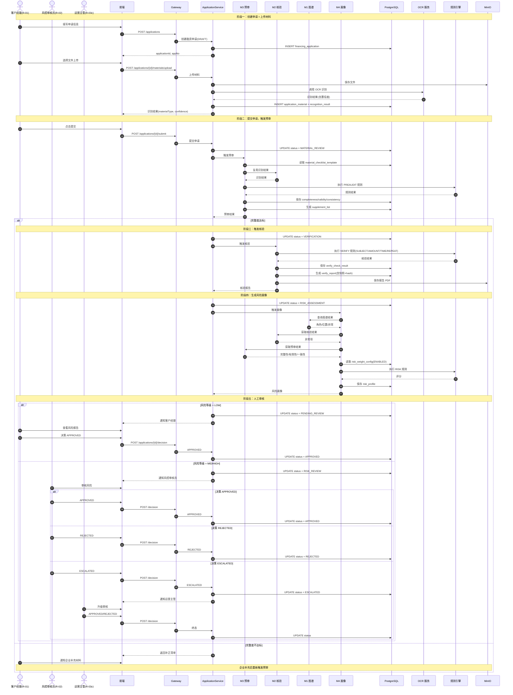
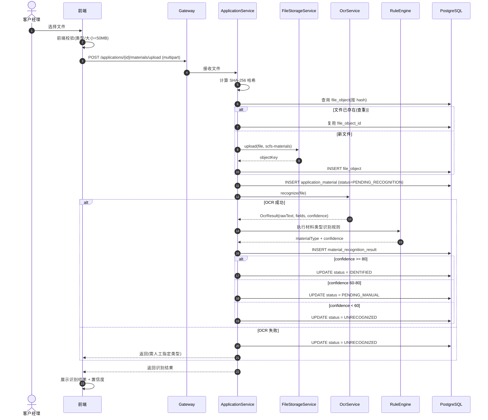
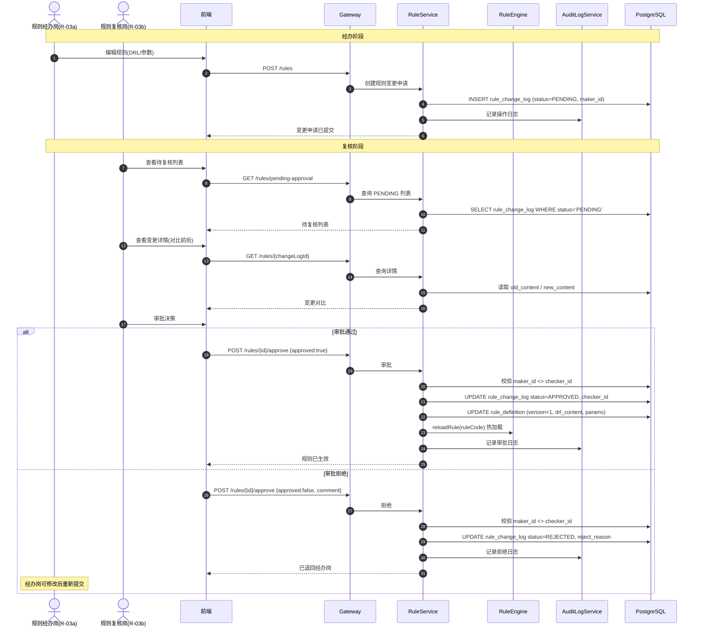
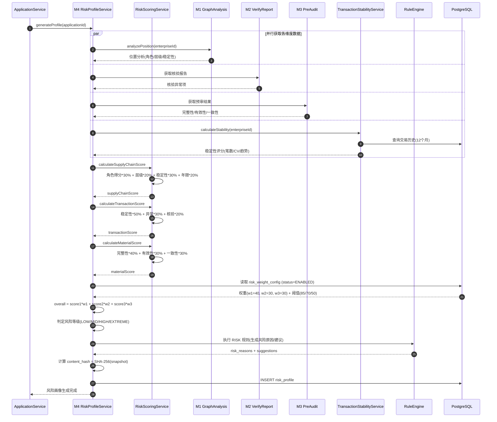
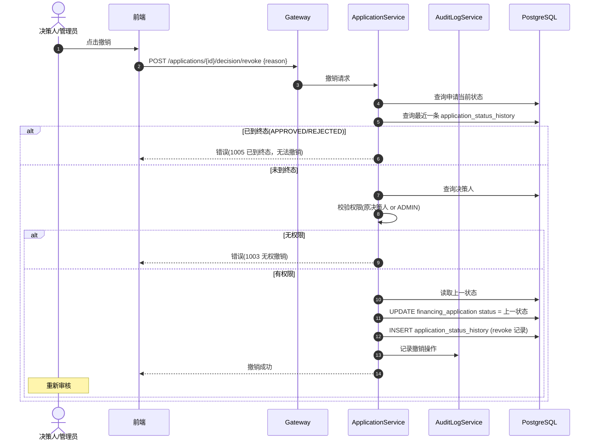
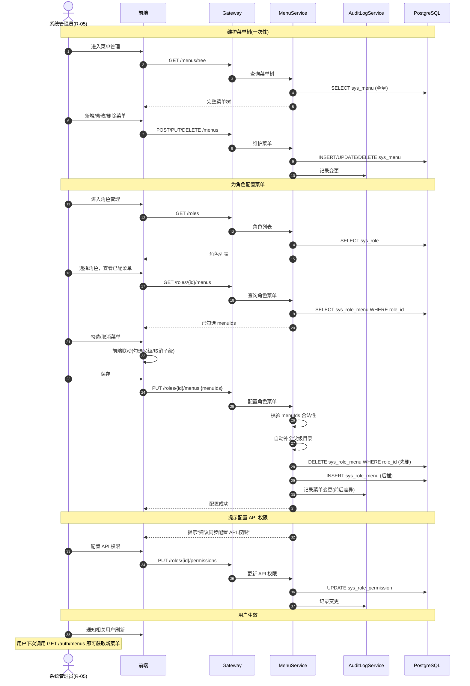
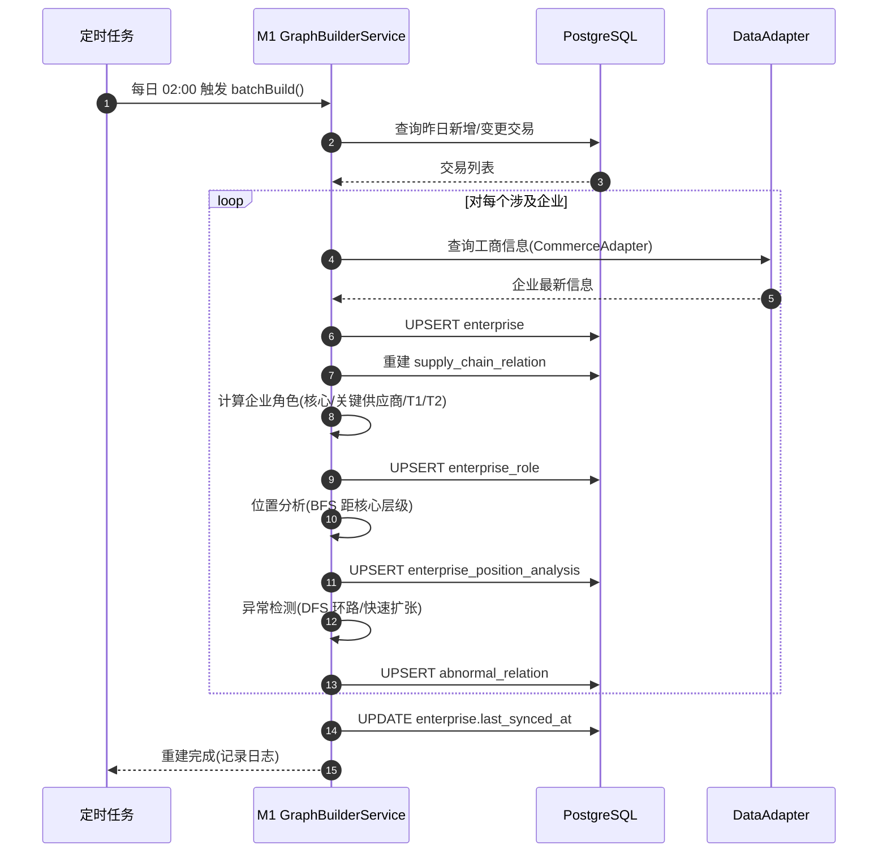

# 供应链金融智能风控与尽调辅助平台 技术设计文档 (RFC)

| 项 | 内容 |
|----|------|
| 文档名称 | 供应链金融智能风控与尽调辅助平台 RFC |
| 文档版本 | V1.2 |
| 编写日期 | 2026-08-14 |
| 关联文档 | [PRD](../prd/scfs_platform_prd.md) |

---

## 目录

1. [架构设计](#1-架构设计)
2. [数据模型设计](#2-数据模型设计)
3. [API 设计](#3-api-设计)
4. [模块详细设计](#4-模块详细设计)
5. [关键流程时序图](#5-关键流程时序图)
6. [实现步骤](#6-实现步骤)
7. [测试策略](#7-测试策略)

---

## 1. 架构设计

### 1.1 As-Is 分析

- **现状**：无现有系统，全新建设
- **痛点**：见 PRD 1.1 五大痛点
- **相关代码路径**：无（新建项目 `scfs_support`）

### 1.2 Target State — 目标架构

#### 架构分层

```
┌──────────────────────────────────────────────────────────────┐
│ 前端层 (React 18 + Ant Design Pro 5 + UmiJS)                │
│  ┌─────────┬─────────┬─────────┬─────────┬─────────┐         │
│  │工作台    │图谱可视化│审核中心  │规则配置  │审计查询 │         │
│  └─────────┴─────────┴─────────┴─────────┴─────────┘         │
└──────────────────────────────────────────────────────────────┘
                       ↕ REST + JWT
┌──────────────────────────────────────────────────────────────┐
│ API 网关层 (Spring Cloud Gateway)                            │
│ 鉴权 / 路由 / 限流 / 访问日志                                  │
└──────────────────────────────────────────────────────────────┘
                       ↕
┌──────────────────────────────────────────────────────────────┐
│ 业务模块层 (Spring Boot 3.x 单体, 4 模块独立分包)             │
│  ┌─────────┬─────────┬─────────┬─────────┐                    │
│  │ M1 图谱  │ M2 核验  │ M3 预审  │ M4 画像  │                    │
│  │module-  │module-  │module-  │module-  │                    │
│  │graph    │verify   │preaudit │risk     │                    │
│  └─────────┴─────────┴─────────┴─────────┘                    │
└──────────────────────────────────────────────────────────────┘
                       ↕ 显式 interface Bean
┌──────────────────────────────────────────────────────────────┐
│ 共享服务层 (common module)                                    │
│ OCR / 文件存储 / 用户权限 / 审计日志 / 规则引擎(Drools)       │
└──────────────────────────────────────────────────────────────┘
                       ↕ DataAdapter 抽象接口
┌──────────────────────────────────────────────────────────────┐
│ 数据接入层 (DataAdapter 抽象接口 + Mock 实现)                 │
│ TaxAdapter / CommerceAdapter / LogisticsAdapter / CifAdapter │
└──────────────────────────────────────────────────────────────┘
                       ↕
┌──────────────────────────────────────────────────────────────┐
│ 存储层                                                        │
│ PostgreSQL 15 (4 schema) / Redis 7 / MinIO (S3 兼容)         │
└──────────────────────────────────────────────────────────────┘
```

#### 模块边界与依赖

```
common (共享服务)
   ↑
   │ interface Bean 调用
   │
M1 graph ─────────────────────────┐
                                 │
M2 verify ──── 依赖 M1 ──────────→│
                                 │
M3 preaudit ── 依赖 M2 ─────────→│ 聚合
                                 │
M4 risk ────── 依赖 M1+M2+M3 ───→│
```

#### 模块职责

| 模块 | Maven artifactId | 职责 | 对外接口（interface Bean） |
|------|-----------------|------|--------------------------|
| M1 图谱 | `scfs-module-graph` | 供应链关系图谱构建、角色识别、位置分析、异常关系识别 | `GraphQueryService` / `GraphAnalysisService` |
| M2 核验 | `scfs-module-verify` | 材料信息识别、多材料交叉核验、报告生成 | `MaterialRecognizeService` / `VerifyReportService` |
| M3 预审 | `scfs-module-preaudit` | 材料类型识别、完整性/有效性/一致性检查、补正清单 | `PreAuditService` / `SupplementListService` |
| M4 画像 | `scfs-module-risk` | 风险画像聚合、风险评分、风险等级输出 | `RiskProfileService` |
| common | `scfs-common` | OCR、文件存储、权限、审计、规则引擎、数据接入 | `OcrService` / `FileStorageService` / `DataAdapter` 等 |

#### 关键约束

| 编号 | 约束 | 说明 |
|------|------|------|
| C-01 | 模块间通过 Spring `interface` Bean 调用 | 禁止跨模块直接访问 Repository，为未来微服务拆分零改动 |
| C-02 | 业务模块不直接访问外部数据源 | 必须通过 `common` 层的 `DataAdapter` 抽象 |
| C-03 | 外部数据源一期全部 Mock | Adapter 接口与 Mock 实现分离，二期切换真实接口零业务代码改动 |
| C-04 | 规则全部通过 Drools 引擎执行 | 硬编码规则仅限 Drools 无法覆盖的算法（如环路检测） |
| C-05 | 前端不直接调用业务模块 | 必须经过 Gateway 路由 |
| C-06 | 规则变更遵循双岗机制 | R-03a 经办 → R-03b 复核，同一人不可兼岗 |

### 1.3 部署拓扑

#### Docker Compose 容器（单机）

| 容器名 | 镜像 | 端口 | 作用 | 依赖 |
|-------|------|------|------|------|
| `scfs-app` | 自构建 openjdk:17-slim | 8080 | 后端业务应用 | postgres, redis, minio, mock-server |
| `scfs-frontend` | nginx:alpine + React 构建产物 | 80 | 前端静态托管 + 反向代理 | scfs-app |
| `scfs-postgres` | postgres:15 | 5432 | 业务数据库（4 schema） | - |
| `scfs-redis` | redis:7-alpine | 6379 | 缓存 / 会话 | - |
| `scfs-minio` | minio/minio | 9000, 9001 | 文件存储（S3 兼容） | - |
| `scfs-mock` | 自构建 python:3.11-slim | 9002 | Mock 外部数据源 | - |
| `scfs-ocr` | Python + PaddleOCR | 9003 | PDF/图片文字、置信度、坐标框及页码识别 | - |

后端镜像采用 Maven 多阶段构建：构建阶段复制完整多模块源码并执行 `mvn clean package -DskipTests`，运行阶段仅复制新生成的 `scfs-app.jar`。禁止仅复制宿主机已有 `target/scfs-app.jar`，否则 `docker compose up --build` 可能运行旧接口代码。

#### 启动顺序

```
postgres → redis → minio → mock-server → app → frontend
```

#### 数据卷

| 卷名 | 挂载 | 用途 |
|------|------|------|
| `pg-data` | /var/lib/postgresql/data | PG 数据持久化 |
| `minio-data` | /data | MinIO 文件持久化 |
| `mock-data` | /app/mock | Mock 数据文件 |

### 1.4 技术选型理由

| 层次 | 选型 | 理由 |
|------|------|------|
| 前端 | React 18 + Ant Design Pro 5 | 企业级中后台开箱即用，组件丰富 |
| 后端框架 | Spring Boot 3.x + Java 17 | 企业级成熟框架，生态完善 |
| 网关 | Spring Cloud Gateway | 与 Spring Boot 无缝集成，反应式高性能 |
| 图谱可视化 | AntV G6 | 蚂蚁开源，支持大规模图谱，与 Ant Design 风格一致 |
| OCR | PaddleOCR | 开源，中文识别率高，本地部署无 API 成本 |
| 规则引擎 | Drools 8 | 成熟的业务规则管理系统，支持规则版本与动态加载 |
| 数据库 | PostgreSQL 15 | 支持 JSONB（结构化材料存储）、图查询能力（pgRouting 辅助环路检测） |
| 文件存储 | MinIO | S3 兼容，本地部署，未来可无缝切换 AWS S3 |
| 缓存 | Redis 7 | 会话管理、热点数据缓存、分布式锁 |
| Mock 服务 | Python + Flask | 轻量，快速模拟外部 REST 接口 |

### 1.5 项目目录结构

```
scfs_support/
├── docs/                          # 文档
│   ├── prd/                       # PRD
│   └── spec/                      # Spec + RFC
├── scfs-backend/                  # 后端 Maven 多模块
│   ├── pom.xml                    # 父 POM
│   ├── scfs-common/               # 共享服务层
│   │   ├── src/main/java/com/scfs/common/
│   │   │   ├── ocr/               # OCR 封装
│   │   │   ├── storage/           # 文件存储
│   │   │   ├── security/          # 权限认证
│   │   │   ├── audit/             # 审计日志
│   │   │   ├── rule/              # Drools 引擎封装
│   │   │   └── adapter/          # 数据接入抽象
│   │   │       ├── DataAdapter.java
│   │   │       ├── TaxAdapter.java
│   │   │       ├── CommerceAdapter.java
│   │   │       ├── LogisticsAdapter.java
│   │   │       ├── CifAdapter.java
│   │   │       └── mock/          # Mock 实现
│   │   └── src/main/resources/
│   ├── scfs-module-graph/         # M1 图谱
│   ├── scfs-module-verify/        # M2 核验
│   ├── scfs-module-preaudit/      # M3 预审
│   ├── scfs-module-risk/          # M4 画像
│   └── scfs-app/                  # 启动模块
│       └── src/main/resources/
│           ├── application.yml
│           └── docker/
├── scfs-frontend/                 # 前端 React
│   ├── src/
│   │   ├── pages/
│   │   │   ├── workspace/         # 工作台
│   │   │   ├── graph/             # 图谱
│   │   │   ├── audit/             # 审核中心
│   │   │   ├── rule/              # 规则配置
│   │   │   └── audit-trail/       # 审计查询
│   │   ├── services/              # API 调用
│   │   └── components/
│   └── package.json
├── scfs-mock-server/              # Mock 外部数据源
│   ├── app.py
│   └── data/                      # Mock 数据 JSON
└── docker-compose.yml             # 部署编排
```

---

## 2. 数据模型设计

### 2.1 数据库 Schema 划分

```
PostgreSQL (scfs_db)
├── schema_common     -- 共享（用户/角色/权限/审计/文件/规则/码值字典）
├── schema_graph       -- M1 图谱
├── schema_verify      -- M2 核验
├── schema_preaudit    -- M3 预审
└── schema_risk        -- M4 画像
```

### 2.2 Schema: schema_common（共享服务）

#### 表 1：sys_user（用户）

| 字段 | 类型 | 约束 | 说明 |
|------|------|------|------|
| id | BIGSERIAL | PK | 主键 |
| username | VARCHAR(64) | UNIQUE NOT NULL | 登录名 |
| password_hash | VARCHAR(128) | NOT NULL | 密码哈希（BCrypt） |
| real_name | VARCHAR(64) | NOT NULL | 真实姓名 |
| role_code | VARCHAR(32) | NOT NULL | 关联 sys_role.role_code |
| email | VARCHAR(128) | | 邮箱 |
| phone | VARCHAR(20) | | 手机号 |
| status | SMALLINT | NOT NULL DEFAULT 1 | 1=启用, 0=禁用 |
| created_at | TIMESTAMP | NOT NULL DEFAULT NOW() | |
| updated_at | TIMESTAMP | NOT NULL DEFAULT NOW() | |

#### 表 2：sys_role（角色定义）

| 字段 | 类型 | 约束 | 说明 |
|------|------|------|------|
| id | BIGSERIAL | PK | |
| role_code | VARCHAR(32) | UNIQUE NOT NULL | 角色编码：RM/RCO/OPS_MAKER/OPS_CHECKER/OPS/AUDIT/ADMIN |
| role_name | VARCHAR(64) | NOT NULL | 角色名称：客户经理/风控审核员/规则经办岗/规则复核岗/运营主管/审计人员/系统管理员 |
| role_type | VARCHAR(16) | NOT NULL | BUSINESS/RISK_CONTROL/CONFIG_MAKER/CONFIG_CHECKER/OPS/AUDIT/SYSTEM |
| description | VARCHAR(255) | | 角色描述 |
| status | SMALLINT | NOT NULL DEFAULT 1 | 1=启用, 0=禁用 |
| created_at | TIMESTAMP | NOT NULL DEFAULT NOW() | |

**索引**：idx_role_code(role_code)

#### 表 3：sys_role_permission（角色 API 权限关联）

| 字段 | 类型 | 约束 | 说明 |
|------|------|------|------|
| id | BIGSERIAL | PK | |
| role_id | BIGINT | NOT NULL | 关联角色 |
| module | VARCHAR(32) | NOT NULL | 模块：GRAPH/VERIFY/PREAUDIT/RISK/RULE/USER/AUDIT |
| permissions | JSONB | NOT NULL | 权限列表 ["view","create","update","delete","export","approve","reject"] |

**索引**：idx_role_perm_role(role_id)
**用途**：控制 API 接口访问权限（与菜单权限独立，作为后端二次校验）

#### 表 3a：sys_menu（菜单定义 — 树形）

| 字段 | 类型 | 约束 | 说明 |
|------|------|------|------|
| id | BIGSERIAL | PK | |
| parent_id | BIGINT | NOT NULL DEFAULT 0 | 父菜单 ID，0=根节点 |
| menu_name | VARCHAR(64) | NOT NULL | 菜单名称 |
| menu_code | VARCHAR(64) | UNIQUE NOT NULL | 菜单编码（唯一标识，如 graph.view） |
| menu_type | VARCHAR(16) | NOT NULL | DIRECTORY（目录）/ MENU（菜单）/ BUTTON（按钮） |
| path | VARCHAR(128) | | 前端路由路径（如 /graph/relations） |
| component | VARCHAR(128) | | 前端组件路径（如 graph/relations） |
| permission | VARCHAR(64) | | 按钮权限标识（如 rule:approve） |
| icon | VARCHAR(64) | | 菜单图标 |
| sort | INT | NOT NULL DEFAULT 0 | 排序值（同级内升序） |
| visible | SMALLINT | NOT NULL DEFAULT 1 | 1=显示, 0=隐藏（隐藏后路由仍可访问） |
| status | SMALLINT | NOT NULL DEFAULT 1 | 1=启用, 0=禁用 |
| created_at | TIMESTAMP | NOT NULL DEFAULT NOW() | |
| updated_at | TIMESTAMP | NOT NULL DEFAULT NOW() | |

**索引**：idx_menu_parent(parent_id), idx_menu_code(menu_code)

#### 表 3b：sys_role_menu（角色-菜单关联）

| 字段 | 类型 | 约束 | 说明 |
|------|------|------|------|
| id | BIGSERIAL | PK | |
| role_id | BIGINT | NOT NULL | 关联角色 |
| menu_id | BIGINT | NOT NULL | 关联菜单（含目录/菜单/按钮） |

**约束**：UNIQUE(role_id, menu_id)
**索引**：idx_role_menu_role(role_id), idx_role_menu_menu(menu_id)

**双层权限说明**：
- 菜单权限（sys_role_menu）：控制前端导航菜单与路由可见性，由 R-05 勾选配置
- API 权限（sys_role_permission）：控制后端接口访问，作为菜单权限的二次防线
- 两者需保持一致：勾选某菜单时，应同时配置对应 API 模块的访问权限

#### 默认菜单树（初始化数据）

```
工作台 (directory: workspace)
├── 我的待办 (menu: workspace.todo, path: /workspace/todo)
└── 运营监控 (menu: workspace.monitor, path: /workspace/monitor)

供应链图谱 (directory: graph)
├── 关系图谱 (menu: graph.relations, path: /graph/relations)
├── 企业角色 (menu: graph.role, path: /graph/role)
├── 位置分析 (menu: graph.position, path: /graph/position)
└── 异常关系 (menu: graph.abnormal, path: /graph/abnormal)

审核中心 (directory: audit)
├── 融资申请 (menu: audit.application, path: /audit/application)
├── 材料管理 (menu: audit.material, path: /audit/material)
├── 核验报告 (menu: audit.verify, path: /audit/verify)
├── 补正清单 (menu: audit.supplement, path: /audit/supplement)
└── 风险画像 (menu: audit.risk, path: /audit/risk)

规则配置 (directory: rule)
├── 规则定义 (menu: rule.definition, path: /rule/definition)
│   └── [按钮] 创建规则 (button: rule:create)
│   └── [按钮] 审批规则 (button: rule:approve)
├── 风险权重 (menu: rule.weight, path: /rule/weight)
│   └── [按钮] 创建权重 (button: weight:create)
│   └── [按钮] 审批权重 (button: weight:approve)
└── 材料模板 (menu: rule.template, path: /rule/template)
└── OCR识别模板 (route: /rule/ocr-template, permission: RULE.view)
    └── [按钮] 创建模板 (button: template:create)
    └── [按钮] 审批模板 (button: template:approve)

审计查询 (directory: audit-trail)
├── 操作日志 (menu: audit-trail.log, path: /audit-trail/log)
└── 流程追溯 (menu: audit-trail.trace, path: /audit-trail/trace)

系统管理 (directory: system)
├── 用户管理 (menu: system.user, path: /system/user)
├── 角色管理 (menu: system.role, path: /system/role)
├── 菜单管理 (menu: system.menu, path: /system/menu)
└── 数据源 (menu: system.datasource, path: /system/datasource)
```

#### 表 4：sys_audit_log（审计日志）

| 字段 | 类型 | 约束 | 说明 |
|------|------|------|------|
| id | BIGSERIAL | PK | |
| user_id | BIGINT | NOT NULL | 操作用户 |
| username | VARCHAR(64) | NOT NULL | 冗余，便于查询 |
| module | VARCHAR(32) | NOT NULL | 模块：GRAPH/VERIFY/PREAUDIT/RISK/RULE/USER |
| action | VARCHAR(64) | NOT NULL | 操作：LOGIN/CREATE/UPDATE/DELETE/EXPORT/APPROVE/REJECT |
| target_type | VARCHAR(32) | | 操作对象类型 |
| target_id | VARCHAR(64) | | 操作对象 ID |
| detail | JSONB | | 操作详情（变更前后） |
| ip_address | VARCHAR(45) | | IP |
| created_at | TIMESTAMP | NOT NULL DEFAULT NOW() | |

**索引**：idx_audit_user(user_id, created_at), idx_audit_target(target_type, target_id), idx_audit_time(created_at)
**分区策略**：按月分区表 sys_audit_log_yyyymm

#### 表 5：file_object（文件对象）

| 字段 | 类型 | 约束 | 说明 |
|------|------|------|------|
| id | BIGSERIAL | PK | |
| file_name | VARCHAR(255) | NOT NULL | 原始文件名 |
| file_type | VARCHAR(32) | NOT NULL | 文件后缀：pdf/jpg/png/docx/xlsx |
| file_size | BIGINT | NOT NULL | 字节 |
| minio_bucket | VARCHAR(64) | NOT NULL | MinIO bucket |
| minio_object_key | VARCHAR(255) | NOT NULL | MinIO 对象 key |
| content_hash | VARCHAR(64) | NOT NULL | SHA-256 内容哈希（用于查重） |
| uploaded_by | BIGINT | NOT NULL | 上传用户 |
| created_at | TIMESTAMP | NOT NULL DEFAULT NOW() | |

**索引**：idx_file_hash(content_hash), idx_file_uploader(uploaded_by)

#### 表 6：rule_definition（规则定义）

| 字段 | 类型 | 约束 | 说明 |
|------|------|------|------|
| id | BIGSERIAL | PK | |
| rule_code | VARCHAR(64) | UNIQUE NOT NULL | 规则编码，如 R_AMOUNT_DIFF |
| rule_name | VARCHAR(128) | NOT NULL | 规则名称 |
| category | VARCHAR(32) | NOT NULL | 分类：VERIFY/PREAUDIT/RISK/GRAPH |
| drl_content | TEXT | NOT NULL | Drools DRL 规则内容 |
| params | JSONB | | 规则参数（如金额阈值、时间窗口） |
| status | SMALLINT | NOT NULL DEFAULT 1 | 1=启用, 0=禁用 |
| version | INT | NOT NULL DEFAULT 1 | 版本号 |
| created_by | BIGINT | NOT NULL | |
| created_at | TIMESTAMP | NOT NULL DEFAULT NOW() | |
| updated_at | TIMESTAMP | NOT NULL DEFAULT NOW() | |

**索引**：idx_rule_category(category, status), idx_rule_code(rule_code)

#### 表 7：rule_change_log（规则变更日志 — 双岗）

| 字段 | 类型 | 约束 | 说明 |
|------|------|------|------|
| id | BIGSERIAL | PK | |
| rule_id | BIGINT | NOT NULL | 关联规则 |
| rule_code | VARCHAR(64) | NOT NULL | 冗余 |
| change_type | VARCHAR(16) | NOT NULL | CREATE/UPDATE/ENABLE/DISABLE |
| old_version | INT | | 旧版本 |
| new_version | INT | NOT NULL | 新版本 |
| old_content | TEXT | | 旧 DRL/参数 |
| new_content | TEXT | | 新 DRL/参数 |
| status | VARCHAR(16) | NOT NULL DEFAULT 'PENDING' | PENDING/APPROVED/REJECTED |
| maker_id | BIGINT | NOT NULL | 经办人 (R-03a) |
| checker_id | BIGINT | | 复核人 (R-03b) |
| checked_at | TIMESTAMP | | 复核时间 |
| reject_reason | TEXT | | 拒绝原因 |
| created_at | TIMESTAMP | NOT NULL DEFAULT NOW() | |

**索引**：idx_rule_change_rule(rule_id), idx_rule_change_status(status), idx_rule_change_checker(checker_id, status)
**约束**：CHECK (maker_id <> checker_id) — 经办与复核不能为同一人

#### 表 8：risk_weight_config（风险权重配置 — 双岗）

| 字段 | 类型 | 约束 | 说明 |
|------|------|------|------|
| id | BIGSERIAL | PK | |
| config_name | VARCHAR(64) | NOT NULL | 配置名称 |
| supply_chain_weight | INT | NOT NULL | 供应链维度权重（0-100） |
| transaction_weight | INT | NOT NULL | 交易维度权重（0-100） |
| material_weight | INT | NOT NULL | 材料维度权重（0-100） |
| low_risk_threshold | INT | NOT NULL DEFAULT 85 | 低风险阈值 |
| mid_risk_threshold | INT | NOT NULL DEFAULT 70 | 中风险阈值 |
| high_risk_threshold | INT | NOT NULL DEFAULT 50 | 高风险阈值 |
| status | VARCHAR(16) | NOT NULL DEFAULT 'PENDING' | PENDING/APPROVED/REJECTED/ENABLED/DISABLED |
| version | INT | NOT NULL DEFAULT 1 | |
| maker_id | BIGINT | NOT NULL | 经办人 (R-03a) |
| checker_id | BIGINT | | 复核人 (R-03b) |
| checked_at | TIMESTAMP | | 复核时间 |
| reject_reason | TEXT | | 拒绝原因 |
| created_at | TIMESTAMP | NOT NULL DEFAULT NOW() | |

**约束**：
- CHECK (supply_chain_weight + transaction_weight + material_weight = 100)
- CHECK (maker_id <> checker_id)

#### 表 8a：code_dictionary（统一码值字典）

| 字段 | 类型 | 约束 | 说明 |
|------|------|------|------|
| id | BIGSERIAL | PK | 主键 |
| code_type | VARCHAR(64) | NOT NULL | 码值类型，如 APPLICATION_STATUS、MATERIAL_TYPE |
| code_key | VARCHAR(128) | UNIQUE NOT NULL | 全局唯一键，格式为“码值类型.原始值”，如 APPLICATION_STATUS.DRAFT |
| code_value | VARCHAR(128) | NOT NULL | 码值中文名称，如“草稿” |
| sort_order | INT | NOT NULL DEFAULT 0 | 同一码值类型内的显示顺序 |
| status | SMALLINT | NOT NULL DEFAULT 1 | 1=启用，0=禁用 |
| description | VARCHAR(255) | | 码值说明 |
| created_at | TIMESTAMP | NOT NULL DEFAULT NOW() | 创建时间 |
| updated_at | TIMESTAMP | NOT NULL DEFAULT NOW() | 更新时间 |

**唯一性与查询约定**：

- `code_key` 全表唯一，使用 `code_type + '.' + 原始码值` 组成，避免 `PENDING`、`APPROVED`、`HIGH` 等跨类型重名冲突。
- 业务表继续保存原始码值。例如 `financing_application.status='DRAFT'`，展示时使用 `APPLICATION_STATUS.DRAFT` 查询中文值“草稿”。
- `code_type` 用于按类型批量加载下拉选项，索引为 `idx_code_dictionary_type(code_type, sort_order)`。
- 初始化数据由 `V4__init_code_dictionary.sql` 写入，并使用 `ON CONFLICT (code_key) DO NOTHING` 保证幂等。

**首期码值范围**：用户角色、角色类型、菜单类型、权限模块与动作、审计动作与对象、文件类型、规则分类与变更类型、双岗状态、业务类型、企业数据源、供应链关系类型、企业角色、影响力与可信度、异常类型与状态、融资申请状态机、材料类型与识别状态、核验类型与结果、报告评估、预审不一致字段、补正状态和风险等级。

### 2.3 Schema: schema_graph（M1 供应链图谱）

#### 表 9：enterprise（企业）

| 字段 | 类型 | 约束 | 说明 |
|------|------|------|------|
| id | BIGSERIAL | PK | 企业客户号，业务表统一通过该字段关联企业 |
| name | VARCHAR(128) | NOT NULL | 企业名称 |
| uscc | VARCHAR(18) | UNIQUE NOT NULL | 统一社会信用代码 |
| industry | VARCHAR(64) | | 所属行业 |
| legal_person | VARCHAR(64) | | 法定代表人 |
| registered_capital | DECIMAL(18,2) | | 注册资本（万元） |
| establish_date | DATE | | 成立日期 |
| address | VARCHAR(255) | | 注册地址 |
| data_source | VARCHAR(16) | NOT NULL DEFAULT 'MOCK' | MOCK/CIF |
| last_synced_at | TIMESTAMP | | 最后同步时间 |
| created_at | TIMESTAMP | NOT NULL DEFAULT NOW() | |
| updated_at | TIMESTAMP | NOT NULL DEFAULT NOW() | |

**索引**：idx_enterprise_uscc(uscc), idx_enterprise_name(name)

#### 表 10：supply_chain_relation（供应链关系）

| 字段 | 类型 | 约束 | 说明 |
|------|------|------|------|
| id | BIGSERIAL | PK | |
| from_enterprise_id | BIGINT | NOT NULL | 上游企业 |
| to_enterprise_id | BIGINT | NOT NULL | 下游企业 |
| relation_type | VARCHAR(16) | NOT NULL | PURCHASE/SUPPLY/CONTRACT/INVOICE/LOGISTICS/FUND |
| first_coop_date | DATE | | 首次合作 |
| last_coop_date | DATE | | 最近合作 |
| total_transactions | INT | DEFAULT 0 | 累计交易笔数 |
| total_amount | DECIMAL(18,2) | DEFAULT 0 | 累计交易金额 |
| core_enterprise_id | BIGINT | | 所属核心企业 |
| level | INT | NOT NULL DEFAULT 1 | 层级（1=一级, 2=二级） |
| created_at | TIMESTAMP | NOT NULL DEFAULT NOW() | |
| updated_at | TIMESTAMP | NOT NULL DEFAULT NOW() | |

**约束**：UNIQUE(from_enterprise_id, to_enterprise_id, relation_type)
**索引**：idx_relation_from(from_enterprise_id), idx_relation_to(to_enterprise_id), idx_relation_core(core_enterprise_id), idx_relation_type(relation_type)

#### 表 11：enterprise_role（企业角色识别结果）

| 字段 | 类型 | 约束 | 说明 |
|------|------|------|------|
| id | BIGSERIAL | PK | |
| enterprise_id | BIGINT | NOT NULL | |
| role | VARCHAR(32) | NOT NULL | CORE/KEY_SUPPLIER/TIER1/TIER2/NORMAL/EDGE |
| core_enterprise_id | BIGINT | | 关联核心企业 |
| coop_duration_years | DECIMAL(5,1) | | 合作年限 |
| coop_enterprise_count | INT | | 合作企业数 |
| influence_level | VARCHAR(8) | NOT NULL | HIGH/MID/LOW |
| credibility_level | VARCHAR(8) | NOT NULL | HIGH/MID/LOW |
| calculated_at | TIMESTAMP | NOT NULL DEFAULT NOW() | 计算时间 |
| created_at | TIMESTAMP | NOT NULL DEFAULT NOW() | |

**索引**：idx_role_enterprise(enterprise_id), idx_role_core(core_enterprise_id)

#### 表 12：enterprise_position_analysis（企业位置分析结果）

| 字段 | 类型 | 约束 | 说明 |
|------|------|------|------|
| id | BIGSERIAL | PK | |
| enterprise_id | BIGINT | NOT NULL | |
| in_core_chain | BOOLEAN | NOT NULL | 是否在核心企业体系 |
| distance_to_core | INT | | 距核心企业层级 |
| upstream_stable | BOOLEAN | | 上游稳定 |
| downstream_stable | BOOLEAN | | 下游稳定 |
| credibility | VARCHAR(8) | NOT NULL | HIGH/MID/LOW/INSUFFICIENT |
| credibility_reason | TEXT | | 评价依据 |
| calculated_at | TIMESTAMP | NOT NULL DEFAULT NOW() | |

**索引**：idx_position_enterprise(enterprise_id)

#### 表 13：abnormal_relation（异常关系预警）

| 字段 | 类型 | 约束 | 说明 |
|------|------|------|------|
| id | BIGSERIAL | PK | |
| enterprise_id | BIGINT | NOT NULL | |
| abnormal_type | VARCHAR(32) | NOT NULL | RAPID_EXPANSION/CIRCULAR/RELATED_PARTY |
| severity | VARCHAR(8) | NOT NULL | HIGH/MID/LOW |
| description | TEXT | NOT NULL | 预警描述 |
| evidence | JSONB | | 证据（环路路径/关联企业/增长率等） |
| status | VARCHAR(16) | NOT NULL DEFAULT 'OPEN' | OPEN/CONFIRMED/DISMISSED |
| detected_at | TIMESTAMP | NOT NULL DEFAULT NOW() | |
| created_at | TIMESTAMP | NOT NULL DEFAULT NOW() | |

**索引**：idx_abnormal_enterprise(enterprise_id, abnormal_type), idx_abnormal_status(status)

### 2.4 Schema: schema_verify（M2 真实性核验）

#### 表 14：financing_application（融资申请）

| 字段 | 类型 | 约束 | 说明 |
|------|------|------|------|
| id | BIGSERIAL | PK | |
| app_no | VARCHAR(32) | UNIQUE NOT NULL | 申请编号 APP-yyyymmdd-xxxx |
| enterprise_id | BIGINT | NOT NULL | 融资企业 |
| buyer_enterprise_id | BIGINT | FK → schema_graph.enterprise(id), NOT NULL | 买方客户号（直接使用 enterprise.id） |
| seller_enterprise_id | BIGINT | FK → schema_graph.enterprise(id), NOT NULL | 卖方客户号（直接使用 enterprise.id，亦为融资企业） |
| business_type | VARCHAR(32) | NOT NULL | AR_FINANCING/FACTORING/ORDER_FINANCING |
| financing_amount | DECIMAL(18,2) | NOT NULL | 融资金额 |
| submitted_by | BIGINT | NOT NULL | 提交人（客户经理） |
| status | VARCHAR(32) | NOT NULL DEFAULT 'DRAFT' | 状态机 9 状态 |
| current_handler | BIGINT | | 当前处理人 |
| submitted_at | TIMESTAMP | | 提交时间 |
| approved_at | TIMESTAMP | | 审批完成时间 |
| version | INT | NOT NULL DEFAULT 0 | 乐观锁版本号 |
| created_at | TIMESTAMP | NOT NULL DEFAULT NOW() | |
| updated_at | TIMESTAMP | NOT NULL DEFAULT NOW() | |

融资申请不另设客户号字段，统一以 `schema_graph.enterprise.id` 作为客户号。新增申请时，买方和卖方必须存在于企业表，且双方须在 `supply_chain_relation.from_enterprise_id/to_enterprise_id` 中存在直接关系。列表中的买卖方名称通过上述企业 ID 实时关联 `enterprise.name` 展示。

**外键**：fk_application_buyer_enterprise(buyer_enterprise_id) → schema_graph.enterprise(id)，fk_application_seller_enterprise(seller_enterprise_id) → schema_graph.enterprise(id)

**索引**：idx_app_no(app_no), idx_app_enterprise(enterprise_id), idx_app_status(status), idx_app_buyer_enterprise(buyer_enterprise_id), idx_app_seller_enterprise(seller_enterprise_id)

**迁移归属**：V1 创建融资申请基础表；V5 集中完成买卖方客户号字段新增、历史数据回填、非空约束、企业外键及买卖方索引。V5 不重复 V1 的建表及既有字段、索引语句。

客户维护直接写入 `schema_graph.enterprise`，贸易关系维护写入 `schema_graph.supply_chain_relation`，本轮不新增客户或关系表。V6 将文档列出的演示账号密码统一为 `admin123`；V7 清理只有数据库元数据、没有 MinIO 对象的演示 file_object、application_material 及 recognition 记录，避免暴露不可预览/下载的悬空数据；V9 规范化规则 DRL 换行。

#### 表 15：application_status_history（申请状态流转历史）

| 字段 | 类型 | 约束 | 说明 |
|------|------|------|------|
| id | BIGSERIAL | PK | |
| application_id | BIGINT | NOT NULL | |
| from_status | VARCHAR(32) | | 原状态 |
| to_status | VARCHAR(32) | NOT NULL | 新状态 |
| operator_id | BIGINT | NOT NULL | 操作人 |
| remark | TEXT | | 备注（判定理由、撤销原因等） |
| created_at | TIMESTAMP | NOT NULL DEFAULT NOW() | |

**索引**：idx_status_history_app(application_id, created_at)
**保留理由**：融资申请业务状态流转专用，含判定理由字段；区别于通用审计日志，客户经理查某笔申请的完整流转历程。

#### 表 16：application_material（融资申请材料关联）

| 字段 | 类型 | 约束 | 说明 |
|------|------|------|------|
| id | BIGSERIAL | PK | |
| application_id | BIGINT | NOT NULL | 关联申请 |
| file_object_id | BIGINT | NOT NULL | 关联文件 |
| ocr_template_id | BIGINT | FK，可空，ON DELETE SET NULL | 用户上传时指定的 OCR 模板；为空时自动匹配模板 |
| material_type | VARCHAR(32) | NOT NULL | CONTRACT/INVOICE/ORDER/LOGISTICS/ACCEPTANCE/PAYMENT/QUALIFICATION |
| identified_by | VARCHAR(16) | NOT NULL DEFAULT 'AUTO' | AUTO/MANUAL 识别方式 |
| confidence | DECIMAL(5,2) | | 置信度（0-100） |
| status | VARCHAR(16) | NOT NULL DEFAULT 'IDENTIFIED' | IDENTIFIED/PENDING_MANUAL/UNRECOGNIZED |
| created_at | TIMESTAMP | NOT NULL DEFAULT NOW() | |

**索引**：idx_app_material_app(application_id), idx_app_material_type(material_type), idx_application_material_ocr_template(ocr_template_id)

**删除策略**：删除材料时先删除对应 `material_recognition_result`，再删除 `application_material`，同时清除该申请已失效的 `verify_check_result`；底层文件对象可能被内容去重复用，不直接删除 MinIO 对象。

#### 表 17：material_recognition_result（材料识别结构化结果）

| 字段 | 类型 | 约束 | 说明 |
|------|------|------|------|
| id | BIGSERIAL | PK | |
| application_material_id | BIGINT | UNIQUE NOT NULL | 1:1 关联材料 |
| buyer_name | VARCHAR(128) | | 买方名称 |
| buyer_uscc | VARCHAR(18) | | 买方信用代码；合同材料不写入 |
| seller_name | VARCHAR(128) | | 卖方名称 |
| seller_uscc | VARCHAR(18) | | 卖方信用代码；合同材料不写入 |
| commodity | TEXT | | 商品信息 |
| amount | DECIMAL(18,2) | | 金额 |
| amount_in_words | VARCHAR(128) | | 金额大写 |
| contract_date | DATE | | 合同日期 |
| order_date | DATE | | 订单日期 |
| invoice_date | DATE | | 开票时间 |
| logistics_date | DATE | | 物流日期 |
| acceptance_date | DATE | | 验收日期 |
| payment_date | DATE | | 付款日期 |
| contract_period | VARCHAR(64) | | 合同期限 |
| payment_term | VARCHAR(64) | | 付款期限 |
| transaction_no | VARCHAR(64) | | 单据编号；发票材料展示为“发票号码”，合同/订单分别展示为合同编号/订单编号 |
| field_confidence | JSONB | | 各字段置信度 {field: confidence} |
| raw_ocr_result | JSONB | | 原始 OCR 结果 |
| field_positions | JSONB | | 字段位置标注 |
| recognized_at | TIMESTAMP | NOT NULL DEFAULT NOW() | |

**索引**：idx_recog_material(application_material_id)

**展示映射**：结构化字段保持通用存储模型，前端按材料类型显示业务名称。发票的 `transaction_no` 显示为“发票号码”，`invoice_date` 显示为“开票时间”；合同和订单分别显示合同编号/日期、订单编号/日期。发票结果页不再以“商品”占用开票时间展示位。合同 OCR 详情不渲染 `buyer_uscc`、`seller_uscc`。

#### 表 17a：ocr_recognition_template（OCR结构化识别模板）

| 字段 | 类型 | 约束 | 说明 |
|------|------|------|------|
| id | BIGSERIAL | PK | 模板主键 |
| template_code | VARCHAR(64) | UNIQUE NOT NULL | 唯一模板编号，仅允许字母、数字、下划线和短横线 |
| template_name | VARCHAR(128) | NOT NULL | 模板名称 |
| material_type | VARCHAR(32) | NOT NULL | 支持全部材料清单类型：CONTRACT/INVOICE/ORDER/LOGISTICS/ACCEPTANCE/PAYMENT/QUALIFICATION 等 |
| enterprise_id | BIGINT | 可空 | 指定企业模板；空表示通用模板 |
| priority | INT | NOT NULL DEFAULT 0 | 匹配优先级，数值越大越优先 |
| enabled | BOOLEAN | NOT NULL DEFAULT TRUE | 启停状态 |
| match_anchors | JSONB | NOT NULL DEFAULT `[]` | 模板匹配关键词列表 |
| field_rules | JSONB | NOT NULL DEFAULT `[]` | 字段提取规则列表 |
| created_at | TIMESTAMP | NOT NULL DEFAULT NOW() | 创建时间 |
| updated_at | TIMESTAMP | NOT NULL DEFAULT NOW() | 更新时间 |

**索引**：uk_ocr_template_code(template_code), idx_ocr_template_match(material_type, enterprise_id, enabled, priority DESC)

**迁移归属**：V8 创建表、匹配索引及标准模板；V10 增加唯一模板编号，并在材料表增加所选模板外键；V12 为标准发票模板增加 `invoiceDate`（开票时间）提取规则。

**field_rules 结构**：

```json
[
  {
    "fieldCode": "buyerName",
    "extractMode": "ANCHOR_REGION",
    "page": 1,
    "anchors": ["甲方", "买方", "购买方"],
    "direction": "RIGHT",
    "region": {"x": 0, "y": -0.02, "width": 0.45, "height": 0.06},
    "removeLabels": true,
    "required": true,
    "minConfidence": 0.75
  }
]
```

`region` 使用归一化坐标，原点位于页面左上角；固定区域的 x/y/width/height 相对于整页宽高，相对锚点区域的 x/y 表示相对偏移。OCR 返回的 `items[].box` 和 `items[].page` 用于换算实际区域并按从上到下、从左到右拼接文本。

#### 表 18：verify_check_result（核验项检查结果）

| 字段 | 类型 | 约束 | 说明 |
|------|------|------|------|
| id | BIGSERIAL | PK | |
| application_id | BIGINT | NOT NULL | |
| check_type | VARCHAR(32) | NOT NULL | SUBJECT/AMOUNT/TIME/REPEAT |
| result | VARCHAR(16) | NOT NULL | PASS/ABNORMAL/MISSING |
| details | JSONB | | 检查明细（不一致项、金额比对、时间轴等） |
| executed_rules | JSONB | | 执行的规则编码列表 |
| executed_at | TIMESTAMP | NOT NULL DEFAULT NOW() | |

**索引**：idx_verify_app(application_id, check_type)

#### 表 19：verify_report（真实性核验报告）

| 字段 | 类型 | 约束 | 说明 |
|------|------|------|------|
| id | BIGSERIAL | PK | |
| report_no | VARCHAR(32) | UNIQUE NOT NULL | 报告编号 RPT-yyyymmdd-xxxx |
| application_id | BIGINT | NOT NULL | |
| version | INT | NOT NULL DEFAULT 1 | 版本（追溯用） |
| overall_assessment | VARCHAR(16) | NOT NULL | LOW/MID/HIGH risk |
| abnormal_count | INT | NOT NULL | 异常项数量 |
| risk_hints | JSONB | | 风险提示列表 |
| content_snapshot | JSONB | NOT NULL | 报告快照（不可篡改） |
| content_hash | VARCHAR(64) | NOT NULL | 内容哈希（完整性校验） |
| generated_at | TIMESTAMP | NOT NULL DEFAULT NOW() | |
| created_at | TIMESTAMP | NOT NULL DEFAULT NOW() | |

**索引**：idx_report_app(application_id), idx_report_no(report_no)

### 2.5 Schema: schema_preaudit（M3 材料预审）

#### 表 20：material_checklist_template（材料清单模板）

> 物理表位于 `schema_common`，M3 预审模块通过共享规则服务读取。

| 字段 | 类型 | 约束 | 说明 |
|------|------|------|------|
| id | BIGSERIAL | PK | |
| business_type | VARCHAR(32) | UNIQUE NOT NULL | AR_FINANCING/FACTORING/ORDER_FINANCING |
| required_materials | JSONB | NOT NULL | 必备材料列表 |
| version | INT | NOT NULL DEFAULT 1 | |
| status | VARCHAR(16) | NOT NULL DEFAULT 'ENABLED' | ENABLED/DISABLED；新建、修改后直接启用 |
| maker_id | BIGINT | NOT NULL | 最近维护人 |
| checker_id | BIGINT | 可空 | 历史兼容字段，取消审核流程后不再写入 |
| checked_at | TIMESTAMP | 可空 | 历史兼容字段，取消审核流程后不再写入 |
| reject_reason | TEXT | 可空 | 历史兼容字段，取消审核流程后不再写入 |
| created_at | TIMESTAMP | NOT NULL DEFAULT NOW() | |
| updated_at | TIMESTAMP | NOT NULL DEFAULT NOW() | |

**维护规则**：材料清单模板不再走经办/复核流程，创建、修改、删除在权限校验和审计留痕后立即生效。V11 将历史 DRAFT/PENDING/REJECTED/APPROVED 数据统一置为 ENABLED，清空复核信息，并删除 `template:approve` 菜单授权。

#### 表 21：material_completeness_result（完整性检查结果）

| 字段 | 类型 | 约束 | 说明 |
|------|------|------|------|
| id | BIGSERIAL | PK | |
| application_id | BIGINT | NOT NULL | |
| required_count | INT | NOT NULL | 应有材料数 |
| submitted_count | INT | NOT NULL | 已提交数 |
| completeness_pct | DECIMAL(5,2) | NOT NULL | 完整度百分比 |
| missing_materials | JSONB | | 缺失材料列表 |
| checked_at | TIMESTAMP | NOT NULL DEFAULT NOW() | |

**索引**：idx_completeness_app(application_id)

#### 表 22：material_validity_result（有效性检查结果）

| 字段 | 类型 | 约束 | 说明 |
|------|------|------|------|
| id | BIGSERIAL | PK | |
| application_id | BIGINT | NOT NULL | |
| total_files | INT | NOT NULL | 总文件数 |
| expired_count | INT | NOT NULL DEFAULT 0 | 过期数 |
| incomplete_count | INT | NOT NULL DEFAULT 0 | 缺页/信息不全数 |
| abnormal_count | INT | NOT NULL DEFAULT 0 | 明显异常数 |
| details | JSONB | | `abnormalItems` 异常材料、`materialResults` 全部材料逐项结果、`allValid` 总体有效标识 |
| checked_at | TIMESTAMP | NOT NULL DEFAULT NOW() | |

#### 表 23a：enterprise_info_consistency_result（企业信息一致性检查-主表）

| 字段 | 类型 | 约束 | 说明 |
|------|------|------|------|
| id | BIGSERIAL | PK | |
| application_id | BIGINT | NOT NULL | 关联申请 |
| overall_consistent | BOOLEAN | NOT NULL | 总体是否一致 |
| name_consistent | BOOLEAN | NOT NULL | 企业名称一致 |
| uscc_consistent | BOOLEAN | NOT NULL | 信用代码一致 |
| legal_person_consistent | BOOLEAN | NOT NULL | 兼容字段；当前 OCR 未提供法人，固定为 true 且不参与总体结论 |
| address_consistent | BOOLEAN | NOT NULL | 兼容字段；当前 OCR 未提供地址，固定为 true 且不参与总体结论 |
| mismatch_count | INT | NOT NULL DEFAULT 0 | 不一致项数 |
| checked_at | TIMESTAMP | NOT NULL DEFAULT NOW() | |

**索引**：idx_consistency_app(application_id)

#### 表 23b：enterprise_info_mismatch_detail（企业信息不一致明细）

| 字段 | 类型 | 约束 | 说明 |
|------|------|------|------|
| id | BIGSERIAL | PK | |
| result_id | BIGINT | NOT NULL | 关联主表 |
| field_type | VARCHAR(16) | NOT NULL | NAME/USCC/LEGAL_PERSON/ADDRESS |
| field_name | VARCHAR(32) | NOT NULL | 字段中文名 |
| consistent | BOOLEAN | NOT NULL | 该字段是否一致 |
| source_values | JSONB | NOT NULL | 各材料中的值 [{material_id, material_type, value}] |
| mismatch_detail | TEXT | | 不一致说明 |

**索引**：idx_mismatch_result(result_id), idx_mismatch_field(field_type)

#### 表 24：supplement_list（补正清单）

| 字段 | 类型 | 约束 | 说明 |
|------|------|------|------|
| id | BIGSERIAL | PK | |
| application_id | BIGINT | NOT NULL | |
| supplement_items | JSONB | NOT NULL | 补正项列表 [{type, reason, suggestion}] |
| status | VARCHAR(16) | NOT NULL DEFAULT 'PENDING' | PENDING/COMPLETED |
| deadline | DATE | | 补正截止日期 |
| generated_at | TIMESTAMP | NOT NULL DEFAULT NOW() | |
| created_at | TIMESTAMP | NOT NULL DEFAULT NOW() | |

**索引**：idx_supplement_app(application_id, status)

### 2.6 Schema: schema_risk（M4 风险画像）

#### 表 25：risk_profile（风险画像）

| 字段 | 类型 | 约束 | 说明 |
|------|------|------|------|
| id | BIGSERIAL | PK | |
| application_id | BIGINT | NOT NULL | |
| enterprise_id | BIGINT | NOT NULL | |
| version | INT | NOT NULL DEFAULT 1 | 版本 |
| supply_chain_score | DECIMAL(5,2) | NOT NULL | 供应链维度评分（0-100） |
| transaction_score | DECIMAL(5,2) | NOT NULL | 交易维度评分 |
| material_score | DECIMAL(5,2) | NOT NULL | 材料维度评分 |
| weighted_config_id | BIGINT | NOT NULL | 使用的权重配置 |
| overall_score | DECIMAL(5,2) | NOT NULL | 综合评分 |
| risk_level | VARCHAR(16) | NOT NULL | LOW/MID/HIGH/EXTREME |
| risk_reasons | JSONB | NOT NULL | 风险原因列表 |
| suggestions | JSONB | NOT NULL | 建议关注事项 |
| content_hash | VARCHAR(64) | NOT NULL | 内容哈希 |
| generated_at | TIMESTAMP | NOT NULL DEFAULT NOW() | |
| created_at | TIMESTAMP | NOT NULL DEFAULT NOW() | |

**索引**：idx_risk_app(application_id), idx_risk_enterprise(enterprise_id)

#### 表 26：transaction_stability（交易稳定性评分）

| 字段 | 类型 | 约束 | 说明 |
|------|------|------|------|
| id | BIGSERIAL | PK | |
| enterprise_id | BIGINT | NOT NULL | |
| score | DECIMAL(5,2) | NOT NULL | 稳定性评分（0-100） |
| transaction_count_12m | INT | | 近 12 月交易笔数 |
| amount_std_dev | DECIMAL(18,2) | | 金额标准差 |
| trend_data | JSONB | | 近 12 月金额趋势 [{month, amount}] |
| calculated_at | TIMESTAMP | NOT NULL DEFAULT NOW() | |

**索引**：idx_stability_enterprise(enterprise_id)

### 2.7 ER 关系总览

```
sys_role ── sys_role_permission
   ↑
sys_user (role_code)
sys_audit_log
code_dictionary（统一码值中文映射，供全部业务模块共享）

enterprise (M1) ──┬── supply_chain_relation
                  ├── enterprise_role
                  ├── enterprise_position_analysis
                  └── abnormal_relation

financing_application (M2) ──┬── application_status_history
                             ├── application_material ── material_recognition_result
                             ├── verify_check_result
                             ├── verify_report
                             ├── material_completeness_result (M3)
                             ├── material_validity_result (M3)
                             ├── enterprise_info_consistency_result (M3)
                             │     └── enterprise_info_mismatch_detail
                             ├── supplement_list (M3)
                             └── risk_profile (M4) ── transaction_stability

ocr_recognition_template (M2) ── material_type/enterprise_id 匹配 ── application_material

file_object (common) ←── application_material (M2)
rule_definition (common) ←── verify_check_result.executed_rules
rule_change_log (common) — 双岗审批
risk_weight_config (common) ←── risk_profile.weighted_config_id — 双岗审批
material_checklist_template (common) — 双岗审批
```

### 2.8 数据保留策略

| 数据类型 | 保留策略 |
|---------|---------|
| 核验报告 + 快照 | ≥ 5 年（合规要求） |
| 原始材料文件（MinIO） | ≥ 5 年（全部保留） |
| 审计日志 | ≥ 5 年，按月分区 |
| 规则变更日志 | 永久保留 |
| OCR 原始结果 | 5 年（随报告） |
| OCR 识别模板及规则 | 启用期间保留；变更操作写审计日志，历史识别结果保留命中模板 ID |

### 2.9 数据更新策略

| 数据类型 | 更新方式 |
|---------|---------|
| 企业基础信息（工商） | T+1 批量同步 |
| 供应链关系 | T+1 批量构建 |
| OCR 识别结果 | 实时（申请提交时） |
| OCR 识别模板 | 规则配置页面实时维护；下一次上传或重新识别时生效 |
| 核验/预审/画像 | 实时（按申请触发） |

---

**Section 2 数据模型是否符合预期？** 确认后推进到 Section 3（API 设计）。

---

## 3. API 设计

### 3.1 API 通用约定

#### 基础路径

```
http://{host}:8080/api/v1
```

#### 认证

- 除 `/auth/login` 外，所有接口需在 Header 携带 `Authorization: Bearer {JWT}`
- JWT 载荷：`{userId, username, roleCode, exp}`，有效期 30 分钟
- 权限校验基于 `sys_role_permission`，按 `module + permissions` 控制

#### 通用响应格式

```json
{
  "code": 0,
  "message": "success",
  "data": { ... },
  "traceId": "uuid-v4"
}
```

#### 错误码定义

| code | HTTP Status | 说明 |
|------|------------|------|
| 0 | 200 | 成功 |
| 1001 | 400 | 参数错误 |
| 1002 | 401 | 未认证 |
| 1003 | 403 | 无权限 |
| 1004 | 404 | 资源不存在 |
| 1005 | 409 | 状态冲突（如状态机非法流转） |
| 1006 | 422 | 业务校验失败（如双岗同人） |
| 2001 | 500 | OCR 服务异常 |
| 2002 | 503 | 外部数据源不可用（已降级） |
| 9999 | 500 | 未知错误 |

#### 分页约定

- 请求参数：`page`（从 1 开始）、`size`（默认 20，最大 100）
- 响应：

```json
{
  "code": 0,
  "data": {
    "list": [...],
    "total": 100,
    "page": 1,
    "size": 20
  }
}
```

### 3.2 认证与用户模块

#### IF-001：用户登录

- **Method**：`POST /auth/login`
- **权限**：无
- **Request**：

```json
{
  "username": "string",
  "password": "string"
}
```

- **Response**：

```json
{
  "code": 0,
  "data": {
    "token": "jwt-token",
    "userId": 1,
    "username": "zhangsan",
    "realName": "张三",
    "roleCode": "RM",
    "roleName": "客户经理",
    "permissions": {
      "GRAPH": ["view"],
      "VERIFY": ["view", "create", "update"],
      "RULE": []
    },
    "menus": [
      {
        "id": 1, "menuName": "工作台", "menuType": "DIRECTORY",
        "path": "", "icon": "dashboard", "sort": 1,
        "children": [
          {"id": 2, "menuName": "我的待办", "menuType": "MENU", "path": "/workspace/todo", "component": "workspace/todo", "sort": 1, "children": []}
        ]
      }
    ]
  }
}
```

- **menus 说明**：仅返回当前用户角色有权限的菜单（按 sys_role_menu 过滤），前端据此动态生成路由与导航
- **错误**：1002 用户名或密码错误；1003 账户已禁用

#### IF-002：用户登出

- **Method**：`POST /auth/logout`
- **权限**：已登录
- **Response**：`{"code": 0}`

#### IF-003：获取当前用户信息

- **Method**：`GET /auth/me`
- **权限**：已登录
- **Response**：同 IF-001 的 data

#### IF-004：用户列表（分页）

- **Method**：`GET /users`
- **权限**：ADMIN
- **Query**：`page, size, roleCode?, status?, keyword?`
- **Response**：用户列表

#### IF-005：创建用户

- **Method**：`POST /users`
- **权限**：ADMIN
- **Request**：

```json
{
  "username": "string",
  "password": "string",
  "realName": "string",
  "roleCode": "RM",
  "email": "string",
  "phone": "string"
}
```

- **错误**：1006 用户名已存在

#### IF-006：修改用户

- **Method**：`PUT /users/{id}`
- **权限**：ADMIN
- **Request**：同 IF-005（password 可空，空则不改）

#### IF-007：启用/禁用用户

- **Method**：`PATCH /users/{id}/status`
- **权限**：ADMIN
- **Request**：`{"status": 1}`

#### IF-008：角色列表

- **Method**：`GET /roles`
- **权限**：ADMIN
- **Response**：角色列表（含权限）

#### IF-009：修改角色 API 权限

- **Method**：`PUT /roles/{id}/permissions`
- **权限**：ADMIN
- **Request**：

```json
{
  "permissions": {
    "GRAPH": ["view"],
    "RULE": ["view", "create", "approve"]
  }
}
```

#### IF-009a：菜单树查询（管理员视图，含全部菜单）

- **Method**：`GET /menus/tree`
- **权限**：ADMIN
- **Query**：`status?`（不传则返回全部，传 1 只返回启用的）
- **Response**：完整菜单树（含目录/菜单/按钮三级），用于管理员维护菜单

```json
{
  "code": 0,
  "data": [
    {
      "id": 1, "menuName": "工作台", "menuType": "DIRECTORY",
      "path": "", "icon": "dashboard", "sort": 1, "status": 1,
      "children": [...]
    }
  ]
}
```

#### IF-009b：当前用户菜单（登录后用于路由生成）

- **Method**：`GET /auth/menus`
- **权限**：已登录
- **Response**：当前用户角色有权限的菜单树（与 IF-001 登录响应中的 menus 一致，用于刷新场景重新拉取）

#### IF-009c：创建菜单

- **Method**：`POST /menus`
- **权限**：ADMIN
- **Request**：

```json
{
  "parentId": 1,
  "menuName": "企业角色",
  "menuCode": "graph.role",
  "menuType": "MENU",
  "path": "/graph/role",
  "component": "graph/role",
  "permission": "",
  "icon": "team",
  "sort": 2,
  "visible": 1,
  "status": 1
}
```

- **错误**：1006 menu_code 已存在；1006 parent_id 不存在或不在启用状态

#### IF-009d：修改菜单

- **Method**：`PUT /menus/{id}`
- **权限**：ADMIN
- **Request**：同 IF-009c（全字段更新）
- **错误**：1006 不能将自身设为父节点（防止环路）

#### IF-009e：删除菜单

- **Method**：`DELETE /menus/{id}`
- **权限**：ADMIN
- **前置条件**：该菜单无子菜单
- **效果**：同时删除 sys_role_menu 中的关联记录
- **错误**：1005 存在子菜单，无法删除

#### IF-009f：获取角色的菜单 ID 列表

- **Method**：`GET /roles/{id}/menus`
- **权限**：ADMIN
- **Response**：

```json
{
  "code": 0,
  "data": {
    "roleId": 1,
    "menuIds": [1, 2, 3, 10, 11],
    "permissions": {"GRAPH": ["view"], "RULE": ["view", "create", "approve"]}
  }
}
```

#### IF-009g：配置角色菜单（勾选）

- **Method**：`PUT /roles/{id}/menus`
- **权限**：ADMIN
- **Request**：

```json
{
  "menuIds": [1, 2, 3, 10, 11, 12]
}
```

- **效果**：
  - 全量覆盖该角色的菜单关联（先删后插）
  - 勾选某菜单时，其所有父级目录自动勾选
  - 取消勾选某目录时，其所有子菜单自动取消
  - 同步提示管理员配置对应的 API 权限（IF-009）
- **审计**：记录菜单变更前后差异到 sys_audit_log

#### IF-009h：复制角色权限（从已有角色复制菜单+API权限）

- **Method**：`POST /roles/{id}/copy-from`
- **权限**：ADMIN
- **Request**：`{"sourceRoleId": 2}`
- **效果**：将源角色的菜单和 API 权限完整复制到目标角色
- **使用场景**：新增角色时基于已有角色快速配置

### 3.3 融资申请模块

#### IF-010：创建融资申请

- **Method**：`POST /applications`
- **权限**：RM
- **Request**：

```json
{
  "enterpriseId": 1,
  "businessType": "FACTORING",
  "financingAmount": 5000000.00
}
```

#### IF-010a：融资申请客户查询与维护

- **查询**：`GET /applications/customers?keyword=`，权限 VERIFY.view
- **新增**：`POST /applications/customers`，权限 VERIFY.create
- **修改**：`PUT /applications/customers/{id}`，权限 VERIFY.update
- **字段**：name、uscc 必填；industry、legalPerson、address 可选
- **校验**：客户不存在或名称/统一社会信用代码为空时返回业务错误

#### IF-010b：维护买卖方贸易关系

- **Method**：`POST /applications/trade-relations`
- **权限**：VERIFY.create
- **Request**：`{"buyerEnterpriseId":1,"sellerEnterpriseId":2}`
- **校验**：双方必须存在且不能相同；任一方向已有关系时不重复插入

- **Response**：

```json
{
  "code": 0,
  "data": {
    "applicationId": 1,
    "appNo": "APP-20260713-0001",
    "status": "DRAFT"
  }
}
```

#### IF-011：融资申请列表

- **Method**：`GET /applications`
- **权限**：RM/RCO/OPS/AUDIT（按角色过滤可见范围）
- **Query**：`page, size, status?, businessType?, enterpriseId?, dateFrom?, dateTo?, handler?`
- **Response**：申请列表

#### IF-012：申请详情

- **Method**：`GET /applications/{id}`
- **权限**：RM/RCO/OPS/AUDIT
- **Response**：申请完整信息 + 当前状态 + 状态流转历史

#### IF-013：提交申请（触发预审+核验）

- **Method**：`POST /applications/{id}/submit`
- **权限**：RM
- **前置条件**：status=DRAFT 且已上传材料
- **Response**：`{"code": 0, "data": {"status": "MATERIAL_REVIEW"}}`
- **错误**：1005 材料未上传；1005 状态不可流转

#### IF-014：获取申请状态历史

- **Method**：`GET /applications/{id}/status-history`
- **权限**：RM/RCO/OPS/AUDIT
- **Response**：状态流转列表（含判定理由）

#### IF-014a：指派申请审核人

- **Method**：`POST /applications/{id}/assign?handlerId={userId}`
- **权限**：VERIFY.approve
- **前置条件**：申请不是 DRAFT 且未进入终态
- **效果**：更新 current_handler 和乐观锁版本，并写入 application_status_history

#### IF-015：人工审核决策

- **Method**：`POST /applications/{id}/decision`
- **权限**：RM（PENDING_REVIEW）/ RCO（RISK_REVIEW）/ OPS（ESCALATED）
- **Request**：

```json
{
  "decision": "APPROVED",
  "remark": "材料齐全，风险可控"
}
```

- **decision 取值**：APPROVED / REJECTED / ESCALATED（仅 RCO 可用）
- **错误**：1005 当前状态不可审核；1003 无权审核当前状态

#### IF-016：撤销人工判定

- **Method**：`POST /applications/{id}/decision/revoke`
- **权限**：原决策人 或 ADMIN
- **前置条件**：申请未到终态（APPROVED/REJECTED）
- **Request**：`{"reason": "需补充核查"}`
- **效果**：回退到上一审核状态，记录 application_status_history

### 3.4 材料管理模块

#### IF-017：上传材料文件

- **Method**：`POST /applications/{id}/materials`
- **权限**：RM
- **Content-Type**：`multipart/form-data`
- **Request**：`file`（文件）、`materialType`（材料类型）、`ocrTemplateId?`（所选 OCR 模板，可空）
- **模板校验**：指定模板时必须存在、已启用且与材料类型一致；未指定时由系统按材料类型、锚点和优先级自动匹配。
- **Response**：

```json
{
  "code": 0,
  "data": {
    "materialId": 1,
    "fileObjectId": 10,
    "fileName": "contract.pdf",
    "fileSize": 102400,
    "materialType": "CONTRACT",
    "identifiedBy": "AUTO",
    "confidence": 92.50,
    "status": "IDENTIFIED"
  }
}
```

- **错误**：1001 文件类型不在白名单、文件超过 50MB、PDF 扩展名与 `%PDF-` 文件签名不匹配

#### IF-018：材料列表

- **Method**：`GET /applications/{id}/materials`
- **权限**：RM/RCO/OPS/AUDIT
- **Query**：`materialType?`
- **Response**：材料列表（含识别状态、置信度、`ocrTemplateId`、`ocrTemplateCode`、`ocrTemplateName`）

#### IF-019：手动指定材料类型

- **Method**：`PUT /applications/materials/{id}/type`
- **权限**：RM
- **Request**：`{"materialType": "INVOICE"}`
- **使用场景**：材料识别 status=UNRECOGNIZED 时人工指定

#### IF-020：获取材料识别结果

- **Method**：`GET /applications/materials/{id}/recognition`
- **权限**：RM/RCO/OPS/AUDIT
- **Response**：material_recognition_result 完整字段 + field_positions

#### IF-021：手动修正识别字段

- **Method**：`PUT /applications/materials/{id}/recognition`
- **权限**：RM
- **Request**：识别结果字段（部分更新）
- **使用场景**：OCR 置信度低或识别错误时人工修正

#### IF-022：下载材料文件

- **Method**：`GET /files/{fileObjectId}/download`
- **权限**：RM/RCO/OPS/AUDIT
- **Response**：附件文件流（Content-Disposition=attachment）

#### IF-022a：在线预览材料文件

- **Method**：`GET /files/{fileObjectId}/preview`
- **权限**：已认证用户
- **Response**：内联文件流（Content-Disposition=inline），PDF/PNG/JPEG 返回对应媒体类型，其余返回 application/octet-stream
- **错误处理**：文件元数据或 MinIO 对象不存在时返回“文件内容不存在或已被清理”

#### IF-022b：查询可选 OCR 模板

- **Method**：`GET /applications/materials/ocr-templates?materialType={type}`
- **权限**：VERIFY.create
- **Response**：与材料类型匹配且已启用的模板列表，上传控件以“模板编号｜模板名称”展示。

#### IF-022c：删除申请材料

- **Method**：`DELETE /applications/materials/{id}`
- **权限**：VERIFY.delete
- **效果**：删除材料及其 OCR 识别结果，清除该申请的历史核验结果；之后允许重新选择文件、材料类型和 OCR 模板上传。
- **存储策略**：不直接删除可能被内容去重机制复用的文件对象和 MinIO 内容。

### 3.5 供应链图谱模块（M1）

#### IF-023：查询企业供应链关系图谱

- **Method**：`GET /graph/enterprises/{enterpriseId}/relations`
- **权限**：RM/RCO/OPS/AUDIT
- **Query**：`relationType?`（多值逗号分隔）、`dateFrom?`、`dateTo?`、`maxLevel?`（默认 2）
- **Response**：

```json
{
  "code": 0,
  "data": {
    "centerEnterprise": {"id": 1, "name": "XX公司", "uscc": "91310000..."},
    "nodes": [
      {"id": 1, "name": "XX公司", "uscc": "...", "level": 0},
      {"id": 2, "name": "YY公司", "uscc": "...", "level": 1}
    ],
    "edges": [
      {
        "fromId": 1, "toId": 2, "relationType": "CONTRACT",
        "firstCoopDate": "2021-01-01", "lastCoopDate": "2026-07-01",
        "totalTransactions": 150, "totalAmount": 50000000.00
      }
    ],
    "totalNodes": 35,
    "totalEdges": 120
  }
}
```

#### IF-024：查询企业角色

- **Method**：`GET /graph/enterprises/{enterpriseId}/role`
- **权限**：RM/RCO/OPS/AUDIT
- **Response**：

```json
{
  "code": 0,
  "data": {
    "enterpriseId": 1,
    "roles": [
      {
        "role": "TIER1",
        "coreEnterpriseId": 10,
        "coreEnterpriseName": "核心企业A",
        "coopDurationYears": 5.0,
        "coopEnterpriseCount": 35,
        "influenceLevel": "HIGH",
        "credibilityLevel": "HIGH"
      }
    ]
  }
}
```

#### IF-025：企业供应链位置分析

- **Method**：`GET /graph/enterprises/{enterpriseId}/position`
- **权限**：RM/RCO/OPS/AUDIT
- **Response**：

```json
{
  "code": 0,
  "data": {
    "enterpriseId": 1,
    "inCoreChain": true,
    "distanceToCore": 1,
    "upstreamStable": true,
    "downstreamStable": true,
    "credibility": "HIGH",
    "credibilityReason": "距核心企业1级，上下游稳定"
  }
}
```

#### IF-026：查询企业异常关系

- **Method**：`GET /graph/enterprises/{enterpriseId}/abnormals`
- **权限**：RM/RCO/OPS/AUDIT
- **Query**：`abnormalType?`（RAPID_EXPANSION/CIRCULAR/RELATED_PARTY）、`status?`
- **Response**：异常关系预警列表（含 evidence）

### 3.6 核验模块（M2）

#### IF-027：触发真实性核验

- **Method**：`POST /applications/{id}/verify`
- **权限**：RM（系统自动调用，或手动重试）
- **前置条件**：status=VERIFICATION
- **Response**：

```json
{
  "code": 0,
  "data": {
    "reportId": 1,
    "reportNo": "RPT-20260713-0001",
    "overallAssessment": "MID",
    "abnormalCount": 2,
    "checkResults": [
      {"checkType": "SUBJECT", "result": "PASS"},
      {"checkType": "AMOUNT", "result": "ABNORMAL", "details": {...}},
      {"checkType": "TIME", "result": "PASS"},
      {"checkType": "REPEAT", "result": "PASS"}
    ]
  }
}
```

#### IF-028：获取核验报告

- **Method**：`GET /applications/{id}/verify-report`
- **权限**：RM/RCO/OPS/AUDIT
- **Response**：verify_report 完整内容 + 各核验项详情

#### IF-029：下载核验报告 PDF

- **Method**：`GET /reports/{reportNo}/export-pdf`
- **权限**：RM/RCO/OPS/AUDIT
- **Response**：PDF 文件流；版式与报告页面一致，包含报告头、综合统计卡片、基础信息、风险提示、核验结果卡片、自动换行、分页及页码。

#### IF-030：获取核验项详情

- **Method**：`GET /applications/{id}/verify-checks/{checkType}`
- **权限**：RM/RCO/OPS/AUDIT
- **checkType**：SUBJECT/AMOUNT/TIME/REPEAT
- **Response**：verify_check_result 详情

### 3.7 预审模块（M3）

#### IF-031：触发材料预审

- **Method**：`POST /applications/{id}/preaudit`
- **权限**：RM（系统自动调用，或手动重试）
- **前置条件**：status=MATERIAL_REVIEW
- **Response**：

```json
{
  "code": 0,
  "data": {
    "completeness": {
      "requiredCount": 6,
      "submittedCount": 4,
      "completenessPct": 66.67,
      "missingMaterials": ["LOGISTICS", "ACCEPTANCE"]
    },
    "validity": {
      "totalFiles": 4,
      "expiredCount": 0,
      "incompleteCount": 0,
      "abnormalCount": 0
    },
    "consistency": {
      "overallConsistent": false,
      "nameConsistent": true,
      "usccConsistent": true,
      "legalPersonConsistent": false,
      "addressConsistent": true,
      "mismatchCount": 1
    }
  }
}
```

#### IF-032：获取完整性检查结果

- **Method**：`GET /applications/{id}/preaudit/completeness`
- **权限**：RM/RCO/OPS/AUDIT

#### IF-033：获取有效性检查结果

- **Method**：`GET /applications/{id}/preaudit/validity`
- **权限**：RM/RCO/OPS/AUDIT
- **结果语义**：返回汇总计数和 `details.materialResults` 全量逐材料结果；每项包含文件名、材料类型、OCR 状态、是否过期、缺失字段、问题说明和有效标识。结果由当前材料数据实时计算，不使用固定值。

#### IF-034：获取企业信息一致性检查结果

- **Method**：`GET /applications/{id}/preaudit/consistency`
- **权限**：RM/RCO/OPS/AUDIT
- **Response**：主表 + 明细列表
- **结果语义**：当前比较买卖方企业名称与统一社会信用代码；明细保留各申请登记值和材料识别值的来源。法人、地址为兼容字段，不参与当前总体结论。

#### IF-035：获取/生成补正清单

- **Method**：`GET /applications/{id}/supplement-list`
- **权限**：RM/RCO/OPS/AUDIT
- **Response**：

```json
{
  "code": 0,
  "data": {
    "supplementListId": 1,
    "status": "PENDING",
    "deadline": "2026-07-20",
    "items": [
      {"type": "LOGISTICS", "reason": "缺失", "suggestion": "补充最近一次交易物流记录"},
      {"type": "LEGAL_PERSON", "reason": "不一致", "suggestion": "核实并更正材料中的法人信息"}
    ]
  }
}
```

#### IF-036：导出补正清单

- **Method**：`GET /applications/{id}/supplement-list/export`
- **权限**：RM
- **Query**：`format=pdf|xlsx`
- **Response**：文件流

### 3.8 风险画像模块（M4）

#### IF-037：生成风险画像

- **Method**：`POST /applications/{id}/risk-profile`
- **权限**：RM（系统自动调用）
- **前置条件**：status=RISK_ASSESSMENT
- **Response**：

```json
{
  "code": 0,
  "data": {
    "profileId": 1,
    "enterpriseId": 1,
    "scores": {
      "supplyChainScore": 85.0,
      "transactionScore": 72.0,
      "materialScore": 68.0,
      "overallScore": 76.0
    },
    "riskLevel": "MID",
    "riskReasons": [
      "材料完整度不足（缺失2项）",
      "存在关联交易预警"
    ],
    "suggestions": [
      "要求企业补充缺失材料后重新核验",
      "重点关注关联交易合理性"
    ]
  }
}
```

#### IF-038：获取风险画像

- **Method**：`GET /applications/{id}/risk-profile`
- **权限**：RM/RCO/OPS/AUDIT
- **Response**：风险画像完整信息

#### IF-039：企业维度风险画像

- **Method**：`GET /enterprises/{enterpriseId}/risk-profile`
- **权限**：RM/RCO/OPS/AUDIT
- **用途**：客户经理尽调场景，不依赖具体融资申请
- **Response**：企业风险画像（含供应链信息、交易情况、历史风险）

### 3.9 企业查询模块

#### IF-040：企业搜索

- **Method**：`GET /enterprises`
- **权限**：RM/RCO/OPS/AUDIT
- **Query**：`keyword`（名称或信用代码模糊匹配）
- **Response**：企业列表

#### IF-041：企业详情

- **Method**：`GET /enterprises/{id}`
- **权限**：RM/RCO/OPS/AUDIT
- **Response**：enterprise 完整信息

### 3.10 规则配置模块（双岗）

#### IF-042：规则列表

- **Method**：`GET /rules`
- **权限**：R-03a/R-03b/AUDIT
- **Query**：`category?, status?`

#### IF-043：创建规则变更申请（经办）

- **Method**：`POST /rules`
- **权限**：R-03a（OPS_MAKER）
- **Request**：

```json
{
  "ruleCode": "R_AMOUNT_DIFF",
  "ruleName": "金额差异检查",
  "category": "VERIFY",
  "drlContent": "package com.scfs... rule \"R_AMOUNT_DIFF\" when ... then ... end",
  "params": {"amountTolerance": 1.00}
}
```

- **效果**：创建 rule_change_log，status=PENDING
- **错误**：1006 规则编码已存在

#### IF-044：修改规则变更申请（经办）

- **Method**：`PUT /rules/{changeLogId}`
- **权限**：R-03a
- **前置条件**：changeLog.status=PENDING 或 REJECTED（退回后修改）
- **效果**：更新变更申请内容

#### IF-045：审批规则变更（复核）

- **Method**：`POST /rules/{changeLogId}/approve`
- **权限**：R-03b（OPS_CHECKER）
- **前置条件**：changeLog.status=PENDING
- **Request**：

```json
{
  "approved": true,
  "comment": "规则合理"
}
```

- **approved=true**：status=APPROVED，规则版本+1，rule_definition 更新
- **approved=false**：status=REJECTED，退回经办岗
- **错误**：1006 经办人与复核人为同一人

#### IF-046：规则变更历史

- **Method**：`GET /rules/{ruleId}/change-logs`
- **权限**：R-03a/R-03b/AUDIT

#### IF-047：待复核规则变更列表

- **Method**：`GET /rules/pending-approval`
- **权限**：R-03b

### 3.11 风险权重配置模块（双岗）

#### IF-048：权重配置列表

- **Method**：`GET /risk-weights`
- **权限**：R-03a/R-03b/AUDIT
- **Query**：`status?`

#### IF-049：创建权重配置变更（经办）

- **Method**：`POST /risk-weights`
- **权限**：R-03a
- **Request**：

```json
{
  "configName": "默认配置V2",
  "supplyChainWeight": 40,
  "transactionWeight": 30,
  "materialWeight": 30,
  "lowRiskThreshold": 85,
  "midRiskThreshold": 70,
  "highRiskThreshold": 50
}
```

- **错误**：1006 权重之和不为 100

#### IF-050：审批权重配置（复核）

- **Method**：`POST /risk-weights/{id}/approve`
- **权限**：R-03b
- **Request**：`{"approved": true, "comment": "..."}`
- **错误**：1006 经办与复核同人

#### IF-051：启用权重配置

- **Method**：`POST /risk-weights/{id}/enable`
- **权限**：R-03b（审批通过后）
- **效果**：将该配置置为 ENABLED，其余置为 DISABLED

### 3.12 材料清单模板模块

#### IF-052：模板列表

- **Method**：`GET /templates`
- **权限**：RULE.view

#### IF-053：创建材料清单模板

- **Method**：`POST /templates`
- **权限**：RULE.create
- **Request**：

```json
{
  "businessType": "FACTORING",
  "requiredMaterials": ["CONTRACT_SALE", "INVOICE", "AR_CONFIRMATION", "PAYMENT_CONFIRMATION"]
}
```
- **效果**：版本初始化为 1、状态设为 ENABLED，记录创建审计日志并立即生效；不进入审批流程。

#### IF-054a：修改材料清单模板

- **Method**：`PUT /templates/{id}`
- **权限**：RULE.update
- **Request**：`{"businessType":"FACTORING","requiredMaterials":["CONTRACT","INVOICE"]}`
- **效果**：更新业务类型和必需材料 JSONB，版本号递增，状态保持 ENABLED，记录 UPDATE 审计日志并立即生效

#### IF-054b：删除材料清单模板

- **Method**：`DELETE /templates/{id}`
- **权限**：RULE.delete
- **效果**：物理删除模板，记录 DELETE 审计日志；前端必须二次确认

### 3.12a OCR 识别模板配置模块

#### IF-054c：OCR模板列表

- **Method**：`GET /ocr-templates?materialType={type}`
- **权限**：RULE.view
- **Response**：按材料类型、优先级降序返回模板编号、名称及 fieldRules；材料类型支持完整材料清单枚举。

#### IF-054d：创建OCR模板

- **Method**：`POST /ocr-templates`
- **权限**：RULE.create
- **Request**：唯一模板编号、模板名称、材料类型、适用企业、优先级、enabled、matchAnchors、fieldRules
- **校验**：模板编号全局唯一且符合 `[A-Za-z0-9_-]{2,64}`；模板名称和材料类型不能为空；材料类型支持完整材料清单枚举。

#### IF-054e：修改OCR模板

- **Method**：`PUT /ocr-templates/{id}`
- **权限**：RULE.update
- **效果**：完整更新模板属性和 JSONB 规则，下一次上传或重新识别时生效

#### IF-054f：删除OCR模板

- **Method**：`DELETE /ocr-templates/{id}`
- **权限**：RULE.delete
- **效果**：删除指定模板；前端必须二次确认

#### IF-054g：解析 OCR 模板样本

- **Method**：`POST /ocr-templates/sample/analyze`
- **权限**：RULE.create
- **Content-Type**：`multipart/form-data`
- **效果**：OCR 解析样本文件并返回文本、置信度、位置和页码，供可视化样本设计器配置字段规则。

#### IF-054h：测试 OCR 模板规则

- **Method**：`POST /ocr-templates/sample/test`
- **权限**：RULE.create
- **Request**：`fieldRules` + `sample`
- **效果**：不保存模板，直接返回当前规则对样本的字段提取结果。

#### OCR结构化提取顺序

1. PaddleOCR 服务对图片或 PDF 各页执行方向分类、页面矫正、文字行方向识别，返回文本、置信度、坐标框和页码。
2. 上传时指定 `ocr_template_id` 则直接使用该模板；否则按 `application_material.material_type` 查询启用模板，校验 matchAnchors 并选择优先级最高的模板。
3. `FULL_TEXT` 对全文执行正则；`ABSOLUTE_REGION` 将归一化区域换算为实际坐标；`ANCHOR_REGION` 先定位锚点文本框再计算相对区域。
4. 区域内 OCR 项按 y、x 排序后拼接，映射到 MaterialRecognitionResult 字段。
5. 模板未命中的字段继续使用通用金额和交易编号正则兜底；仅非合同材料执行通用信用代码兜底。即使历史合同模板仍包含 `buyerUscc`/`sellerUscc` 规则，结果映射阶段也忽略这两个值。
6. 模板配置端按 `materialType` 过滤字段选项：合同模板不提供 `buyerUscc`、`sellerUscc`，打开历史合同模板或切换为合同类型时清理这两类规则。
7. 模板金额区域可能返回包含标签、币种、单位、千分位或 OCR 断字空白的文本。入库前先移除空白（含不换行空格），提取首个合法十进制金额，再移除中英文千分位并统一全角小数点；例如 `合同金额：￥4,854,00 0.00元` 转换为 `4854000.00`。无法转换时保留通用兜底结果并记录告警，不以异常文本覆盖已识别金额。
8. field_confidence 保存 overall、templateId 和 templateCode，raw_ocr_result/field_positions 保存原始证据。

### 3.13 审计日志模块

#### IF-055：审计日志查询

- **Method**：`GET /audit-logs`
- **权限**：AUDIT
- **Query**：`userId?, module?, action?, targetType?, targetId?, dateFrom?, dateTo?, page, size`

#### IF-056：审计日志详情

- **Method**：`GET /audit-logs/{id}`
- **权限**：AUDIT
- **Response**：含 detail JSONB

#### IF-057：导出审计日志

- **Method**：`GET /audit-logs/export`
- **权限**：AUDIT
- **Query**：同 IF-055 + `format=xlsx|csv`
- **Response**：文件流

### 3.14 API 汇总

| 模块 | 接口数 | 覆盖功能 |
|------|-------|---------|
| 认证与用户 | 9 (IF-001~009) | 登录/登出/用户CRUD/角色权限 |
| 菜单管理 | 8 (IF-009a~009h) | 菜单树CRUD/角色菜单配置/当前用户菜单/权限复制 |
| 融资申请 | 7 (IF-010~016) | 申请CRUD/状态流转/决策/撤销 |
| 材料管理 | 9 (IF-017~022c) | 上传/列表/类型/识别/修正/下载/预览/选模/删除重传 |
| 供应链图谱 | 4 (IF-023~026) | 图谱/角色/位置/异常 |
| 核验 | 4 (IF-027~030) | 触发/报告/PDF/详情 |
| 预审 | 6 (IF-031~036) | 触发/完整/有效/一致/补正/导出 |
| 风险画像 | 3 (IF-037~039) | 生成/查询/企业维度 |
| 企业查询 | 2 (IF-040~041) | 搜索/详情 |
| 规则配置 | 5 (IF-042~046) + IF-047 | 列表/变更/审批/历史/待办 |
| 风险权重 | 4 (IF-048~051) | 列表/变更/审批/启用 |
| 材料模板 | 4 (IF-052~054b) | 列表/创建/修改/删除，维护后直接生效 |
| OCR 模板 | 6 (IF-054c~054h) | 列表/增改删/样本解析/规则测试 |
| 审计日志 | 3 (IF-055~057) | 查询/详情/导出 |
| **合计** | **75** | |

---

**Section 3 API 设计是否符合预期？** 确认后推进到 Section 4（模块详细设计）。

---

## 4. 模块详细设计

### 4.1 共享服务层 (scfs-common)

#### 4.1.1 OCR 服务 (OcrService)

| 项 | 内容 |
|----|------|
| 接口 | `com.scfs.common.ocr.OcrService` |
| 实现类 | `PaddleOcrServiceImpl`（默认）、`TesseractOcrServiceImpl`（备用） |
| 调用方 | M3 预审模块、M2 核验模块 |

**接口方法**：

```java
public interface OcrService {
    /** 识别文件，返回结构化结果 + 字段置信度 + 位置坐标 */
    OcrResult recognize(FileObject file);
    
    /** 仅识别指定区域（用于重新识别低置信度字段） */
    OcrResult recognizeRegion(FileObject file, BoundingBox region);
}

public class OcrResult {
    private String rawText;                    // 全文文本
    private Map<String, FieldValue> fields;    // 结构化字段
    private List<TextBox> textBoxes;          // 文本框位置
}

public class FieldValue {
    private String value;
    private double confidence;                 // 0-1.0
    private BoundingBox position;              // 坐标
}
```

**关键策略**：
- 调用 PaddleOCR 本地服务（HTTP），超时 30s，失败重试 1 次
- 文件大于 5MB 自动压缩
- PDF 按页识别，结果合并
- 字段提取基于规则模板（按 material_type 选择模板）

**异常处理**：
- OCR 服务不可用 → 抛出 `OcrException`，调用方降级为 status=UNRECOGNIZED

#### 4.1.2 文件存储服务 (FileStorageService)

| 项 | 内容 |
|----|------|
| 接口 | `com.scfs.common.storage.FileStorageService` |
| 实现类 | `MinioStorageServiceImpl` |
| 存储后端 | MinIO（S3 兼容） |

**接口方法**：

```java
public interface FileStorageService {
    String upload(MultipartFile file, String bucket);
    InputStream download(String bucket, String objectKey);
    void delete(String bucket, String objectKey);
    String generatePresignedUrl(String bucket, String objectKey, int expireMinutes);
}
```

**Bucket 规划**：

| Bucket | 用途 | 保留期 |
|--------|------|--------|
| `scfs-materials` | 融资申请材料 | 5 年 |
| `scfs-reports` | 核验报告 PDF | 5 年 |
| `scfs-exports` | 导出文件（审计日志等） | 30 天 |

**关键策略**：
- 上传时计算 SHA-256 内容哈希，相同哈希文件复用（查重）
- 文件名生成：`{yyyyMMdd}/{uuid}.{ext}`
- 下载支持生成预签名 URL（有效期 15 分钟）

#### 4.1.3 用户权限服务

| 接口 | 说明 |
|------|------|
| `AuthService` | 登录、JWT 签发与校验 |
| `UserService` | 用户 CRUD、密码重置 |
| `RoleService` | 角色 CRUD、API 权限配置 |
| `MenuService` | 菜单树 CRUD、角色菜单配置、当前用户菜单查询 |
| `PermissionChecker` | 权限校验切面（基于 Spring AOP） |

**PermissionChecker 关键逻辑**：

```java
@Aspect
@Component
public class PermissionChecker {
    @Around("@annotation(requirePermission)")
    public Object check(ProceedingJoinPoint pjp, RequirePermission requirePermission) {
        String module = requirePermission.module();
        String action = requirePermission.action();
        // 1. 从 SecurityContext 获取当前用户角色
        // 2. 查 sys_role_permission 获取 API 权限
        // 3. 校验 module + action 是否允许
        // 4. 不通过抛 PermissionDeniedException (code=1003)
    }
}
```

**使用方式**：

```java
@PostMapping("/applications")
@RequirePermission(module = "VERIFY", action = "create")
public Response createApplication(@RequestBody ApplicationDTO dto) { ... }
```

#### 4.1.4 审计日志服务 (AuditLogService)

| 项 | 内容 |
|----|------|
| 接口 | `com.scfs.common.audit.AuditLogService` |
| 实现类 | `AuditLogServiceImpl`（异步写入） |
| 调用方 | 所有业务模块 |

**接口方法**：

```java
public interface AuditLogService {
    void log(AuditEntry entry);
}

public class AuditEntry {
    private Long userId;
    private String username;
    private String module;
    private String action;
    private String targetType;
    private String targetId;
    private Object before;   // 变更前快照
    private Object after;    // 变更后快照
    private String ipAddress;
}
```

**关键策略**：
- 基于 Spring AOP 自动记录 @Audit 注解的方法
- 异步写入（`@Async`），不阻塞主业务
- detail 字段存 JSONB，包含变更前后差异（基于 JSON Patch）
- 按月分区表，查询时自动路由到对应分区

#### 4.1.5 规则引擎服务 (RuleEngineService)

| 项 | 内容 |
|----|------|
| 接口 | `com.scfs.common.rule.RuleEngineService` |
| 实现类 | `DroolsRuleEngineServiceImpl` |
| 调用方 | M2 核验、M3 预审、M4 画像 |

**接口方法**：

```java
public interface RuleEngineService {
    /** 执行规则，返回命中的规则与结果 */
    RuleExecutionResult execute(String category, RuleContext context);
    
    /** 热加载规则（规则审批通过后调用） */
    void reloadRule(String ruleCode);
}

public class RuleContext {
    private String businessType;            // 业务类型
    private Long applicationId;             // 申请 ID
    private Map<String, Object> facts;     // 事实数据
}

public class RuleExecutionResult {
    private List<String> executedRules;    // 执行的规则编码
    private List<RuleViolation> violations; // 违规项
    private Map<String, Object> outputs;    // 输出
}
```

**关键策略**：
- Drools KieContainer 按分类（VERIFY/PREAUDIT/RISK/GRAPH）管理
- 规则审批通过后调用 `reloadRule` 热加载，无需重启应用
- 规则执行结果（executed_rules）记录到 verify_check_result
- 规则版本管理：rule_definition.version，每次变更 +1

#### 4.1.6 数据接入抽象 (DataAdapter)

| 项 | 内容 |
|----|------|
| 接口 | `com.scfs.common.adapter.DataAdapter` |
| 实现类 | 一期全部 Mock 实现 |

**子接口**：

| 接口 | 实现类 | 用途 |
|------|--------|------|
| `TaxAdapter` | `MockTaxAdapter` | 税务数据（发票验真、纳税申报） |
| `CommerceAdapter` | `MockCommerceAdapter` | 工商数据（企业基础信息） |
| `LogisticsAdapter` | `MockLogisticsAdapter` | 物流数据（运输轨迹） |
| `CifAdapter` | `MockCifAdapter` | 行内 CIF 数据（客户信息） |

**接口示例**：

```java
public interface TaxAdapter {
    /** 发票验真 */
    InvoiceVerifyResult verifyInvoice(String invoiceNo, String invoiceCode, BigDecimal amount);
    
    /** 查询纳税申报记录 */
    List<TaxRecord> queryTaxRecords(String uscc, Date from, Date to);
}

public interface CommerceAdapter {
    /** 查询企业工商信息 */
    EnterpriseInfo queryEnterprise(String uscc);
    
    /** 查询股东信息 */
    List<Shareholder> queryShareholders(String uscc);
    
    /** 查询关联企业（同一法人/股东） */
    List<EnterpriseInfo> queryRelatedEnterprises(String uscc);
}

public interface LogisticsAdapter {
    /** 查询物流轨迹 */
    LogisticsTrack queryLogisticsTrack(String trackingNo);
}

public interface CifAdapter {
    /** 查询行内客户信息 */
    CustomerInfo queryCustomer(String customerId);
}
```

**降级策略**：

```java
public abstract class DataAdapterBase {
    @Retryable(maxAttempts = 2, backoff = @Backoff(delay = 1000))
    protected <T> T callWithFallback(Supplier<T> supplier, Supplier<T> fallback) {
        try {
            return supplier.get();
        } catch (Exception e) {
            log.warn("数据源调用失败，降级处理: {}", e.getMessage());
            return fallback.get();
        }
    }
}
```

- Mock 实现返回构造的测试数据
- 二期切换真实实现时，仅需替换 `@Primary` 实现类，业务代码零改动

### 4.2 M1 供应链图谱模块 (scfs-module-graph)

#### 4.2.1 模块职责

- 构建企业供应链关系图谱（基于交易数据）
- 识别企业在供应链中的角色（核心/关键供应商/T1/T2）
- 分析企业位置（距核心层级、上下游稳定性）
- 识别异常关系（快速扩张/循环贸易/关联方）

#### 4.2.2 核心 Service 接口

```java
package com.scfs.module.graph.service;

public interface GraphQueryService {
    /** 查询企业供应链关系图谱（多层） */
    GraphData queryRelations(Long enterpriseId, GraphQueryCondition condition);
    
    /** 查询企业角色 */
    List<EnterpriseRoleResult> queryRoles(Long enterpriseId);
}

public interface GraphAnalysisService {
    /** 位置分析 */
    PositionAnalysisResult analyzePosition(Long enterpriseId);
    
    /** 异常关系识别 */
    List<AbnormalRelation> detectAbnormals(Long enterpriseId);
    
    /** 重建某企业的图谱（T+1 批量调用） */
    void rebuildGraph(Long enterpriseId);
}

public interface GraphBuilderService {
    /** 基于交易数据构建关系 */
    void buildRelation(RelationBuildRequest request);
    
    /** 批量构建（定时任务） */
    void batchBuild();
}
```

#### 4.2.3 关键算法

**核心企业识别算法**：

```
输入：所有企业的 supply_chain_relation
输出：core_enterprise_id（每个关系链的核心企业）

算法：
1. 统计每个企业的入度（作为下游的次数）和出度（作为上游的次数）
2. 识别"枢纽节点"：入度 + 出度 > 阈值 N（默认 20）
3. 识别"链头"：入度 = 0 且出度 > 5 的企业
4. 对每个枢纽节点，BFS 遍历上下游，标记 level
5. 链头优先级高于枢纽，作为该链 core_enterprise
```

**循环贸易检测算法（DFS + 路径回溯）**：

```
输入：企业 A 的关系图
输出：所有包含 A 的环路

算法：
1. 构建有向图 G = (V, E)，V 为企业，E 为关系
2. 从 A 出发 DFS，维护当前路径 path[]
3. 访问节点 v 时：
   - 若 v 在 path 中，发现环路，记录 path 中 v 之后的部分
   - 否则继续 DFS
4. 限制最大深度 maxDepth = 5（防止爆炸）
5. 对每条环路，计算严重性：
   - 长度 ≤ 3 → HIGH
   - 长度 4-5 → MID
   - 无环路 → 无异常
```

**快速扩张识别算法**：

```
输入：企业 A 近 12 月的合作企业数趋势
输出：是否快速扩张

算法：
1. 按月统计合作企业数 series[]
2. 计算近 6 月环比增长率
3. 若连续 3 个月环比 > 30% → RAPID_EXPANSION
4. evidence 记录增长率序列
```

#### 4.2.4 关键流程：图谱重建

```
触发：每日凌晨 2:00 定时任务（@Scheduled）
流程：
1. 查询昨日新增/变更的交易数据
2. 对涉及的企业，重建 supply_chain_relation
3. 重新计算企业角色（enterprise_role）
4. 重新计算位置分析（enterprise_position_analysis）
5. 重新检测异常关系（abnormal_relation）
6. 更新 last_synced_at
```

### 4.3 M2 真实性核验模块 (scfs-module-verify)

#### 4.3.1 模块职责

- 材料信息识别（调用 OcrService）
- 多材料交叉核验（4 类核验：主体/金额/时间/重复）
- 生成真实性核验报告（含快照，不可篡改）

#### 4.3.2 核心 Service 接口

```java
package com.scfs.module.verify.service;

public interface MaterialRecognizeService {
    /** 识别材料（调用 OCR + 模板提取） */
    RecognitionResult recognize(Long applicationMaterialId);
    
    /** 重新识别（手动触发） */
    RecognitionResult reRecognize(Long applicationMaterialId);
}

public interface VerifyExecutorService {
    /** 执行全部核验项 */
    VerifyReport executeVerify(Long applicationId);
    
    /** 执行单个核验项 */
    CheckResult executeCheck(Long applicationId, CheckType checkType);
}

public interface VerifyReportService {
    /** 生成报告（含快照） */
    VerifyReport generateReport(Long applicationId);
    
    /** 生成 PDF */
    byte[] generatePdf(Long reportId);
}
```

#### 4.3.3 核验项实现

**主体一致性核验 (SUBJECT)**：

```
输入：申请的所有材料识别结果
算法：
1. 提取每份材料的买方、卖方
2. 跨材料比对买方、卖方是否一致
3. 与企业工商信息（CommerceAdapter）比对
4. 输出：PASS / ABNORMAL（不一致项）
```

**金额一致性核验 (AMOUNT)**：

```
输入：合同金额、发票金额、订单金额、验收金额
算法：
1. 提取各材料金额
2. 规则引擎执行：
   - R_AMOUNT_DIFF: 合同金额 vs 发票金额，差异 ≤ 1%
   - R_AMOUNT_MATCH: 发票金额 = 验收金额
   - R_AMOUNT_TOLERANCE: 累计发票金额 ≤ 合同金额
3. 输出：PASS / ABNORMAL（差异项 + 金额明细）
```

**时间逻辑核验 (TIME)**：

```
输入：合同日期、发票日期、物流日期、验收日期、付款日期
算法：
1. 规则引擎执行：
   - R_TIME_ORDER: 合同日期 < 发票日期 < 物流日期 < 验收日期 < 付款日期
   - R_TIME_WINDOW: 各日期间隔 ≤ 180 天
2. 输出：PASS / ABNORMAL（时间轴 + 异常项）
```

**重复融资核验 (REPEAT)**：

```
输入：申请的所有发票号码、合同编号
算法：
1. 查询历史融资申请中相同发票号/合同号的记录
2. 规则引擎执行：
   - R_REPEAT_INVOICE: 发票号在历史申请中已使用
   - R_REPEAT_CONTRACT: 合同号在历史申请中已使用
3. 输出：PASS / ABNORMAL（重复项列表）
```

#### 4.3.4 核验报告生成流程

```
流程：
1. 聚合 4 类核验结果
2. 计算 abnormalCount
3. 评估 overall_assessment:
   - 0 异常 → LOW
   - 1-2 异常 → MID
   - ≥3 异常 → HIGH
4. 生成报告快照 content_snapshot（JSONB）
5. 计算 content_hash = SHA-256(content_snapshot)
6. 保存 verify_report
7. 生成 PDF（基于快照渲染）
```

### 4.4 M3 材料预审模块 (scfs-module-preaudit)

#### 4.4.1 模块职责

- 材料类型识别
- 完整性检查（对照模板）
- 有效性检查（过期/缺页/异常）
- 企业信息一致性检查（当前纳入结论的 2 类要素：买卖方名称、统一社会信用代码；法人和地址字段仅兼容保留）
- 生成补正清单

#### 4.4.2 核心 Service 接口

```java
package com.scfs.module.preaudit.service;

public interface PreAuditService {
    /** 执行预审（完整性+有效性+一致性） */
    PreAuditResult executePreAudit(Long applicationId);
}

public interface CompletenessChecker {
    /** 完整性检查 */
    CompletenessResult check(Long applicationId);
}

public interface ValidityChecker {
    /** 有效性检查 */
    ValidityResult check(Long applicationId);
}

public interface ConsistencyChecker {
    /** 企业信息一致性检查（名称、统一社会信用代码） */
    ConsistencyResult check(Long applicationId);
}

public interface SupplementListService {
    /** 生成补正清单 */
    SupplementList generate(Long applicationId);
    
    /** 导出（PDF/Excel） */
    byte[] export(Long applicationId, ExportFormat format);
}
```

#### 4.4.3 完整性检查算法

```
输入：application_id
流程：
1. 查询该申请的业务类型 business_type
2. 查询 material_checklist_template（status=ENABLED）获取必备材料列表
3. 查询已上传材料（application_material）
4. 计算缺失材料 missing = required - submitted
5. 计算完整度 completeness_pct = submitted / required * 100
6. 保存 material_completeness_result
```

#### 4.4.4 有效性检查算法

```
输入：application_id
流程：
1. 查询所有申请材料和对应 OCR 识别结果
2. 对每份文件：
   a. OCR 检查：未完成识别记为信息不完整
   b. 关键字段检查：按 CONTRACT/INVOICE/ORDER/LOGISTICS/ACCEPTANCE/PAYMENT 分别检查必填主体、金额、单据编号和日期
   c. 过期检查：材料业务日期早于当前日期一年以上记为过期
3. 汇总 expired_count / incomplete_count / abnormal_count
4. details 同时保存 abnormalItems 和 materialResults，保证前端可展示全部材料的有效/异常结论
5. 已有结果执行更新，否则新增 material_validity_result
```

#### 4.4.5 企业信息一致性检查算法

```
输入：application_id
流程：
1. 查询申请企业 enterprise（基准信息）
2. 读取申请登记的买方/卖方名称及统一社会信用代码，作为基准来源
3. 查询所有材料识别结果，分别收集 BUYER_NAME/SELLER_NAME/BUYER_USCC/SELLER_USCC
4. 对 NAME 和 USCC 分组比较：每个角色至少需要“申请登记值 + 一份材料识别值”；标准化后所有值相同才判定一致
5. 保存 enterprise_info_consistency_result（主表）
6. 保存 enterprise_info_mismatch_detail（明细及各来源值）；检查前删除该申请旧结果，避免历史数据干扰
7. LEGAL_PERSON/ADDRESS 因当前 OCR 结构无对应字段，仅兼容保留，不参与 overall_consistent
```

#### 4.4.6 补正清单生成算法

```
输入：预审结果
流程：
1. 遍历完整性检查 → 缺失材料项
2. 遍历有效性检查 → 过期/缺页/异常项
3. 遍历一致性检查 → 不一致要素
4. 对每项生成建议：
   - 缺失："补充 XX 材料"
   - 过期："更新 XX（已过期）"
   - 不一致："核实 XX 信息（合同与工商不一致）"
5. 设置补正截止日期（默认 +7 天）
6. 保存 supplement_list
```

### 4.5 M4 风险画像模块 (scfs-module-risk)

#### 4.5.1 模块职责

- 聚合 M1/M2/M3 结果
- 风险评分（3 维度加权）
- 风险等级判定
- 生成风险建议

#### 4.5.2 核心 Service 接口

```java
package com.scfs.module.risk.service;

public interface RiskProfileService {
    /** 生成风险画像（申请维度） */
    RiskProfile generateProfile(Long applicationId);
    
    /** 查询企业历史风险画像 */
    List<RiskProfile> queryEnterpriseProfiles(Long enterpriseId);
}

public interface RiskScoringService {
    /** 计算供应链维度评分 */
    double calculateSupplyChainScore(Long applicationId);
    
    /** 计算交易维度评分 */
    double calculateTransactionScore(Long applicationId);
    
    /** 计算材料维度评分 */
    double calculateMaterialScore(Long applicationId);
}

public interface TransactionStabilityService {
    /** 计算交易稳定性 */
    StabilityResult calculateStability(Long enterpriseId);
}
```

#### 4.5.3 评分算法

**供应链维度评分 (supply_chain_score, 0-100)**：

```
输入：M1 图谱结果
评分项（默认权重，可配置）：
- 企业角色权重 30%：CORE=100, TIER1=80, TIER2=60, NORMAL=40, EDGE=20
- 距核心层级权重 20%：level=1→100, 2→80, 3→60, >3→40
- 上下游稳定性权重 30%：都稳定=100, 单边稳定=70, 都不稳定=40
- 合作年限权重 20%：≥5年=100, 3-5年=80, 1-3年=60, <1年=40
计算：score = Σ(各项得分 * 权重)
```

**交易维度评分 (transaction_score, 0-100)**：

```
输入：交易稳定性 + 金额趋势
评分项：
- 交易稳定性权重 50%：
  - 交易笔数 12m：≥50笔=100, 20-50=80, 10-20=60, <10=40
  - 金额标准差（变异系数 CV）：CV<0.2=100, 0.2-0.5=70, >0.5=40
- 异常关系权重 30%：
  - 无异常=100, 1个 MID=70, 1个 HIGH=40, 多个异常=20
- 交易真实性核验结果权重 20%：
  - 0 异常=100, 1 异常=70, ≥2 异常=40
计算：score = Σ(各项得分 * 权重)
```

**材料维度评分 (material_score, 0-100)**：

```
输入：M3 预审结果
评分项：
- 完整性权重 40%：completeness_pct 直接映射
- 有效性权重 30%：(total - expired - incomplete - abnormal) / total * 100
- 一致性权重 30%：(4 - mismatch_count) / 4 * 100
计算：score = Σ(各项得分 * 权重)
```

**综合评分 (overall_score)**：

```
输入：3 维度评分 + 权重配置（risk_weight_config，status=ENABLED）
计算：overall = supply_chain_score * w1 + transaction_score * w2 + material_score * w3
其中 w1 + w2 + w3 = 100%
```

**风险等级判定**：

```
基于 risk_weight_config 的阈值：
- overall >= low_risk_threshold (默认 85) → LOW
- overall >= mid_risk_threshold (默认 70) → MID
- overall >= high_risk_threshold (默认 50) → HIGH
- overall < high_risk_threshold → EXTREME
```

#### 4.5.4 风险原因生成

```
输入：各维度评分 + 异常项
算法：
1. 遍历评分项，收集得分 < 70 的项
2. 遍历核验异常、预审异常
3. 生成风险原因列表 risk_reasons[]
4. 生成建议列表 suggestions[]（基于规则模板）
示例：
- "材料完整度不足（缺失2项）" → "要求企业补充缺失材料后重新核验"
- "存在关联交易预警" → "重点关注关联交易合理性"
- "交易稳定性偏低（金额波动大）" → "建议核实大额交易背景"
```

### 4.6 模块依赖关系

```
                    ┌──────────────────────────┐
                    │      scfs-common         │
                    │  OCR / Storage / Auth    │
                    │  Audit / Rule / Adapter  │
                    └────────────┬─────────────┘
                                 │ interface Bean
        ┌────────────────────────┼────────────────────────┐
        ↓                        ↓                        ↓
┌───────────────┐      ┌───────────────┐      ┌───────────────┐
│  M1 Graph     │      │  M2 Verify    │      │  M3 PreAudit  │
│               │      │               │      │               │
│ GraphQuery    │      │ Recognize     │      │ Completeness  │
│ GraphAnalysis │      │ VerifyExec    │      │ Validity      │
│ GraphBuilder  │      │ VerifyReport  │      │ Consistency   │
└───────┬───────┘      └───────┬───────┘      └───────┬───────┘
        │                      │                      │
        │      M2 依赖 M1       │      M3 依赖 M2       │
        └──────────────────────┴──────────────────────┘
                                 │
                                 ↓ interface Bean
                        ┌───────────────┐
                        │  M4 Risk      │
                        │               │
                        │ RiskProfile   │
                        │ RiskScoring   │
                        │ Stability     │
                        └───────────────┘
                        M4 依赖 M1+M2+M3
```

### 4.7 跨模块调用约束

| 调用方 | 被调用方 | 调用方式 | 接口 |
|--------|---------|---------|------|
| M2 | M1 | interface Bean | `GraphQueryService.queryRoles` |
| M2 | common | interface Bean | `OcrService.recognize` |
| M3 | M2 | interface Bean | `MaterialRecognizeService.recognize`（复用识别结果） |
| M3 | common | interface Bean | `RuleEngineService.execute("PREAUDIT", ctx)` |
| M4 | M1 | interface Bean | `GraphAnalysisService.analyzePosition` |
| M4 | M2 | interface Bean | `VerifyReportService` 获取核验结果 |
| M4 | M3 | interface Bean | `PreAuditService.executePreAudit` |
| M4 | common | interface Bean | `risk_weight_config` 读取 |

**约束**：
- 禁止跨模块直接访问 Repository（JPA Entity）
- 跨模块调用必须通过 interface Bean，返回 DTO 而非 Entity
- 循环依赖检测：Maven enforcer-plugin 禁止循环依赖

### 4.8 事务边界设计

| 场景 | 事务范围 | 传播行为 |
|------|---------|---------|
| 创建融资申请 | 单表插入 | REQUIRED |
| 上传材料 + OCR 识别 | OCR 异步，文件上传独立事务 | REQUIRES_NEW |
| 触发核验（4 项核验） | 每项核验独立事务，失败不影响其他 | REQUIRES_NEW |
| 生成核验报告 | 单事务（聚合+保存） | REQUIRED |
| 触发预审（3 项检查） | 每项检查独立事务 | REQUIRES_NEW |
| 生成风险画像 | 单事务（聚合+评分+保存） | REQUIRED |
| 规则审批通过 | 双表更新（change_log + rule_definition） | REQUIRED |
| 菜单配置（先删后插） | 单事务 | REQUIRED |

---

**Section 4 模块详细设计是否符合预期？** 确认后推进到 Section 5（关键流程时序图）。

---

## 5. 关键流程时序图

### 5.1 端到端融资申请流程（主流程）



### 5.2 材料上传与 OCR 识别流程



### 5.3 规则配置双岗审批流程



### 5.4 风险画像生成流程



### 5.5 撤销人工判定流程



### 5.6 菜单配置流程



### 5.7 图谱重建定时任务流程



---

**Section 5 关键流程时序图是否符合预期？** 确认后推进到 Section 6（实现步骤）。

---

## 6. 实现步骤

### 6.1 阶段划分总览

```
阶段 0: 工程骨架          ──┐
阶段 1: 基础设施与数据层     │ 基础（必须先完成）
                            ──┘
阶段 2: 共享服务层(common)  ──┐
阶段 3: M1 图谱模块          │ 核心模块（可并行，M1→M2→M3→M4 有依赖）
阶段 4: M2 核验模块           │
阶段 5: M3 预审模块           │
阶段 6: M4 风险画像模块     ──┘
阶段 7: 前端页面            ──┐
阶段 8: 集成与端到端测试      │ 收尾
阶段 9: 部署与交付          ──┘
```

### 6.2 阶段 0：工程骨架搭建

**目标**：建立项目结构、构建脚本、Docker Compose 环境

**任务清单**：
- [ ] S0-1 创建 Maven 多模块项目结构（父 POM + 6 子模块）
- [ ] S0-2 配置父 POM（Java 17、Spring Boot 3.x、依赖版本统一管理）
- [ ] S0-3 创建 scfs-app 启动模块（application.yml + 主类）
- [ ] S0-4 编写 docker-compose.yml（6 容器：app/frontend/postgres/redis/minio/mock）
- [ ] S0-5 编写各容器的 Dockerfile
- [ ] S0-6 创建 scfs-frontend（React 18 + Ant Design Pro 5 + UmiJS）
- [ ] S0-7 创建 scfs-mock-server（Python Flask）
- [ ] S0-8 配置 .gitignore / .editorconfig / checkstyle

**产出**：
- 项目骨架可启动（空白应用）
- `docker-compose up` 可拉起全部容器
- 健康检查端点 `/actuator/health` 可访问

**验证**：
- 访问 http://localhost 显示前端首页
- 访问 http://localhost:8080/actuator/health 返回 UP
- 访问 http://localhost:9001 可登录 MinIO 控制台

### 6.3 阶段 1：基础设施与数据层

**目标**：建立数据库 schema、表结构、基础配置

**任务清单**：
- [ ] S1-1 编写 Flyway/Liquibase migration 脚本（创建 5 个 schema）
- [ ] S1-2 编写 26 张表的 DDL（含索引、约束、CHECK）
- [ ] S1-3 编写初始化数据脚本：
  - sys_role（7 个角色）
  - sys_role_permission（默认 API 权限）
  - sys_menu（默认菜单树）
  - sys_role_menu（默认角色-菜单关联）
  - rule_definition（初始规则集）
  - risk_weight_config（默认权重 40/30/30，阈值 85/70/50）
  - material_checklist_template（3 种业务类型默认模板）
- [ ] S1-4 配置 Redis 连接、MinIO 连接、数据库连接池
- [ ] S1-5 编写 JPA Entity（按 schema 分包）
- [ ] S1-6 编写 Repository 接口（Spring Data JPA）

**产出**：
- 数据库初始化脚本可重复执行
- Entity 与 Repository 就绪
- 单元测试：CRUD 基本操作通过

**验证**：
- `docker-compose up` 后数据库自动初始化
- 默认管理员账号可登录（admin/admin123）

### 6.4 阶段 2：共享服务层 (scfs-common)

**目标**：实现 common 模块的全部服务

**任务清单**：
- [ ] S2-1 实现 `AuthService`（JWT 签发/校验、登录/登出）
- [ ] S2-2 实现 `UserService` + `RoleService`（CRUD）
- [ ] S2-3 实现 `MenuService`（菜单树 CRUD、角色菜单配置、当前用户菜单查询）
- [ ] S2-4 实现 `PermissionChecker`（AOP 切面 + @RequirePermission 注解）
- [ ] S2-5 实现 `FileStorageService`（MinIO 封装 + SHA-256 查重）
- [ ] S2-6 集成 PaddleOCR，实现 `OcrService`
- [ ] S2-7 集成 Drools 8，实现 `RuleEngineService`（KieContainer 管理 + 热加载）
- [ ] S2-8 实现 4 个 `DataAdapter` 子接口的 Mock 实现
- [ ] S2-9 实现 `AuditLogService`（异步写入 + @Audit 注解 + AOP）
- [ ] S2-10 实现全局异常处理（统一错误码响应）
- [ ] S2-11 实现通用 DTO（Response/PageResult/ErrorResponse）

**产出**：
- common 模块全部服务可独立测试
- API IF-001~009 + IF-009a~009h 可调用

**验证**：
- 单元测试覆盖率 ≥ 80%
- 集成测试：登录→获取菜单→调用受保护接口 全流程通过
- OCR 识别一份测试合同，返回结构化字段
- Drools 执行一条测试规则，返回命中结果

### 6.5 阶段 3：M1 供应链图谱模块

**目标**：实现图谱构建、角色识别、位置分析、异常检测

**任务清单**：
- [ ] S3-1 实现 `GraphBuilderService`（基于交易数据构建关系）
- [ ] S3-2 实现核心企业识别算法（入度/出度 + BFS 标记 level）
- [ ] S3-3 实现 `GraphQueryService`（关系图谱查询、角色查询）
- [ ] S3-4 实现 `GraphAnalysisService.analyzePosition`（位置分析）
- [ ] S3-5 实现循环贸易检测算法（DFS + 路径回溯）
- [ ] S3-6 实现快速扩张识别算法（环比增长率）
- [ ] S3-7 实现关联方识别（同一法人/股东）
- [ ] S3-8 实现图谱重建定时任务（@Scheduled 每日 02:00）
- [ ] S3-9 编写 Mock 交易数据（用于测试）
- [ ] S3-10 实现 API IF-023~026

**产出**：
- 图谱模块可独立运行
- 给定企业 ID，返回完整图谱 + 角色 + 位置 + 异常

**验证**：
- 构造测试数据（含环路），算法正确识别
- 图谱可视化（前端 G6）可渲染测试数据

**依赖**：阶段 2 完成

### 6.6 阶段 4：M2 真实性核验模块

**目标**：实现材料识别、4 类核验、报告生成

**任务清单**：
- [ ] S4-1 实现 `MaterialRecognizeService`（调用 OcrService + 模板提取）
- [ ] S4-2 编写材料类型识别规则（基于字段特征判断 CONTRACT/INVOICE/ORDER 等）
- [ ] S4-3 编写材料字段提取模板（按 material_type 的字段映射）
- [ ] S4-4 实现主体一致性核验（SUBJECT）
- [ ] S4-5 实现金额一致性核验（AMOUNT）+ Drools 规则 R_AMOUNT_*
- [ ] S4-6 实现时间逻辑核验（TIME）+ Drools 规则 R_TIME_*
- [ ] S4-7 实现重复融资核验（REPEAT）+ Drools 规则 R_REPEAT_*
- [ ] S4-8 实现 `VerifyExecutorService`（聚合 4 类核验）
- [ ] S4-9 实现 `VerifyReportService`（生成报告快照 + SHA-256 hash）
- [ ] S4-10 实现报告 PDF 生成（基于模板渲染）
- [ ] S4-11 实现 API IF-017~022（材料管理）+ IF-027~030（核验）

**产出**：
- 上传材料后自动识别 + 核验 + 生成报告
- 报告含 4 类核验结果 + 异常项明细

**验证**：
- 上传一组测试材料（合同+发票+物流+验收），核验通过
- 故意制造金额不一致，核验报告正确标记异常
- 报告 PDF 可下载，内容完整

**依赖**：阶段 2、阶段 3（核验需查询图谱角色）

### 6.7 阶段 5：M3 材料预审模块

**目标**：实现完整性、有效性、一致性检查与补正清单

**任务清单**：
- [ ] S5-1 实现 `CompletenessChecker`（对照模板检查缺失）
- [ ] S5-2 实现 `ValidityChecker`（过期/缺页/异常检查）
- [ ] S5-3 实现 `ConsistencyChecker`（名称、统一社会信用代码对比，主表 + 明细表；法人和地址不参与当前结论）
- [ ] S5-4 实现 `SupplementListService`（生成补正清单）
- [ ] S5-5 实现补正清单导出（PDF + Excel）
- [ ] S5-6 实现 `PreAuditService`（聚合 3 项检查）
- [ ] S5-7 实现 API IF-031~036

**产出**：
- 提交申请后自动预审 + 生成补正清单
- 补正清单可导出

**验证**：
- 缺失材料时，完整性检查正确识别
- 企业名称或统一社会信用代码不一致时，按角色和材料来源正确记录明细
- 补正清单导出内容正确

**依赖**：阶段 4（复用材料识别结果）

### 6.8 阶段 6：M4 风险画像模块

**目标**：实现风险评分、等级判定、画像生成

**任务清单**：
- [ ] S6-1 实现 `TransactionStabilityService`（交易笔数、CV、趋势）
- [ ] S6-2 实现 `RiskScoringService.calculateSupplyChainScore`
- [ ] S6-3 实现 `RiskScoringService.calculateTransactionScore`
- [ ] S6-4 实现 `RiskScoringService.calculateMaterialScore`
- [ ] S6-5 实现综合评分（读取 risk_weight_config 加权）
- [ ] S6-6 实现风险等级判定（基于阈值）
- [ ] S6-7 实现风险原因与建议生成（规则模板）
- [ ] S6-8 实现 `RiskProfileService`（聚合 + 生成画像 + hash）
- [ ] S6-9 实现 API IF-037~039

**产出**：
- 风险画像生成完整，含 3 维度评分 + 等级 + 原因 + 建议

**验证**：
- 构造不同风险等级的测试数据，评分结果合理
- 修改权重配置后，重新生成画像评分变化
- 画像内容 hash 正确

**依赖**：阶段 3、4、5（聚合 M1+M2+M3 结果）

### 6.9 阶段 7：前端页面

**目标**：实现全部前端页面与交互

**任务清单**：
- [ ] S7-1 搭建前端骨架（UmiJS + 路由 + 布局 + 登录页）
- [ ] S7-2 实现动态菜单与路由（基于登录返回的 menus）
- [ ] S7-3 实现权限控制组件（按钮级 v-permission 指令）
- [ ] S7-4 工作台页面（待办列表 + 运营监控）
- [ ] S7-5 融资申请列表 + 详情 + 创建表单
- [ ] S7-6 材料上传组件（拖拽上传 + 进度 + 识别结果展示）
- [ ] S7-7 供应链图谱可视化（AntV G6 + 交互）
- [ ] S7-8 核验报告展示（4 类核验结果 + 异常高亮）
- [ ] S7-9 预审结果展示（完整/有效/一致 + 补正清单）
- [ ] S7-10 风险画像展示（评分雷达图 + 原因列表）
- [ ] S7-11 审核中心（决策按钮 + 撤销）
- [ ] S7-12 规则配置页面（双岗审批流程）
- [ ] S7-13 风险权重配置页面
- [ ] S7-14 材料模板配置页面
- [ ] S7-15 系统管理（用户/角色/菜单管理）
- [ ] S7-16 审计日志查询页面

**产出**：
- 全部页面可访问，功能闭环

**验证**：
- 不同角色登录看到不同菜单
- 端到端走通完整流程
- 浏览器兼容性测试（Chrome/Edge）

**依赖**：阶段 2~6 的 API 就绪

### 6.10 阶段 8：集成与端到端测试

**目标**：全流程集成测试，确保模块间协作正常

**任务清单**：
- [ ] S8-1 编写端到端测试用例（覆盖主流程）
- [ ] S8-2 端到端测试：创建申请 → 上传 → 预审 → 核验 → 画像 → 审批 → 通过
- [ ] S8-3 异常场景测试：
  - 材料不完整 → 补正清单
  - 金额不一致 → 核验异常
  - 循环贸易 → 异常预警
  - OCR 失败 → 降级处理
  - 数据源不可用 → 降级处理
- [ ] S8-4 双岗机制测试：
  - 经办提交 → 复核通过 → 规则生效
  - 经办提交 → 复核拒绝 → 退回
  - 同人经办+复核 → 拒绝
- [ ] S8-5 权限测试：
  - 不同角色看到不同菜单
  - 无权限访问 API → 403
  - 按钮级权限控制
- [ ] S8-6 状态机测试：
  - 合法流转全部通过
  - 非法流转被拒绝
  - 撤销判定回退正确
- [ ] S8-7 并发测试：
  - 同一申请并发决策 → 乐观锁冲突
  - 规则热加载并发 → 无异常
- [ ] S8-8 性能测试：
  - 单笔申请全流程 < 30s
  - 100 并发用户登录 < 5s
  - 图谱查询（1000 节点）< 2s

**产出**：
- 测试报告
- 缺陷修复

**验证**：
- 全部测试用例通过
- 无 P0/P1 缺陷

### 6.11 阶段 9：部署与交付

**目标**：生产环境部署、文档交付

**任务清单**：
- [ ] S9-1 编写部署文档（docker-compose 一键部署）
- [ ] S9-2 配置生产环境参数（数据库密码、JWT 密钥、MinIO 凭证）
- [ ] S9-3 数据库初始化（执行 migration + 初始化数据）
- [ ] S9-4 创建默认管理员账号
- [ ] S9-5 健康检查与监控配置
- [ ] S9-6 备份策略配置（数据库每日备份 + MinIO 文件备份）
- [ ] S9-7 用户手册（操作指南）
- [ ] S9-8 运维手册（日志查看、重启、扩容）
- [ ] S9-9 培训演示

**产出**：
- 可运行的生产环境
- 完整文档交付

### 6.12 任务依赖关系图

```
S0 ──→ S1 ──→ S2 ──┬──→ S3 ──→ S4 ──→ S5 ──→ S6 ──┐
                   │                                ├──→ S8 ──→ S9
                   └──→ S7（可与 S3~S6 部分并行）─────┘
```

### 6.13 关键决策点

| 决策点 | 时机 | 内容 |
|--------|------|------|
| D1 | 阶段 2 完成 | OCR 识别准确率是否达标（≥ 80%） |
| D2 | 阶段 3 完成 | 图谱算法是否覆盖所有异常场景 |
| D3 | 阶段 6 完成 | 风险评分是否合理（需业务确认） |
| D4 | 阶段 8 完成 | 是否满足性能要求 |
| D5 | 阶段 9 完成 | 是否可交付用户使用 |

---

**Section 6 实现步骤是否符合预期？** 确认后推进到 Section 7（测试策略）。

---

## 7. 测试策略

### 7.1 测试分层总览

```
┌─────────────────────────────────────────────────────┐
│  L4 端到端测试 (E2E)        覆盖率目标: 主流程 100%  │
├─────────────────────────────────────────────────────┤
│  L3 集成测试 (Integration) 覆盖率目标: 模块间 90%   │
├─────────────────────────────────────────────────────┤
│  L2 服务层单元测试 (Service) 覆盖率目标: ≥ 80%      │
├─────────────────────────────────────────────────────┤
│  L1 仓储层单元测试 (Repository) 覆盖率目标: ≥ 80%   │
└─────────────────────────────────────────────────────┘
```

| 层级 | 测试类型 | 工具 | 运行环境 | 执行频率 |
|------|---------|------|---------|---------|
| L1 | Repository 单元测试 | JUnit5 + Testcontainers (PostgreSQL) | CI | 每次 commit |
| L2 | Service 单元测试 | JUnit5 + Mockito | CI | 每次 commit |
| L3 | 集成测试 | Spring Boot Test + Testcontainers | CI | 每次 PR 合并 |
| L4 | 端到端测试 | Playwright (前端) + REST Assured (API) | 预发布 | 每日构建 |

### 7.2 L1 仓储层单元测试

**范围**：JPA Repository 的自定义查询、分页、关联查询

**测试方法**：使用 Testcontainers 启动真实 PostgreSQL，避免 H2 与 PG 的 SQL 差异

**示例**：

```java
@DataJpaTest
@Testcontainers
class FinancingApplicationRepositoryTest {
    @Container
    static PostgreSQLContainer<?> pg = new PostgreSQLContainer<>("postgres:15");
    
    @Autowired
    private FinancingApplicationRepository repo;
    
    @Test
    void should_query_by_status_and_assignee() {
        // given
        FinancingApplication app = createTestApp();
        repo.save(app);
        
        // when
        Page<FinancingApplication> result = repo.findByStatusAndAssigneeId(
            ApplicationStatus.PENDING_REVIEW, 1L, PageRequest.of(0, 10));
        
        // then
        assertThat(result.getContent()).hasSize(1);
    }
}
```

**关键测试点**：
- financing_application：按状态+审核人查询、按企业查询、乐观锁冲突
- supply_chain_relation：按企业查询关联企业、层级查询
- rule_change_log：按状态查询待复核、按经办人查询
- verify_check_result：按申请+核验类型查询
- risk_profile：按企业查询历史画像、按状态查询
- audit_log：按时间范围查询、按模块查询

### 7.3 L2 服务层单元测试

**范围**：Service 层业务逻辑，Mock 依赖

**测试方法**：Mockito mock 依赖的 Repository 和外部服务

**关键测试点**：

#### 7.3.1 M1 图谱算法测试

```java
@ExtendWith(MockitoExtension.class)
class GraphAnalysisServiceTest {
    @InjectMocks
    private GraphAnalysisServiceImpl service;
    @Mock
    private SupplyChainRelationRepository relationRepo;
    
    @Test
    void should_detect_cycle_trade() {
        // given: A→B→C→A 环路
        List<SupplyChainRelation> relations = List.of(
            createRelation("A", "B"),
            createRelation("B", "C"),
            createRelation("C", "A")
        );
        when(relationRepo.findByEnterprise("A")).thenReturn(relations);
        
        // when
        List<AbnormalRelation> abnormals = service.detectAbnormals("A");
        
        // then
        assertThat(abnormals).hasSize(1);
        assertThat(abnormals.get(0).getAbnormalType()).isEqualTo("CYCLE_TRADE");
        assertThat(abnormals.get(0).getSeverity()).isEqualTo("HIGH");
    }
    
    @Test
    void should_identify_rapid_expansion() {
        // given: 近 6 月合作企业数 [5, 6, 9, 13, 20, 30]（连续 3 月环比 > 30%）
        when(relationRepo.queryMonthlyPartners("A", any())).thenReturn(List.of(5,6,9,13,20,30));
        
        // when
        List<AbnormalRelation> abnormals = service.detectAbnormals("A");
        
        // then
        assertThat(abnormals).anyMatch(a -> a.getAbnormalType().equals("RAPID_EXPANSION"));
    }
}
```

#### 7.3.2 M2 核验算法测试

```java
@ExtendWith(MockitoExtension.class)
class VerifyExecutorServiceTest {
    @Test
    void should_verify_amount_consistency() {
        // given: 合同金额 100w, 发票金额 99.5w（差异 0.5% ≤ 1% 容差）
        VerifyContext ctx = VerifyContext.builder()
            .contractAmount(BigDecimal.valueOf(1_000_000))
            .invoiceAmount(BigDecimal.valueOf(995_000))
            .build();
        
        // when
        CheckResult result = service.executeCheck(ctx, CheckType.AMOUNT);
        
        // then
        assertThat(result.getResult()).isEqualTo(CheckResultType.PASS);
    }
    
    @Test
    void should_flag_amount_mismatch() {
        // given: 合同 100w, 发票 90w（差异 10% > 1%）
        VerifyContext ctx = VerifyContext.builder()
            .contractAmount(BigDecimal.valueOf(1_000_000))
            .invoiceAmount(BigDecimal.valueOf(900_000))
            .build();
        
        // when
        CheckResult result = service.executeCheck(ctx, CheckType.AMOUNT);
        
        // then
        assertThat(result.getResult()).isEqualTo(CheckResultType.ABNORMAL);
        assertThat(result.getAbnormalItems()).anyMatch(i -> i.contains("AMOUNT_DIFF"));
    }
}
```

#### 7.3.3 M4 风险评分测试

```java
@ExtendWith(MockitoExtension.class)
class RiskScoringServiceTest {
    @Test
    void should_calculate_overall_score_with_default_weights() {
        // given: 三维度评分 90/80/70, 权重 40/30/30
        RiskWeightConfig config = createDefaultConfig(); // 40/30/30, 85/70/50
        
        // when
        double overall = service.calculateOverall(90, 80, 70, config);
        
        // then: 90*0.4 + 80*0.3 + 70*0.3 = 36 + 24 + 21 = 81
        assertThat(overall).isEqualTo(81.0, within(0.01));
    }
    
    @Test
    void should_determine_risk_level() {
        // given
        RiskWeightConfig config = createDefaultConfig(); // 阈值 85/70/50
        
        // when & then
        assertThat(service.determineLevel(90, config)).isEqualTo(RiskLevel.LOW);
        assertThat(service.determineLevel(75, config)).isEqualTo(RiskLevel.MID);
        assertThat(service.determineLevel(60, config)).isEqualTo(RiskLevel.HIGH);
        assertThat(service.determineLevel(40, config)).isEqualTo(RiskLevel.EXTREME);
    }
}
```

#### 7.3.4 双岗机制测试

```java
@ExtendWith(MockitoExtension.class)
class RuleServiceTest {
    @Test
    void should_reject_same_maker_checker() {
        // given
        Long userId = 100L;
        RuleChangeLog changeLog = createChangeLog(1L, userId); // maker_id = 100
        
        // when
        when(securityContext.getCurrentUserId()).thenReturn(userId);
        
        // then
        assertThatThrownBy(() -> service.approve(1L, true))
            .isInstanceOf(DualControlViolationException.class)
            .hasMessageContaining("经办人与复核人不能为同一人");
    }
    
    @Test
    void should_reload_rule_after_approval() {
        // given
        Long makerId = 100L, checkerId = 200L;
        RuleChangeLog changeLog = createChangeLog(1L, makerId);
        
        // when
        when(securityContext.getCurrentUserId()).thenReturn(checkerId);
        service.approve(1L, true);
        
        // then
        verify(ruleEngine).reloadRule("R_AMOUNT_DIFF");
        verify(ruleDefinitionRepo).updateVersionAndContent(eq(1L), eq(2), anyString());
    }
}
```

### 7.4 L3 集成测试

**范围**：模块间协作、跨模块接口调用

**测试方法**：Spring Boot Test 启动完整应用上下文 + Testcontainers

#### 7.4.1 核验→预审→画像集成

```java
@SpringBootTest
@Testcontainers
class FullFlowIntegrationTest {
    @Test
    void should_run_verify_preaudit_risk_in_sequence() {
        // given: 已上传材料的申请
        Long appId = createApplicationWithMaterials();
        
        // when: 触发核验
        verifyExecutorService.executeVerify(appId);
        // then: 核验报告生成
        VerifyReport verifyReport = verifyReportService.getReport(appId);
        assertThat(verifyReport).isNotNull();
        
        // when: 触发预审
        preAuditService.executePreAudit(appId);
        // then: 预审结果生成
        PreAuditResult preAudit = preAuditService.getResult(appId);
        assertThat(preAudit.getCompleteness()).isNotNull();
        
        // when: 触发风险画像
        riskProfileService.generateProfile(appId);
        // then: 画像生成，引用了核验和预审结果
        RiskProfile profile = riskProfileService.getProfile(appId);
        assertThat(profile.getSupplyChainScore()).isGreaterThan(0);
        assertThat(profile.getMaterialScore()).isGreaterThan(0);
    }
}
```

#### 7.4.2 OCR 降级测试

```java
@SpringBootTest
class OcrFallbackTest {
    @MockBean
    private PaddleOcrClient ocrClient;
    
    @Test
    void should_fallback_when_ocr_unavailable() {
        // given: OCR 服务超时
        when(ocrClient.recognize(any())).thenThrow(new TimeoutException());
        
        // when
        Long materialId = uploadMaterial();
        
        // then: 材料状态降级为 UNRECOGNIZED
        ApplicationMaterial material = materialRepo.findById(materialId).get();
        assertThat(material.getStatus()).isEqualTo(MaterialStatus.UNRECOGNIZED);
    }
}
```

#### 7.4.3 数据源降级测试

```java
@SpringBootTest
class DataAdapterFallbackTest {
    @MockBean
    private TaxAdapter taxAdapter;
    
    @Test
    void should_fallback_when_tax_adapter_unavailable() {
        // given: 税务接口不可用
        when(taxAdapter.verifyInvoice(any(), any(), any()))
            .thenThrow(new ServiceException("TAX_UNAVAILABLE"));
        
        // when: 触发核验
        CheckResult result = verifyExecutorService.executeCheck(appId, CheckType.REPEAT);
        
        // then: 降级处理，标记为"数据源不可用"，不阻断流程
        assertThat(result.getResult()).isEqualTo(CheckResultType.SKIPPED);
        assertThat(result.getNote()).contains("数据源不可用");
    }
}
```

### 7.5 L4 端到端测试

**范围**：从用户操作到最终结果的完整流程

**工具**：Playwright（前端）+ REST Assured（API 直连）

#### 7.5.1 端到端测试用例清单

| 用例 ID | 场景 | 角色 | 操作步骤 | 预期结果 |
|---------|------|------|---------|---------|
| E2E-001 | 正常融资申请全流程 | R-01 + R-02 | 创建→上传→提交→预审→核验→画像→审核通过 | 状态 APPROVED，报告可下载 |
| E2E-002 | 材料不完整补正 | R-01 | 创建→上传（缺材料）→提交 | 生成补正清单，状态 MATERIAL_REVIEW |
| E2E-003 | 金额不一致核验异常 | R-01 | 上传金额不一致的合同+发票 | 核验报告标记 AMOUNT 异常 |
| E2E-004 | 循环贸易异常预警 | R-01 | 构造环路交易数据 | 图谱标记 CYCLE_TRADE，画像风险等级 HIGH |
| E2E-005 | 风控审核员拒绝 | R-02 | 审核→拒绝 | 状态 REJECTED，记录决策原因 |
| E2E-006 | 升级至运营主管 | R-02 + R-03c | 审核→升级→运营主管决策 | 状态 ESCALATED→APPROVED/REJECTED |
| E2E-007 | 撤销决策 | R-02 | 审核→撤销 | 状态回退至 RISK_ASSESSMENT |
| E2E-008 | 撤销终态拒绝 | R-02 | APPROVED→撤销 | 错误"已到终态" |
| E2E-009 | 规则双岗审批通过 | R-03a + R-03b | 经办→提交→复核→通过 | 规则生效，版本+1 |
| E2E-010 | 规则双岗审批拒绝 | R-03a + R-03b | 经办→提交→复核→拒绝 | 退回经办，状态 REJECTED |
| E2E-011 | 同人经办复核拒绝 | R-03a | 同一用户经办+复核 | 错误"经办与复核不能为同一人" |
| E2E-012 | 风险权重配置生效 | R-03a + R-03b | 修改权重→审批→重新生成画像 | 评分按新权重计算 |
| E2E-013 | 菜单权限配置 | R-05 | 配置角色菜单→用户登录 | 用户看到对应菜单 |
| E2E-014 | 无权限 API 访问 | R-01 | R-01 调用规则配置 API | 返回 403 |
| E2E-015 | 审计日志查询 | R-04 | 查询操作日志 | 返回完整操作记录 |

#### 7.5.2 Playwright 示例

```typescript
// e2e/finance-application.spec.ts
import { test, expect } from '@playwright/test';

test('E2E-001: 正常融资申请全流程', async ({ page }) => {
    // 1. 客户经理登录
    await page.goto('/login');
    await page.fill('[name=username]', 'zhangsan');
    await page.fill('[name=password]', '123456');
    await page.click('button[type=submit]');
    
    // 2. 验证菜单（R-01 应看到工作台、图谱、审核中心、材料管理）
    await expect(page.locator('text=工作台')).toBeVisible();
    await expect(page.locator('text=规则配置')).not.toBeVisible();
    
    // 3. 创建融资申请
    await page.click('text=审核中心');
    await page.click('text=创建申请');
    await page.fill('[name=enterpriseName]', '测试科技公司');
    await page.fill('[name=businessType]', 'RECEIVABLE');
    await page.click('button:has-text("提交")');
    
    // 4. 上传材料
    const appId = await page.url().match(/applications\/(\d+)/)?.[1];
    await page.setInputFiles('input[type=file]', 'test-data/contract.pdf');
    await page.waitForSelector('text=识别完成');
    
    // 5. 提交申请
    await page.click('button:has-text("提交申请")');
    await page.waitForSelector('text=预审完成');
    
    // ... 后续步骤
});
```

### 7.6 性能测试

**工具**：JMeter / Gatling

**测试场景**：

| 场景 | 并发 | 目标 | 通过标准 |
|------|------|------|---------|
| 用户登录 | 100 | P95 < 2s | 错误率 0% |
| 申请列表查询 | 50 | P95 < 1s | 错误率 0% |
| 材料上传+OCR | 10 | P95 < 15s | 错误率 0% |
| 图谱查询（1000 节点） | 20 | P95 < 2s | 错误率 0% |
| 风险画像生成 | 10 | P95 < 10s | 错误率 0% |
| 端到端全流程 | 5 | 单笔 < 30s | 错误率 0% |

### 7.7 安全测试

**范围**：认证、授权、输入校验、数据安全

| 测试项 | 方法 | 通过标准 |
|--------|------|---------|
| JWT 伪造 | 使用过期/伪造 token 访问 | 返回 401 |
| 越权访问 | R-01 调用管理类 API | 返回 403 |
| 水平越权 | 用户 A 查看用户 B 的申请 | 返回 403 |
| SQL 注入 | 输入 `' OR 1=1` 等注入字符 | 参数化查询防护，无异常 |
| XSS | 输入 `<script>` 标签 | 前端转义，不执行 |
| 文件上传 | 上传 .exe / .sh 文件 | 拒绝非允许类型 |
| 大文件攻击 | 上传 > 50MB 文件 | 拒绝 |
| 并发双岗绕过 | 同一变更并发提交+审批 | 乐观锁冲突，拒绝 |
| 敏感数据脱敏 | 查询用户列表 | 密码字段不返回 |

### 7.8 测试数据管理

**测试数据分类**：

| 类型 | 用途 | 管理 |
|------|------|------|
| 静态测试数据 | 单元测试 | `src/test/resources/fixtures/` JSON 文件 |
| 动态测试数据 | 集成测试 | 测试代码内构造，@BeforeEach 初始化 |
| 测试材料文件 | OCR/核验测试 | `test-data/materials/` 目录，含合同/发票样本 |
| Mock 数据源 | 端到端测试 | Mock Server 返回固定响应 |
| 性能测试数据 | 性能测试 | SQL 脚本批量生成（10万企业、100万交易） |

**测试数据清理**：
- L1/L2 测试：使用 @Transactional 自动回滚
- L3 集成测试：每个测试类启动新容器，测试后销毁
- L4 端到端测试：每次运行前重置数据库（Flyway clean + migrate）

### 7.9 CI/CD 集成

```yaml
# .github/workflows/ci.yml (示例)
stages:
  - name: lint
    tasks: [checkstyle, eslint]
  - name: unit-test
    tasks: [l1-repository-test, l2-service-test]
    requires: [lint]
  - name: integration-test
    tasks: [l3-integration-test]
    requires: [unit-test]
  - name: build
    tasks: [maven-package, frontend-build, docker-build]
    requires: [integration-test]
  - name: e2e-test
    tasks: [l4-e2e-test]
    requires: [build]
    trigger: [pr-merge, nightly]
```

**门禁规则**：
- L1/L2 单元测试覆盖率 < 80% → 阻断
- L3 集成测试失败 → 阻断
- L4 端到端测试失败 → 阻断（仅 PR 合并时）
- 代码扫描（SonarQube）有 Critical → 阻断

---

**Section 7 测试策略是否符合预期？** 确认后推进到 Section 8（部署策略）。

---

## 8. 部署策略

### 8.1 部署架构总览

一期采用单机 Docker Compose 部署，6 容器协作：

```
┌─────────────────────────────────────────────────────────┐
│                   Docker Host (单机)                      │
│                                                         │
│  ┌──────────────┐      ┌──────────────────────────────┐  │
│  │  Nginx       │      │  scfs-frontend (React)      │  │
│  │  (内置)      │─────▶│  Port: 80                    │  │
│  │  Port: 80    │      └──────────────────────────────┘  │
│  └──────┬───────┘                                        │
│         │ /api/*                                         │
│         ▼                                                │
│  ┌──────────────────────────────────────────────────┐    │
│  │  scfs-app (Spring Boot)                          │    │
│  │  Port: 8080                                      │    │
│  │  Java 17 + Spring Boot 3.x                       │    │
│  └──┬──────────┬──────────┬──────────┬───────────────┘    │
│     │          │          │          │                    │
│     ▼          ▼          ▼          ▼                    │
│  ┌──────┐  ┌──────┐  ┌──────┐  ┌──────────────┐         │
│  │ PG   │  │Redis │  │MinIO │  │ Mock Server  │         │
│  │ 5432 │  │ 6379 │  │ 9000 │  │ (Python)     │         │
│  │      │  │      │  │ 9001 │  │ Port: 5000   │         │
│  └──────┘  └──────┘  └──────┘  └──────────────┘         │
│                                                         │
└─────────────────────────────────────────────────────────┘
```

### 8.2 Docker Compose 配置

```yaml
# docker-compose.yml
version: '3.8'

services:
  # ============ 基础设施 ============
  postgres:
    image: postgres:15
    container_name: scfs-postgres
    environment:
      POSTGRES_DB: scfs
      POSTGRES_USER: scfs
      POSTGRES_PASSWORD: ${PG_PASSWORD:-scfs_dev_2024}
      TZ: Asia/Shanghai
    ports:
      - "5432:5432"
    volumes:
      - pg_data:/var/lib/postgresql/data
      - ./docker/postgres/init:/docker-entrypoint-initdb.d
    healthcheck:
      test: ["CMD-SHELL", "pg_isready -U scfs"]
      interval: 10s
      timeout: 5s
      retries: 5
    restart: unless-stopped

  redis:
    image: redis:7-alpine
    container_name: scfs-redis
    command: redis-server --requirepass ${REDIS_PASSWORD:-scfs_redis_2024} --maxmemory 256mb --maxmemory-policy allkeys-lru
    ports:
      - "6379:6379"
    volumes:
      - redis_data:/data
    healthcheck:
      test: ["CMD", "redis-cli", "ping"]
      interval: 10s
      timeout: 5s
      retries: 5
    restart: unless-stopped

  minio:
    image: minio/minio:latest
    container_name: scfs-minio
    command: server /data --console-address ":9001"
    environment:
      MINIO_ROOT_USER: ${MINIO_USER:-scfs_admin}
      MINIO_ROOT_PASSWORD: ${MINIO_PASSWORD:-scfs_minio_2024}
    ports:
      - "9000:9000"
      - "9001:9001"
    volumes:
      - minio_data:/data
    healthcheck:
      test: ["CMD", "curl", "-f", "http://localhost:9000/minio/health/live"]
      interval: 10s
      timeout: 5s
      retries: 5
    restart: unless-stopped

  # ============ Mock 数据源 ============
  mock-server:
    build:
      context: ./scfs-mock-server
      dockerfile: Dockerfile
    container_name: scfs-mock
    ports:
      - "5000:5000"
    environment:
      FLASK_ENV: production
    restart: unless-stopped

  # ============ 应用后端 ============
  app:
    build:
      context: .
      dockerfile: Dockerfile
    container_name: scfs-app
    ports:
      - "8080:8080"
    environment:
      SPRING_PROFILES_ACTIVE: prod
      SPRING_DATASOURCE_URL: jdbc:postgresql://postgres:5432/scfs
      SPRING_DATASOURCE_USERNAME: scfs
      SPRING_DATASOURCE_PASSWORD: ${PG_PASSWORD:-scfs_dev_2024}
      SPRING_REDIS_HOST: redis
      SPRING_REDIS_PORT: 6379
      SPRING_REDIS_PASSWORD: ${REDIS_PASSWORD:-scfs_redis_2024}
      MINIO_ENDPOINT: http://minio:9000
      MINIO_ACCESS_KEY: ${MINIO_USER:-scfs_admin}
      MINIO_SECRET_KEY: ${MINIO_PASSWORD:-scfs_minio_2024}
      OCR_ENDPOINT: http://paddleocr:8866
      JWT_SECRET: ${JWT_SECRET:-scfs_jwt_secret_change_in_production}
    depends_on:
      postgres:
        condition: service_healthy
      redis:
        condition: service_healthy
      minio:
        condition: service_healthy
    healthcheck:
      test: ["CMD", "curl", "-f", "http://localhost:8080/actuator/health"]
      interval: 30s
      timeout: 10s
      retries: 3
      start_period: 60s
    restart: unless-stopped

  # ============ 前端 ============
  frontend:
    build:
      context: ./scfs-frontend
      dockerfile: Dockerfile
    container_name: scfs-frontend
    ports:
      - "80:80"
    depends_on:
      - app
    restart: unless-stopped

volumes:
  pg_data:
  redis_data:
  minio_data:
```

### 8.3 后端 Dockerfile

```dockerfile
# Dockerfile (多阶段构建)
FROM maven:3.9-eclipse-temurin-17 AS builder
WORKDIR /build
COPY pom.xml .
COPY scfs-common/pom.xml scfs-common/
COPY scfs-module-graph/pom.xml scfs-module-graph/
COPY scfs-module-verify/pom.xml scfs-module-verify/
COPY scfs-module-preaudit/pom.xml scfs-module-preaudit/
COPY scfs-module-risk/pom.xml scfs-module-risk/
COPY scfs-app/pom.xml scfs-app/
RUN mvn dependency:go-offline -B
COPY . .
RUN mvn clean package -DskipTests -B

FROM eclipse-temurin:17-jre-alpine
WORKDIR /app
COPY --from=builder /build/scfs-app/target/scfs-app.jar app.jar
EXPOSE 8080
ENV JAVA_OPTS="-Xms512m -Xmx2g -XX:+UseG1GC -Dfile.encoding=UTF-8"
ENTRYPOINT ["sh", "-c", "java $JAVA_OPTS -jar app.jar"]
```

### 8.4 前端 Dockerfile

```dockerfile
# scfs-frontend/Dockerfile
FROM node:18-alpine AS builder
WORKDIR /app
COPY package*.json ./
RUN npm ci
COPY . .
RUN npm run build

FROM nginx:alpine
COPY --from=builder /app/dist /usr/share/nginx/html
COPY nginx.conf /etc/nginx/conf.d/default.conf
EXPOSE 80
```

### 8.5 Nginx 配置（前端容器内）

```nginx
# scfs-frontend/nginx.conf
server {
    listen 80;
    server_name _;
    root /usr/share/nginx/html;
    index index.html;

    # SPA 路由回退
    location / {
        try_files $uri $uri/ /index.html;
    }

    # API 代理到后端
    location /api/ {
        proxy_pass http://app:8080/;
        proxy_set_header Host $host;
        proxy_set_header X-Real-IP $remote_addr;
        proxy_set_header X-Forwarded-For $proxy_add_x_forwarded_for;
        proxy_set_header X-Forwarded-Proto $scheme;
        client_max_body_size 50m;  # 材料上传
    }

    # 静态资源缓存
    location ~* \.(js|css|png|jpg|jpeg|gif|ico|svg|woff2?)$ {
        expires 30d;
        add_header Cache-Control "public, no-transform";
    }

    # 健康检查
    location /health {
        access_log off;
        return 200 "ok";
        add_header Content-Type text/plain;
    }
}
```

### 8.6 环境配置

#### 8.6.1 环境变量文件

```bash
# .env (生产环境，不提交 git)
# 数据库
PG_PASSWORD=your_strong_password_here

# Redis
REDIS_PASSWORD=your_redis_password_here

# MinIO
MINIO_USER=scfs_admin
MINIO_PASSWORD=your_minio_password_here

# JWT
JWT_SECRET=your_jwt_secret_at_least_32_chars_long

# 应用
SPRING_PROFILES_ACTIVE=prod
```

#### 8.6.2 配置分层

| 配置项 | dev | prod | 说明 |
|--------|-----|------|------|
| SPRING_PROFILES_ACTIVE | dev | prod | 环境 |
| 日志级别 | DEBUG | INFO | prod 关闭 DEBUG |
| HikariCP 最大连接 | 5 | 20 | 连接池 |
| OCR 超时 | 60s | 30s | 生产更严格 |
| 文件上传大小限制 | 100MB | 50MB | 生产更保守 |
| Flyway | clean+migrate | migrate only | 生产禁止 clean |

### 8.7 数据库初始化

#### 8.7.1 初始化脚本执行顺序

```
docker/postgres/init/
├── 01-create-extensions.sql          # CREATE EXTENSION pgcrypto;
├── 02-create-schemas.sql              # CREATE SCHEMA common/graph/verify/preaudit/risk;
├── 03-create-tables-common.sql       # common schema 表
├── 04-create-tables-graph.sql        # graph schema 表
├── 05-create-tables-verify.sql       # verify schema 表
├── 06-create-tables-preaudit.sql     # preaudit schema 表
├── 07-create-tables-risk.sql         # risk schema 表
├── 08-create-indexes.sql             # 所有索引
├── 09-seed-roles.sql                 # 角色 + 权限
├── 10-seed-menus.sql                 # 菜单树 + 角色菜单
├── 11-seed-rules.sql                 # 初始规则
├── 12-seed-risk-weights.sql          # 默认权重 + 阈值
├── 13-seed-material-templates.sql    # 材料清单模板
└── 14-seed-admin.sql                 # 默认管理员账号
```

**注意**：
- 脚本按文件名数字顺序执行
- 生产环境使用 Flyway 管理（`flyway migrate`），禁止 `flyway clean`
- 数据库密码在 `.env` 配置，不硬编码

#### 8.7.2 Flyway 管理（应用内）

```
scfs-app/src/main/resources/db/migration/
├── V1__init_schema.sql
├── V2__init_data.sql
├── V3__seed_data.sql
├── V4__init_code_dictionary.sql
├── V5__link_application_trade_parties.sql
├── V6__fix_seed_user_passwords.sql
├── V7__remove_missing_seed_materials.sql
├── V8__add_ocr_recognition_template.sql
├── V9__normalize_drl_newlines.sql
├── V10__add_ocr_template_code_and_material_selection.sql
├── V11__remove_material_template_review.sql
└── V12__add_invoice_date_to_standard_ocr_template.sql
```

应用启动时自动执行 Flyway migrate。迁移采用仅追加策略：已经在环境中执行过的脚本不得改名、改版本或改内容；新增结构使用下一个未占用整数版本。V1 已包含五个 schema、基础业务表和索引，新增迁移前必须先检查 V1 及 V2～V12，避免重复建表、重复加列或重复初始化数据。

### 8.8 部署流程

#### 8.8.1 首次部署

```bash
# 1. 克隆代码
git clone <repo>
cd scfs_support

# 2. 配置环境变量
cp .env.example .env
vi .env  # 修改密码和密钥

# 3. 构建并启动
docker-compose up -d --build

# 4. 等待健康检查
docker-compose ps  # 确认全部 healthy

# 5. 验证
curl http://localhost/health          # 前端
curl http://localhost:8080/actuator/health  # 后端

# 6. 初始化管理员
# 应用启动后自动创建默认管理员 admin/admin123
# 首次登录后强制修改密码
```

#### 8.8.2 版本更新

```bash
# 1. 拉取新代码
git pull

# 2. 重新构建并启动（零停机需配合负载均衡，单机部署有短暂中断）
docker-compose up -d --build app frontend

# 3. 数据库 migration 自动执行
# 应用启动时 Flyway 自动检测并执行新的 migration 脚本

# 4. 验证
docker-compose logs -f app  # 查看启动日志
```

#### 8.8.3 回滚

```bash
# 1. 回滚代码版本
git checkout <previous-tag>

# 2. 重建
docker-compose up -d --build app frontend

# 3. 数据库回滚（谨慎）
# Flyway 默认不支持回滚，需手动执行
# 建议：每次升级前备份数据库
```

### 8.9 备份与恢复

#### 8.9.1 数据库备份

```bash
# 每日备份脚本 (crontab: 0 2 * * *)
#!/bin/bash
BACKUP_DIR=/data/backups/postgres
DATE=$(date +%Y%m%d_%H%M%S)
docker exec scfs-postgres pg_dump -U scfs -Fc scfs > $BACKUP_DIR/scfs_$DATE.dump

# 保留 30 天
find $BACKUP_DIR -name "scfs_*.dump" -mtime +30 -delete
```

#### 8.9.2 MinIO 备份

```bash
# 每周全量备份 (crontab: 0 3 * * 0)
#!/bin/bash
BACKUP_DIR=/data/backups/minio
DATE=$(date +%Y%m%d)
mc mirror --overwrite minio/scfs-materials $BACKUP_DIR/materials_$DATE
mc mirror --overwrite minio/scfs-reports $BACKUP_DIR/reports_$DATE
```

#### 8.9.3 恢复

```bash
# 数据库恢复
docker exec -i scfs-postgres pg_restore -U scfs -d scfs -c < /data/backups/postgres/scfs_20240101_020000.dump

# MinIO 恢复
mc mirror --overwrite /data/backups/minio/materials_20240101 minio/scfs-materials
```

### 8.10 监控与运维

#### 8.10.1 健康检查

| 端点 | 检查项 |
|------|--------|
| `GET /actuator/health` | 应用 + 数据库 + Redis + MinIO 综合状态 |
| `GET /actuator/info` | 版本信息 |
| `GET /actuator/metrics` | JVM、HikariCP、HTTP 指标 |
| `GET /health` (前端) | Nginx 状态 |

#### 8.10.2 日志管理

| 日志 | 位置 | 保留期 |
|------|------|--------|
| 应用日志 | `docker logs scfs-app` | 容器内滚动 |
| 慢 SQL | PostgreSQL log_min_duration_statement=1000ms | 7 天 |
| 审计日志 | 数据库 audit_log 表 | 5 年 |
| Nginx 访问日志 | `docker logs scfs-frontend` | 30 天 |

#### 8.10.3 运维操作清单

| 操作 | 命令 |
|------|------|
| 查看状态 | `docker-compose ps` |
| 查看日志 | `docker-compose logs -f app` |
| 重启应用 | `docker-compose restart app` |
| 进入容器 | `docker exec -it scfs-app sh` |
| 手动备份 | `docker exec scfs-postgres pg_dump -U scfs -Fc scfs > backup.dump` |
| 清理缓存 | `docker exec -it scfs-redis redis-cli -a $REDIS_PASSWORD FLUSHALL` |

### 8.11 资源规划

#### 8.11.1 单机部署资源需求

| 组件 | CPU | 内存 | 磁盘 | 说明 |
|------|-----|------|------|------|
| PostgreSQL | 2C | 2G | 100G SSD | 数据 + 索引 |
| Redis | 0.5C | 512M | 1G | 缓存 + 会话 |
| MinIO | 1C | 1G | 500G | 材料文件 |
| Mock Server | 0.5C | 256M | 1G | 一期 mock |
| App (Spring Boot) | 2C | 2G | 10G | 应用主体 |
| Frontend (Nginx) | 0.5C | 256M | 1G | 静态资源 |
| **合计** | **6.5C** | **6.3G** | **613G** | |

**推荐配置**：8C 16G 1T SSD

#### 8.11.2 二期扩容规划

| 维度 | 一期 | 二期 | 方案 |
|------|------|------|------|
| 应用 | 单实例 | 多实例 | 加负载均衡（Nginx upstream） |
| 数据库 | 单实例 | 主从复制 | PG streaming replication |
| 文件存储 | MinIO 单节点 | MinIO 集群 | 分布式部署 |
| 数据源 | Mock | 真实接口 | 替换 DataAdapter 实现 |
| OCR | 本地 PaddleOCR | GPU 集群 | 独立 OCR 服务 |

### 8.12 安全加固清单

| 项 | 措施 |
|----|------|
| 数据库密码 | 使用强密码，存储在 .env，不提交 git |
| JWT 密钥 | 至少 32 字符，生产环境定期轮换 |
| HTTPS | 生产环境配置 SSL 证书（Nginx 反向代理） |
| 防火墙 | 仅暴露 80/443，内部端口不对外 |
| 容器权限 | 使用非 root 用户运行 |
| 文件上传 | 校验类型+大小，存储到 MinIO 隔离 |
| SQL 注入 | JPA 参数化查询，禁用原生拼接 |
| XSS | 前端输入转义，CSP 头部 |
| CSRF | JWT 方案天然防 CSRF |
| 速率限制 | 登录接口限流（5次/分钟） |
| 日志脱敏 | 密码、身份证等敏感字段脱敏 |

---

**Section 8 部署策略是否符合预期？** 确认后推进到 Section 9（风险与缓解）。

---

## 9. 风险与缓解

### 9.1 技术风险

| 风险 ID | 风险描述 | 影响 | 概率 | 严重度 | 缓解措施 | 负责人 |
|---------|---------|------|------|--------|---------|--------|
| T-001 | OCR 识别准确率不足（< 80%），导致材料类型误判 | 材料分类错误，影响后续核验与预审 | 中 | 高 | 1. 调优 PaddleOCR 模型参数<br>2. 提供人工修正入口（confidence 60-80 时人工确认）<br>3. 置信度 < 60 时标记为 UNRECOGNIZED，要求人工指定类型 | M2 开发 |
| T-002 | Drools 规则热加载失败，导致规则不生效或旧规则残留 | 核验/预审/风险评分使用错误规则 | 低 | 高 | 1. 热加载失败时回滚到上一版本规则<br>2. 启动时加载全部规则，热加载为增量操作<br>3. 规则执行失败时记录异常并降级为默认规则 | common 开发 |
| T-003 | 图谱算法在大型供应链（> 1000 节点）性能下降 | 图谱查询超时，影响用户体验 | 中 | 中 | 1. 限制查询层级（默认 5 层）<br>2. 对高频查询结果缓存（Redis 30 分钟）<br>3. 建立图索引（enterprise_id + relation_type）<br>4. 大型企业图谱预计算（T+1 任务） | M1 开发 |
| T-004 | 模块间循环依赖导致编译失败 | 项目无法构建 | 低 | 高 | 1. Maven enforcer-plugin 检测循环依赖<br>2. 跨模块调用必须通过 interface Bean<br>3. 模块依赖方向固定：common ← graph ← verify ← preaudit ← risk | 架构师 |
| T-005 | Flyway migration 脚本错误导致数据库不可用 | 应用启动失败 | 低 | 高 | 1. migration 脚本在测试环境充分验证<br>2. 生产环境禁止 `flyway clean`<br>3. 升级前必须备份数据库<br>4. migration 采用仅追加模式，不修改已发布脚本 | 后端开发 |
| T-006 | 文件上传大文件导致内存溢出 | 应用崩溃 | 中 | 高 | 1. 限制单文件 50MB<br>2. 使用流式上传（MultipartFile + InputStream）<br>3. JVM 配置 -Xmx2g + G1GC | 后端开发 |
| T-007 | 并发双岗审批绕过（同一变更并发提交+审批） | 双岗机制失效 | 低 | 高 | 1. rule_change_log 使用乐观锁（version 字段）<br>2. 审批时校验 status=PENDING<br>3. 数据库 CHECK 约束 maker_id <> checker_id | 后端开发 |
| T-008 | JWT 密钥泄露导致认证失效 | 任意用户可伪造 token | 低 | 极高 | 1. 密钥至少 32 字符，存储在环境变量<br>2. 定期轮换密钥（建议每季度）<br>3. token 有效期 2 小时，刷新机制 | 架构师 |

### 9.2 业务风险

| 风险 ID | 风险描述 | 影响 | 概率 | 严重度 | 缓解措施 | 负责人 |
|---------|---------|------|------|--------|---------|--------|
| B-001 | 风险评分算法与业务实际不符 | 风险等级判定错误，影响融资决策 | 中 | 高 | 1. 上线前业务团队验证评分模型<br>2. 提供"评分模拟"功能（输入参数预览评分）<br>3. 权重与阈值可配置，快速调整<br>4. 保留评分日志便于追溯 | 产品+风控 |
| B-002 | 核验规则过于严格，导致正常申请被误判异常 | 客户经理工作效率降低 | 中 | 中 | 1. 核验规则参数可配置（如金额容差 1%）<br>2. 异常项可人工复核确认<br>3. 收集误判案例，持续调优规则 | 风控+开发 |
| B-003 | 补正清单过于频繁，影响客户体验 | 企业反复补充材料，效率低 | 中 | 中 | 1. 预审结果详细说明缺失项<br>2. 提供补正模板下载<br>3. 补正截止日期可调整 | 产品 |
| B-004 | 双岗机制导致规则变更流程过长 | 规则更新不及时 | 低 | 中 | 1. 待复核列表主动提醒（站内信/邮件）<br>2. 规则变更支持批量审批<br>3. SLA 监控（待复核超 24h 告警） | 运营 |
| B-005 | Mock 数据与真实数据差异大，二期切换困难 | 接口字段不匹配，返工 | 中 | 中 | 1. DataAdapter 接口设计前瞻性（预留字段）<br>2. Mock 数据遵循真实接口规范<br>3. 二期切换前进行接口对比测试 | 架构师 |

### 9.3 运营风险

| 风险 ID | 风险描述 | 影响 | 概率 | 严重度 | 缓解措施 | 负责人 |
|---------|---------|------|------|--------|---------|--------|
| O-001 | 单点部署，无高可用 | 硬件故障导致服务中断 | 低 | 高 | 1. 一期接受单点风险（明确告知业务方）<br>2. 每日备份（数据库 + MinIO）<br>3. 二期规划多实例 + 负载均衡 | 运维 |
| O-002 | 磁盘空间不足（材料文件持续增长） | 文件上传失败 | 中 | 中 | 1. 监控磁盘使用率（> 80% 告警）<br>2. 材料保留 5 年，定期归档<br>3. MinIO 支持扩容 | 运维 |
| O-003 | 数据库性能下降（审计日志膨胀） | 查询变慢 | 中 | 中 | 1. audit_log 按月分区<br>2. 历史数据归档（> 1 年移至归档表）<br>3. 查询强制时间范围 | DBA |
| O-004 | 用户操作错误（误删规则/配置） | 业务受影响 | 中 | 中 | 1. 规则删除采用软删除（status=DISABLED）<br>2. 关键操作需二次确认<br>3. 全部操作记录审计日志 | 产品 |
| O-005 | 用户忘记密码或账号锁定 | 无法登录 | 中 | 低 | 1. 管理员可重置密码<br>2. 密码错误 5 次锁定 30 分钟<br>3. 自助找回（二期） | 运维 |

### 9.4 安全风险

| 风险 ID | 风险描述 | 影响 | 概率 | 严重度 | 缓解措施 | 负责人 |
|---------|---------|------|------|--------|---------|--------|
| S-001 | 越权访问（水平/垂直越权） | 数据泄露或篡改 | 中 | 极高 | 1. 双层权限（菜单 + API）<br>2. 数据权限校验（用户只能查自己的申请）<br>3. 安全测试覆盖越权场景 | 架构师 |
| S-002 | SQL 注入 | 数据泄露 | 低 | 极高 | 1. JPA 参数化查询<br>2. 禁用原生 SQL 拼接<br>3. 输入校验（@Valid） | 后端开发 |
| S-003 | 文件上传恶意文件 | 服务器被攻击 | 低 | 高 | 1. 校验文件类型（白名单）<br>2. 限制文件大小<br>3. 存储到 MinIO 隔离<br>4. 禁止执行权限 | 后端开发 |
| S-004 | 敏感数据泄露（密码、证件号） | 合规风险 | 低 | 极高 | 1. 密码 BCrypt 加密<br>2. 日志脱敏（@DataMask 注解）<br>3. API 响应不返回敏感字段 | 后端开发 |
| S-005 | 审计日志被篡改 | 追溯失效 | 低 | 高 | 1. 审计日志只追加，不修改<br>2. 报告快照 + SHA-256 hash 校验<br>3. 数据库权限分离（审计表只读用户） | DBA |

### 9.5 风险优先级矩阵

```
严重度 →
极高 │  S-001    S-004                │
高   │  T-001    T-002    T-004       │  B-001
     │  T-005    T-006    T-007    S-005
中   │  T-003    B-002    B-003       │  O-002   O-003
低   │  B-004    O-001                │  O-005
     └────────────────────────────────┴──────────────────
        低           中            高           概率 →
```

### 9.6 风险监控与告警

| 风险类别 | 监控指标 | 告警阈值 | 告警方式 |
|---------|---------|---------|---------|
| OCR 准确率 | 识别置信度均值 | < 75% | 日志 + 仪表盘 |
| 规则执行 | 规则执行异常次数 | > 10 次/小时 | 日志 + 通知 |
| 图谱性能 | 图谱查询 P95 | > 3s | 日志 |
| 双岗审批 | 待复核超时 | > 24h | 站内信 + 邮件 |
| 磁盘空间 | 磁盘使用率 | > 80% | 邮件 + 短信 |
| 数据库 | 慢 SQL 数量 | > 100/分钟 | 日志 |
| 应用健康 | 健康检查失败 | 连续 3 次 | 邮件 + 短信 |
| 登录失败 | 登录失败次数 | > 50 次/分钟 | 邮件（疑似攻击） |

### 9.7 应急预案

| 场景 | 应急措施 | 恢复步骤 |
|------|---------|---------|
| 应用崩溃 | 自动重启（restart: unless-stopped） | 1. 查看日志定位原因<br>2. 修复后重新部署 |
| 数据库故障 | 切换至只读模式 | 1. 恢复最近备份<br>2. 重放 WAL 日志<br>3. 验证数据完整性 |
| MinIO 故障 | 文件上传暂停 | 1. 恢复 MinIO<br>2. 验证文件完整性<br>3. 恢复上传服务 |
| 规则引擎故障 | 降级为默认规则 | 1. 排查 Drools 异常<br>2. 重新加载规则<br>3. 验证规则执行 |
| OCR 服务故障 | 降级为人工识别 | 1. 通知用户手动指定材料类型<br>2. 恢复 OCR 服务<br>3. 批量重新识别 |

---

**Section 9 风险与缓解是否符合预期？** 确认后推进到 Section 10（附录）。

---

## 10. 附录

### 10.1 术语表

| 术语 | 英文 | 说明 |
|------|------|------|
| 供应链金融 | Supply Chain Finance (SCF) | 基于供应链交易的融资服务 |
| 应收账款 | Accounts Receivable | 企业因销售商品/服务而应收的款项 |
| 核心企业 | Core Enterprise | 供应链中的枢纽企业，通常是大型采购方 |
| 上游供应商 | Upstream Supplier | 向核心企业提供商品/服务的企业 |
| 融资申请 | Financing Application | 企业向银行申请融资的请求 |
| 材料预审 | Material Pre-Audit | 提交前对材料的完整性/有效性/一致性检查 |
| 真实性核验 | Authenticity Verification | 对材料真实性的多维度核验 |
| 风险画像 | Risk Profile | 基于多维数据生成的企业风险评估 |
| 双岗机制 | Dual-Control Mechanism | 经办+复核双人审批流程 |
| 供应链图谱 | Supply Chain Graph | 企业间供应链关系的图结构表示 |
| 循环贸易 | Circular Trade | A→B→C→A 形式的贸易环路 |
| 关联交易 | Related Party Transaction | 存在关联关系的企业间交易 |
| OCR | Optical Character Recognition | 光学字符识别 |
| RBAC | Role-Based Access Control | 基于角色的访问控制 |
| JWT | JSON Web Token | 用于认证的 JSON 令牌 |
| DRL | Drools Rule Language | Drools 规则定义语言 |
| KieContainer | Knowledge Is Everything Container | Drools 规则容器 |
| USCC | Unified Social Credit Code | 统一社会信用代码 |
| CV | Coefficient of Variation | 变异系数（标准差/均值） |
| BFS | Breadth-First Search | 广度优先搜索 |
| DFS | Depth-First Search | 深度优先搜索 |

### 10.2 错误码完整清单

| 错误码 | HTTP 状态 | 含义 | 触发场景 |
|--------|----------|------|---------|
| 0 | 200 | 成功 | 正常响应 |
| 1001 | 400 | 参数校验失败 | 请求参数不合法 |
| 1002 | 401 | 用户名或密码错误 | 登录失败 |
| 1003 | 401 | 账户已禁用 | 登录禁用账号 |
| 1004 | 401 | 未登录或 token 过期 | 无 token 或 token 失效 |
| 1005 | 400 | 状态不允许此操作 | 状态机非法流转、已到终态 |
| 1006 | 409 | 资源已存在 | 唯一约束冲突（menu_code、rule_code 等） |
| 1007 | 404 | 资源不存在 | 查询的 ID 不存在 |
| 1008 | 403 | 无权限 | 角色无 API 访问权限 |
| 1009 | 409 | 乐观锁冲突 | 并发修改冲突 |
| 1010 | 400 | 双岗机制违反 | 经办人与复核人为同一人 |
| 1011 | 400 | 文件类型不允许 | 上传非允许类型 |
| 1012 | 400 | 文件大小超限 | 上传 > 50MB |
| 1013 | 503 | OCR 服务不可用 | OCR 调用失败 |
| 1014 | 503 | 数据源不可用 | 外部数据源调用失败 |
| 1015 | 400 | 规则执行失败 | Drools 规则异常 |
| 1016 | 400 | 规则热加载失败 | reloadRule 异常 |
| 1017 | 400 | 存在子节点，无法删除 | 菜单/规则有子项 |
| 1018 | 400 | 不能将自身设为父节点 | 菜单环路检测 |
| 2001 | 500 | 数据库错误 | SQL 异常 |
| 2002 | 500 | 文件存储错误 | MinIO 异常 |
| 2003 | 500 | 缓存错误 | Redis 异常 |
| 9999 | 500 | 未知错误 | 未捕获异常 |

### 10.3 状态机完整定义

#### 10.3.1 融资申请状态机

| 当前状态 | 允许的下一状态 | 触发条件 | 操作角色 |
|---------|---------------|---------|---------|
| DRAFT | MATERIAL_REVIEW | 客户经理提交申请 + 预审完整度达标 | R-01 |
| DRAFT | DRAFT | 预审完整度不达标，返回补正 | 系统 |
| MATERIAL_REVIEW | VERIFICATION | 预审通过，触发核验 | 系统 |
| VERIFICATION | RISK_ASSESSMENT | 核验完成，触发画像 | 系统 |
| RISK_ASSESSMENT | PENDING_REVIEW | 风险等级 LOW，通知客户经理 | 系统 |
| RISK_ASSESSMENT | RISK_REVIEW | 风险等级 MID/HIGH，通知风控 | 系统 |
| PENDING_REVIEW | APPROVED | 客户经理决策通过 | R-01 |
| PENDING_REVIEW | REJECTED | 客户经理决策拒绝 | R-01 |
| RISK_REVIEW | APPROVED | 风控审核通过 | R-02 |
| RISK_REVIEW | REJECTED | 风控审核拒绝 | R-02 |
| RISK_REVIEW | ESCALATED | 风控升级至运营主管 | R-02 |
| ESCALATED | APPROVED | 运营主管决策通过 | R-03c |
| ESCALATED | REJECTED | 运营主管决策拒绝 | R-03c |
| ESCALATED | RISK_REVIEW | 运营主管退回风控 | R-03c |
| PENDING_REVIEW/RISK_REVIEW/ESCALATED | 上一状态 | 撤销人工判定 | 原决策人 / R-05 |

#### 10.3.2 规则变更状态机

| 当前状态 | 允许的下一状态 | 触发条件 | 操作角色 |
|---------|---------------|---------|---------|
| PENDING | APPROVED | 复核通过 | R-03b |
| PENDING | REJECTED | 复核拒绝 | R-03b |
| REJECTED | PENDING | 经办修改后重新提交 | R-03a |
| APPROVED | （终态） | 规则生效 | 系统 |

#### 10.3.3 材料识别状态机

| 当前状态 | 允许的下一状态 | 触发条件 |
|---------|---------------|---------|
| PENDING_RECOGNITION | IDENTIFIED | OCR 成功 + confidence ≥ 80 |
| PENDING_RECOGNITION | PENDING_MANUAL | OCR 成功 + confidence 60-80 |
| PENDING_RECOGNITION | UNRECOGNIZED | OCR 失败或 confidence < 60 |
| PENDING_MANUAL | IDENTIFIED | 人工确认类型 |
| UNRECOGNIZED | IDENTIFIED | 人工指定类型 |
| IDENTIFIED | PENDING_RECOGNITION | 重新识别 |

### 10.4 技术选型汇总

| 类别 | 技术 | 版本 | 选型理由 |
|------|------|------|---------|
| 后端语言 | Java | 17 | LTS 版本，支持 record、sealed class |
| 框架 | Spring Boot | 3.x | 主流 Java 框架，生态成熟 |
| ORM | Spring Data JPA | 3.x | 简化数据访问，支持参数化查询 |
| 数据库 | PostgreSQL | 15 | 支持 JSONB、分区表、pgcrypto |
| 缓存 | Redis | 7 | 高性能缓存 + 会话存储 |
| 文件存储 | MinIO | latest | S3 兼容，私有部署 |
| OCR | PaddleOCR | 2.x | 开源、中文识别准确率高 |
| 规则引擎 | Drools | 8 | 支持 DRL、热加载、复杂规则 |
| 数据库迁移 | Flyway | 9 | 版本化管理 DDL |
| 前端框架 | React | 18 | 组件化、生态丰富 |
| 前端脚手架 | UmiJS | 4 | 企业级 React 框架 |
| UI 组件 | Ant Design Pro | 5 | 企业级中后台 UI |
| 图谱可视化 | AntV G6 | 5 | 专业图分析可视化 |
| 构建工具 | Maven | 3.9 | 依赖管理、多模块 |
| 容器 | Docker + Compose | 24+ | 单机部署、环境隔离 |
| 测试 | JUnit5 + Mockito + Testcontainers | - | 主流测试组合 |
| E2E 测试 | Playwright | 1.x | 跨浏览器、API 友好 |

### 10.5 接口清单（全量）

| 模块 | 接口范围 | 数量 |
|------|---------|------|
| 认证与用户 | IF-001 ~ IF-009 | 9 |
| 菜单管理 | IF-009a ~ IF-009h | 8 |
| 融资申请 | IF-010 ~ IF-016 | 7 |
| 材料管理 | IF-017 ~ IF-022c | 9 |
| 供应链图谱 | IF-023 ~ IF-026 | 4 |
| 核验 | IF-027 ~ IF-030 | 4 |
| 预审 | IF-031 ~ IF-036 | 6 |
| 风险画像 | IF-037 ~ IF-039 | 3 |
| 企业查询 | IF-040 ~ IF-041 | 2 |
| 规则配置 | IF-042 ~ IF-047 | 6 |
| 风险权重 | IF-048 ~ IF-051 | 4 |
| 材料模板 | IF-052 ~ IF-054b | 4 |
| OCR 模板 | IF-054c ~ IF-054h | 6 |
| 审计日志 | IF-055 ~ IF-057 | 3 |
| **合计** | | **75** |

### 10.6 数据模型汇总

| Schema | 表数 | 表清单 |
|--------|------|--------|
| common | 12 | sys_user, sys_role, sys_role_permission, sys_menu, sys_role_menu, sys_audit_log, file_object, rule_definition, rule_change_log, risk_weight_config, material_checklist_template, code_dictionary |
| graph | 5 | enterprise, supply_chain_relation, enterprise_role, enterprise_position_analysis, abnormal_relation |
| verify | 7 | financing_application, application_status_history, application_material, material_recognition_result, ocr_recognition_template, verify_check_result, verify_report |
| preaudit | 5 | material_completeness_result, material_validity_result, enterprise_info_consistency_result, enterprise_info_mismatch_detail, supplement_list |
| risk | 2 | risk_profile, transaction_stability |
| **合计** | **31** | |

`sys_audit_log_202607`、`sys_audit_log_202608` 是 `sys_audit_log` 的物理分区，不重复计入逻辑业务表数量。代码及当前迁移中不存在 `data_source_config`、`verify_report_snapshot`、`risk_profile_snapshot` 表；`risk_weight_config`、`rule_change_log` 实际归属 `schema_common`。

### 10.7 文档变更记录

| 版本 | 日期 | 变更内容 | 作者 |
|------|------|---------|------|
| 1.0.0 | 2026-07-14 | 初始版本，包含 Section 1-10 | 架构师 |
| 1.1.0 | 2026-08-14 | 增加材料删除重传、OCR 全材料类型/唯一编号/上传选模、样本设计器、预审真实结果展示、材料模板取消复核、发票字段展示映射及页面一致的 PDF 导出；同步 V10-V12 数据库变更 | Codex |
| 1.2.0 | 2026-08-14 | 反向同步当前实现：合同 OCR 禁止识别和展示买卖方信用代码；补充金额文本归一化规则；修正实际 Flyway V1-V12 清单和 31 张逻辑表的 schema 归属。审计确认无新增表、字段或索引，因此不新增迁移 SQL | Codex |

### 10.8 待确认事项

| 编号 | 待确认项 | 状态 | 备注 |
|------|---------|------|------|
| P-001 | 风险评分模型的具体评分项与权重 | 已定义默认值，待业务确认 | 默认 40/30/30，阈值 85/70/50 |
| P-002 | OCR 识别准确率是否满足业务要求 | 待测试验证 | 目标 ≥ 80% |
| P-003 | 二期真实数据源接口规范 | 待业务方提供 | DataAdapter 已预留抽象 |
| P-004 | 材料清单模板的详细配置 | 已定义默认模板，待业务确认 | 3 种业务类型 |
| P-005 | 核验规则的容差参数 | 已定义默认值，待业务确认 | 金额容差 1%，时间窗口 180 天 |

---

## 文档结束

本 RFC 涵盖供应链金融智能风控与材料辅助平台的完整技术设计，包括：
- **Section 1**：架构设计（模块化单体）
- **Section 2**：数据模型（5 schema 31 表）
- **Section 3**：API 设计（75 个接口）
- **Section 4**：模块详细设计（含算法）
- **Section 5**：关键流程时序图（7 个）
- **Section 6**：实现步骤（10 阶段）
- **Section 7**：测试策略（4 层）
- **Section 8**：部署策略（Docker Compose）
- **Section 9**：风险与缓解（23 项）
- **Section 10**：附录（术语、错误码、状态机、技术选型）

如需调整或补充，请反馈。
